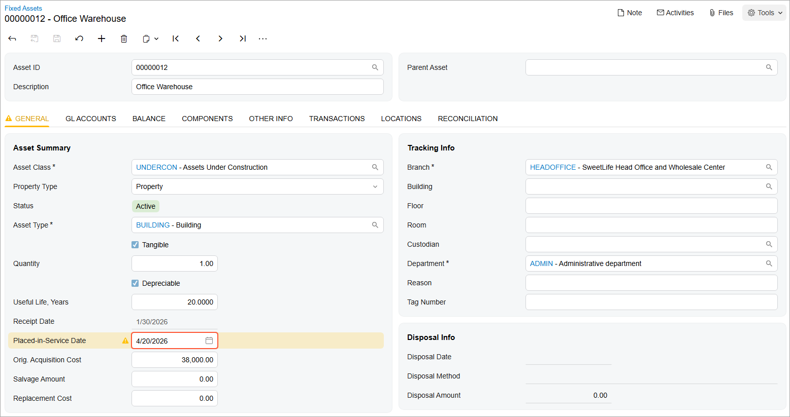

# Fixed Asset Creation: To Create an Asset Under Construction {#_c97fd704-06fc-4881-8aec-d9e54a087f8c .task}

The following activity will walk you through the process of creating a fixed asset under construction.

## Story {#section_nbd_ljv_vxb .section}

Suppose that in January 2026, SweetLife Fruits &amp; Jams started the construction of a warehouse near its office building. According to the company's policy, the cost of such assets must be recorded to a dedicated asset account. The warehouse is expected to be placed in service on April 20, 2026.

Acting as a SweetLife accountant, you need to create a GL transaction, a fixed asset class for assets under construction, and the *Office Warehouse* asset. You then need to reconcile this asset with the GL transaction.

## Configuration Overview {#section_tz4_djx_cnb .section}

In the *U100* dataset, the following tasks have been performed to support this activity:

-   On the [Enable/Disable Features](CS_10_00_00.md) \(CS100000\) form, the *Fixed Asset Management* feature has been enabled.
-   On the [Chart of Accounts](GL_20_25_00.md) \(GL202500\) form, the needed GL accounts have been created.
-   On the [Fixed Assets Preferences](FA_10_10_00.md) \(FA101000\) form, the **Automatically Release Acquisition Transactions** check box has been selected.

## Process Overview {#section_qbd_ljv_vxb .section}

In this activity, on the [Journal Transactions](GL_30_10_00.md) \(GL301000\) form, you will enter a GL transaction to record the acquisition of the office warehouse. On the [Fixed Asset Classes](FA_20_10_00.md) \(FA201000\) form, you will create a fixed asset class for assets under construction. On the [Fixed Assets](FA_30_30_00.md) \(FA303000\) form, you will create the needed fixed asset and reconcile it with the created GL transaction.

## System Preparation {#section_sbd_ljv_vxb .section}

Before you begin creating a fixed asset under construction, do the following:

1.  Launch the Acumatica ERP website with the *U100* dataset preloaded, and sign in as an accountant by using the *johnson* username and the *123* password.
2.  In the info area, in the upper-right corner of the top pane of the Acumatica ERP screen, click the Business Date menu button, and select *1/30/2026* on the calendar.
3.  In the company to which you are signed in, be sure that you have implemented the fixed asset functionality by performing the following prerequisite activities: [Fixed Assets: To Set Up the System for Fixed Asset Management](../ImplementationGuide/config_FixedAssets_Implem_Activity_System.md), [Fixed Assets: To Configure the Fixed Asset Functionality](../ImplementationGuide/config_FixedAssets_Implem_Activity_FixedAssets_Subledger.md), and [Fixed Assets: To Create Fixed Asset Classes](../ImplementationGuide/config_FixedAssets_Implem_Activity_FixedAsset_Classes.md).
4.  On the Company and Branch Selection menu on the top pane of the Acumatica ERP screen, select the *SweetLife Head Office and Wholesale Center* branch.

## Step 1: Creating a GL Transaction {#section_ubd_ljv_vxb .section}

To create a GL transaction that reflects the construction of the office warehouse, do the following:

1.  On the [Journal Transactions](GL_30_10_00.md) \(GL301000\) form, add a new record.
2.  In the Summary area, specify the following settings:
    -   **Module**: *GL*
    -   **Transaction Date**: *1/30/2026* \(inserted automatically\)
    -   **Post Period**: *01-2026* \(inserted automatically\)
    -   **Description**: `Construction of office warehouse`
3.  On the **Details** tab, click **Add Row** on the table toolbar, and specify the following settings in the added row:
    -   **Branch**: *HEADOFFICE*
    -   **Account**: *15010 \(Accrued Purchases: Fixed Assets\)*
    -   **Debit Amount**: `38000`
    -   **Transaction Description**: `Office warehouse`
4.  Click **Add Row** on the table toolbar again, and specify the following settings in the second row:
    -   **Branch**: *HEADOFFICE*
    -   **Account**: *30100 \(Capital Stock\)*
    -   **Credit Amount**: `38000`
    -   **Transaction Description**: `Office warehouse`
5.  On the form toolbar, click **Save**.
6.  On the form toolbar, click **Remove Hold**, and then click **Release** to release the transaction.

## Step 2: Creating a Fixed Asset Class {#section_wbd_ljv_vxb .section}

To create a fixed asset class for assets under construction, do the following:

1.  On the [Fixed Asset Classes](FA_20_10_00.md) \(FA201000\) form, add a new record.
2.  In the Summary area, specify the following settings:
    -   **Asset Class ID**: `UNDERCON`
    -   **Description**: `Assets Under Construction`
    -   **Active**: Selected
3.  On the **General** tab, specify the following settings:
    -   **Asset Type**: *BUILDING*
    -   **Depreciable**: Selected
    -   **Under Construction**: Selected
    -   **Useful Life, Years**: `20`
4.  On the **GL Accounts** tab, specify the following settings:
    -   **Fixed Assets Account**: *15500 \(Assets under Construction\)*
    -   **Gain Account**: *90000 \(Gain/Loss of Fixed Asset Disposal\)*
    -   **Loss Account**: *90000 \(Gain/Loss of Fixed Asset Disposal\)*
5.  On the **Depreciation** tab, specify the following settings:
    -   **Class Method**: *SL \(Straight-Line\)*
    -   **Averaging Convention**: *Mid Period*
6.  On the form toolbar, click **Save** to save your changes.

## Step 3: Creating a Fixed Asset Under Construction {#section_ybd_ljv_vxb .section}

To create the *Office Warehouse* fixed asset that is under construction, do the following:

1.  On the [Fixed Assets](FA_30_30_00.md) \(FA303000\) form, add a new record.
2.  In the Summary area, specify `Office Warehouse` in the **Description** box.
3.  On the **General** tab, specify the following settings:
    -   **Asset Class**: *UNDERCON*
    -   **Asset Type**: *BUILDING* \(inserted automatically from the fixed asset class settings\)
    -   **Useful Life, Years**: *20.0000* \(inserted automatically from the fixed asset class settings\)
    -   **Receipt Date**: *1/30/2026*
    -   **Placed-in-Service Date**: *4/20/2026*

        Notice that as soon as you specify the placed-in-service date, the system displays a warning message that the fixed asset is under construction and cannot be depreciated.

    -   **Orig. Acquisition Cost**: `38000`
    -   **Branch**: *HEADOFFICE* \(the current branch is inserted by default\)
    -   **Department**: *ADMIN*
4.  On the form toolbar, click **Save** to save the asset.

    The system has generated the acquisition transaction and saved it with the *Balanced* status. \(You can review the transaction on the **Transactions** tab.\)

5.  On the form toolbar, click **Remove Hold** to remove the fixed asset from hold, and save it.

    The following screenshot shows the created fixed asset under construction.

    

## Step 4: Reconciling the Created Fixed Asset {#section_dcd_ljv_vxb .section}

To reconcile the *Office Warehouse* fixed asset, do the following:

1.  While you are still viewing the fixed asset on the [Fixed Assets](FA_30_30_00.md) \(FA303000\) form, go to the **Reconciliation** tab.
2.  In the **Account** box, make sure that *15010 \(Accrued Purchases: Fixed Assets\)* is selected.
3.  In the table, select the unlabeled check box in the row with the **Orig. Amount** value of *38,000.00*.
4.  Click **Process** on the table toolbar to generate the reconciliation transaction.
5.  On the form toolbar, click **Save** to save the created reconciliation transaction, and review it on the **Transactions** tab.

    The generated *Reconciliation+* transaction was automatically released because the **Automatically Release Acquisition Transactions** check box \(which is selected\) also applies to the reconciliation transactions that correspond to asset acquisition. The **Batch. Nbr.** box displays the number of the corresponding GL batch.

6.  On the **Reconciliation** tab, review the **Unreconciled Amount**. It is *0.00*, indicating that the full amount of the asset has been reconciled.

**Parent topic:**[Creating Fixed Assets](../UserGuide/FixedAssets_Adding_Fixed_Asset_Mapref.md)

