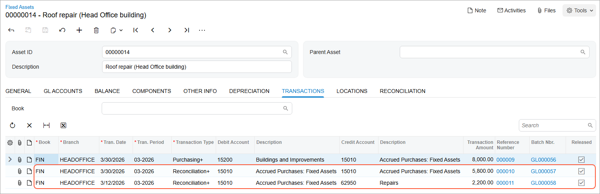

# Non-Default Asset Settings: Process Activity {#_e2249278-d864-49e2-9ba6-2c17b921ca6c .task}

The following activity will walk you through the process of changing the default settings of a fixed asset when you are creating the fixed asset.

## Story {#section_wgd_ljv_vxb .section}

Suppose that on March 12, 2026, SweetLife Fruits &amp; Jams purchased materials to use them for repairs in the office building. In March, the Frontsource Ltd. company repaired the roof by using part of the purchased materials; the company also installed downspouts. SweetLife paid for this work on March 30, 2026. The accountants have decided to capitalize the roof repair expense—that is, to create a fixed asset of the *BUILDING* class and depreciate it for five years.

Acting as a SweetLife accountant, you need to create a fixed asset for the roof repair, with some settings that differ from those that the system copies from the *BUILDING* fixed asset class.

## Configuration Overview {#section_tz4_djx_cnb .section}

In the *U100* dataset, the following tasks have been performed to support this activity:

-   On the [Enable/Disable Features](CS_10_00_00.md) \(CS100000\) form, the *Fixed Asset Management* feature has been enabled.
-   On the [Chart of Accounts](GL_20_25_00.md) \(GL202500\) form, the needed GL accounts have been created.
-   On the [Vendors](AP_30_30_00.md) \(AP303000\) form, the *FRONTSRC* vendor has been created.
-   On the [Fixed Assets Preferences](FA_10_10_00.md) \(FA101000\) form, the **Automatically Release Acquisition Transactions** check box has been selected.

## Process Overview {#section_ahd_ljv_vxb .section}

In this activity, on the [Bills and Adjustments](AP_30_10_00.md) \(AP301000\) form, you will create two AP bills: one for repair materials, and one for work. You will then release the bills on the [Release AP Documents](AP_50_10_00.md) \(AP501000\) form. On the [Fixed Assets](FA_30_30_00.md) \(FA303000\) form, you will create a fixed asset and change a default setting that has been copied from the asset class. Finally, on the same form, you will reconcile the fixed asset with the purchasing transaction.

## System Preparation {#section_chd_ljv_vxb .section}

Before you begin creating a fixed asset, do the following:

1.  Launch the Acumatica ERP website with the *U100* dataset preloaded, and sign in as an accountant by using the *johnson* username and the *123* password.
2.  In the info area, in the upper-right corner of the top pane of the Acumatica ERP screen, click the Business Date menu button, and select *3/12/2026* on the calendar.
3.  In the company to which you are signed in, be sure that you have implemented the fixed asset functionality by performing the following prerequisite activities: [Fixed Assets: To Set Up the System for Fixed Asset Management](../ImplementationGuide/config_FixedAssets_Implem_Activity_System.md), [Fixed Assets: To Configure the Fixed Asset Functionality](../ImplementationGuide/config_FixedAssets_Implem_Activity_FixedAssets_Subledger.md), and [Fixed Assets: To Create Fixed Asset Classes](../ImplementationGuide/config_FixedAssets_Implem_Activity_FixedAsset_Classes.md).
4.  Be sure that you have created a purchasing transaction for the building by performing the [Fixed Asset Creation: To Create and Reconcile an Asset](FixedAssets_Adding_Fixed_Asset_To_Create_Fixed_Asset.md) prerequisite activity.
5.  On the Company and Branch Selection menu on the top pane of the Acumatica ERP screen, select the *SweetLife Head Office and Wholesale Center* branch.

## Step 1: Creating Purchasing Transactions {#section_ehd_ljv_vxb .section}

To create the purchasing transactions \(that is, the needed AP bills\), do the following:

1.  On the [Bills and Adjustments](AP_30_10_00.md) \(AP301000\) form, add a new record.
2.  In the Summary area, specify the following settings for the new AP bill:
    -   **Type**: *Bill*
    -   **Vendor**: *FRONTSRC*
    -   **Date**: *3/12/2026* \(inserted automatically\)
    -   **Post Period**: *03-2026*
    -   **Description**: `Materials for repair work`
3.  On the **Details** tab, click **Add Row** on the table toolbar, and specify the following settings in the added row:
    -   **Branch**: *HEADOFFICE*
    -   **Transaction Descr.**: `Materials for repair work`
    -   **Ext. Cost**: `6750`
    -   **Account**: *62950 \(Repairs\)*
4.  On the form toolbar, click **Remove Hold** and then click **Save** to save the bill with the *Balanced* status.
5.  On the form toolbar, click **Add New Record**.
6.  In the Summary area, specify the following settings for the new bill:
    -   **Type**: *Bill*
    -   **Vendor**: *CSEMBLY*
    -   **Date**: *3/30/2026*
    -   **Post Period**: *03-2026*
    -   **Description**: `Repair work`
7.  On the **Details** tab, click **Add Row** on the table toolbar, and specify the following settings in the added row:
    -   **Branch**: *HEADOFFICE*
    -   **Transaction Descr.**: `Roof repair`
    -   **Ext. Cost**: `4400`
    -   **Account**: *15010 \(Accrued Purchases: Fixed Assets\)*
8.  Click **Add Row** on the table toolbar again, and specify the following settings in the second row:
    -   **Branch**: *HEADOFFICE*
    -   **Transaction Descr.**: `Downspout installation`
    -   **Ext. Cost**: `1400`
    -   **Account**: *15010 \(Accrued Purchases: Fixed Assets\)*
9.  On the form toolbar, click **Remove Hold** and then click **Save** to save the bill with the *Balanced* status.
10. Open the [Release AP Documents](AP_50_10_00.md) \(AP501000\) form and select the unlabeled check boxes in the rows of the $6,750 bill for *FRONTSRC* and the $5,800 bill for *CSEMBLY*.
11. On the form toolbar, click **Release** to release the two AP bills and create purchasing transactions.

## Step 2: Entering and Reconciling a Fixed Asset {#section_ghd_ljv_vxb .section}

To create a fixed asset record for roof repair and reconcile the fixed asset, do the following:

1.  On the [Fixed Assets](FA_30_30_00.md) \(FA303000\) form, add a new record.
2.  In the Summary area, enter `Roof repair (Head Office building)` in the **Description** box.
3.  On the **General** tab, specify the following settings:
    -   **Asset Class**: *BUILDING*
    -   **Asset Type**: *BUILDING* \(inserted automatically based on the asset class\)
    -   **Depreciable**: Selected \(inserted automatically based on the asset class\)
    -   **Receipt Date**: *3/30/2026*
    -   **Placed-in-Service Date**: *3/30/2026*
    -   **Orig. Acquisition Cost**: `8000`
    -   **Branch**: *HEADOFFICE*
    -   **Department**: *ADMIN*
4.  While you are still on the **General** tab, change the **Useful Life, Years** to `5` and save the fixed asset.
5.  On the **Balance** tab, review the asset's settings. The recovery period for the asset is five years, so the fixed asset will be depreciated from the 03-2026 period to the 03-2031 period.
6.  On the form toolbar, click **Save** to save the asset.
7.  On the form toolbar, click **Remove Hold** to remove the fixed asset from hold, and then click **Save**. The system releases the acquisition transaction, and now you can reconcile the cost of the asset.
8.  On the **Reconciliation** tab, make sure that *15010* is selected in the **Account** box.
9.  In the table, select the unlabeled check box in the row of the $5,800 entry.
10. On the table toolbar, click **Process**.
11. On the form toolbar, click **Save**. The unreconciled amount is reduced to $2,200.
12. In the **Account** box, select *62950* to process the rest of the amount by using another account.
13. In the table, select the unlabeled check box in the row of the $6,750 transaction. The system automatically fills the **Selected Amount** column with *2,200.00*.

    **Attention:** The **Selected Amount** is the amount to be reconciled with the cost of the asset; the *Reconciliation+* transaction is generated for this amount. You can change the **Selected Amount** to any needed value. If the amount you specify exceeds the unreconciled amount of the asset, the system will automatically create an addition to the cost of the asset.

14. On the table toolbar, click **Process**.
15. On the form toolbar, click **Save**.
16. On the **Transactions** tab, review the generated reconciliation transactions \(see the following screenshot\).

    With the *Reconciliation+* transaction, the system updates the FA Accrual account and the account debited by the fixed asset purchase to reconcile the asset's cost with the corresponding GL transactions. For the $4,400 and $1,400 transactions, these accounts are the same, so these transactions are combined into one $5,800 transaction. For the $2,200 transaction, the system debits the *15010* account and credits the *62950* account to link the existing roof repair asset with the purchasing transaction.

    

17. On the **Reconciliation** tab, review the **Unreconciled Amount**. Now it is equal to *0.00*, indicating that the asset has been reconciled.

**Parent topic:**[Changing an Asset's Default Settings](../UserGuide/FixedAssets_Changing_Default_Settings_Mapref.md)

