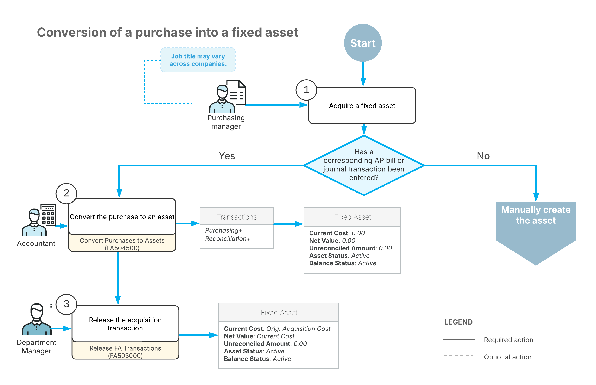

# Conversion of a Purchase: General Information {#_2dc67bae-d0ce-413b-95ab-42a2e4d04a2c .concept}

When you purchase an item, you can enter it as a fixed asset in Acumatica ERP in either of the following ways:

-   You can create the asset manually and further reconcile its cost with the appropriate financial transactions. This approach is described in the [Creating Fixed Assets](FixedAssets_Adding_Fixed_Asset_Mapref.md) chapter.
-   You can convert an existing purchase into a fixed asset or multiple fixed assets, as described in this chapter. This is easiest way to create a fixed asset. Once your company has purchased any property that is supposed to be a fixed asset, you enter an AP bill or a GL transaction in the system on the [Bills and Adjustments](AP_30_10_00.md) \(AP301000\) or [Journal Transactions](GL_30_10_00.md) \(GL301000\) form respectively. Then on the [Convert Purchases to Assets](FA_50_45_00.md) \(FA504500\) form, you direct the system to create the corresponding fixed asset with the appropriate settings. On this form, you can convert to a fixed asset any debit entry posted in the general ledger to any account.

## Learning Objectives {#section_dlc_ljv_vxb .section}

In this chapter, you will learn how to do the following:

-   Convert a purchase to a fixed asset
-   Convert a purchase to multiple fixed assets

## Applicable Scenarios {#section_flc_ljv_vxb .section}

You convert purchases to fixed assets in the following cases:

-   You have purchased an item and need to record it in the system as a fixed asset
-   You have purchased multiple items that were processed with one AP bill or journal transaction and need to record each item as a fixed asset

During the conversion, the system will generate a *Purchasing+* transaction that records the asset acquisition and a *Reconciliation+* transaction that will reconcile the converted amount and link the created asset to the appropriate purchase.

## Conversion of Items into Fixed Assets {#section_ilc_ljv_vxb .section}

All the transactions that are associated with converting acquired items into fixed assets are aggregated by default on one account \(and subaccount, if subaccounts are used in the system\). You specify the FA Accrual account and subaccount on the [Fixed Assets Preferences](FA_10_10_00.md) \(FA101000\) form, and it is used as the default account and subaccount for these transactions.

If the purchase of multiple items was processed with one transaction, when you convert this purchase to fixed assets, the system creates one fixed asset of the specified class for each item.

On the [Convert Purchases to Assets](FA_50_45_00.md) \(FA504500\) form, you select the appropriate Fixed Asset Accrual account in the **Account** box in the Selection area, and the GL transactions associated with the selected account appear in the **Purchase Transactions** table of the current form. You can convert one item or multiple items at once, each into one asset or multiple assets. In the **Fixed Assets** table, you can add a line for each particular asset manually. Alternatively, you can simultaneously add all required asset lines that correspond to the quantity of items specified in the transaction in the **Purchase Transactions** table by selecting an asset class for the transaction in the **Purchase Transactions** table.

You can specify the conversion settings to be used for the fixed assets on three different levels:

-   In the Selection area, which has the **Branch**, **Custodian**, and **Department** boxes.
-   In the lines of the **Purchase Transactions** table. The settings in the Selection area are inserted by default for the bills in the **Purchase Transactions** table.
-   For the assets in the **Fixed Assets** table. The settings in the line of the **Purchase Transactions** table are inserted by default for the assets in the **Fixed Assets** table. You can override any default settings by changing them in this table for each new asset individually.

If you use the FA accrual account and subaccount to aggregate not only the items for conversion but also other items, you should hide the items that you do not want to convert. In this case, you select the **Reconciled** check box for those items in the **Purchase Transactions** table. The items will be hidden when you process the conversion of the new assets.

In the **Fixed Assets** table, you select the check box in the **Create Asset** column for each unit for which you want to create a fixed asset. You then click **Process** on the form toolbar to create the fixed assets.

**Tip:** If some of the transactions that are posted to the account should not be converted to fixed assets, you can also mark them as reconciled to hide them from the **Purchase Transactions** table and thus eliminate them from conversion. To hide a particular transaction, you select the **Reconciled** check box for this transaction in the **Purchase Transactions** table before you create the fixed assets. If you want to review all the transactions that match the selection criteria, including the reconciled ones, you select the **Show Transactions Marked as Reconciled** check box in the Selection area.

You can review the settings of any converted fixed asset on the [Fixed Assets](FA_30_30_00.md) \(FA303000\) form. You can also modify the settings unless the acquisition transaction has been released.

Converting a purchase into a fixed asset creates *Purchasing +* and *Reconciliation +* transactions. For more information about transaction types, see [Types of Fixed Asset Transactions](FA__con_Transaction_Types.md).

## Support of Multiple Base Currencies {#section_slc_ljv_vxb .section}

If the *Multiple Base Currencies* feature is enabled on the [Enable/Disable Features](CS_10_00_00.md) \(CS100000\) form, the following rules are applied when a user is converting a purchase to an asset on the [Convert Purchases to Assets](FA_50_45_00.md) form:

-   It is not possible to create an asset in a branch based on a purchasing transaction posted for another branch that has a different base currency.
-   If a user is adding a new asset, the **Purchase Transactions** table shows only the GL transactions in the same base currency as the base currency of the selected branch.
-   If a user is making an addition to a fixed asset, the lookup table in the **Asset ID** column of the **Fixed Assets** table shows only the assets whose currency is the same as the base currency of the selected branch.

## Fixed Asset Statuses {#section_ulc_ljv_vxb .section}

The status of a fixed asset is shown on the **General** tab of the [Fixed Assets](FA_30_30_00.md) \(FA303000\) form. During its lifecycle, an asset can have any of the following statuses.

|Status|Description|
|------|-----------|
|*On Hold*|The asset can still be edited, but cannot be depreciated or disposed of. An asset has this status if the user clicks **Hold** on the More menu of the [Fixed Assets](FA_30_30_00.md) form for it.

 The asset can be deleted.

|
|*Active*|The asset can be depreciated and disposed of, but some of its settings cannot be changed. The asset receives this status by default when a new asset is created or when the user clicks **Remove Hold** on the More menu of the [Fixed Assets](FA_30_30_00.md) form for an asset with the *On Hold* status.

 The asset can be deleted if the acquisition transaction is not released yet.

|
|*Fully Depreciated*|The asset's cost was fully depreciated over the useful life of the asset in all depreciation books assigned to the asset.|
|*Disposed*|The asset has been disposed of \(for example, sold or abandoned\).|
|*Suspended*|The depreciation has been temporarily stopped for the asset.|
|*Reversed*|The asset has been reversed.|

The status of the fixed asset balance is shown in the **Status** column on the **Balance** tab of the [Fixed Assets](FA_30_30_00.md) form, which displays a row for each depreciation book. The status may vary for different depreciation books. The fixed asset balance for each book can have one of the following statuses:

-   *Active*: This is a newly created asset.
-   *Fully Depreciated*: The asset's cost was fully depreciated over the useful life of the asset in this particular book. In most cases, the net book value of the fully depreciated asset is zero \(or is the same as the salvage amount, if it is specified\).
-   *Disposed*: The asset was disposed of. If the asset has multiple books, this status is the same for all books.
-   *Suspended*: Depreciation has been temporarily stopped for the asset. This status is the same for all books.
-   *Reversed*: The asset has been reversed. If the asset has multiple books, this status is the same for all books.

## Workflow of Fixed Asset Conversion { .section}

The following diagram shows the conversion of a purchase into a fixed asset.

As the diagram shows, the conversion of a purchase involves these steps:

1.  Your company acquires the fixed asset. The original acquisition cost includes the cost of the purchase plus the cost of the preparations to deploy the asset; the asset can later be reconciled with the appropriate financial transactions.

    You manually create the fixed asset if its purchase has not been recorded in the system with a corresponding AP bill on the [Bills and Adjustments](AP_30_10_00.md) \(AP301000\) form or journal transaction on the [Journal Transactions](GL_30_10_00.md) \(GL301000\) form.

2.  If an AP bill or a journal transaction has been entered for the purchased items, you create the asset by converting an existing purchased item on the [Convert Purchases to Assets](FA_50_45_00.md) \(FA504500\) form. Most settings for conversion are copied by default from the fixed asset class that you specify for the asset. You can change only some of the fixed asset's settings before conversion.

    During the conversion, the system generates a *Purchasing+* transaction that records the asset acquisition and a *Reconciliation+* transaction that reconciles the converted amount and links the created asset to the appropriate purchase.

3.  On the [Release FA Transactions](FA_50_30_00.md) \(FA503000\) form, you release the acquisition transaction that was created during the conversion.

**Parent topic:**[Converting Purchases to Fixed Assets](../UserGuide/FixedAssets_Converting_Purchase_Mapref.md)

