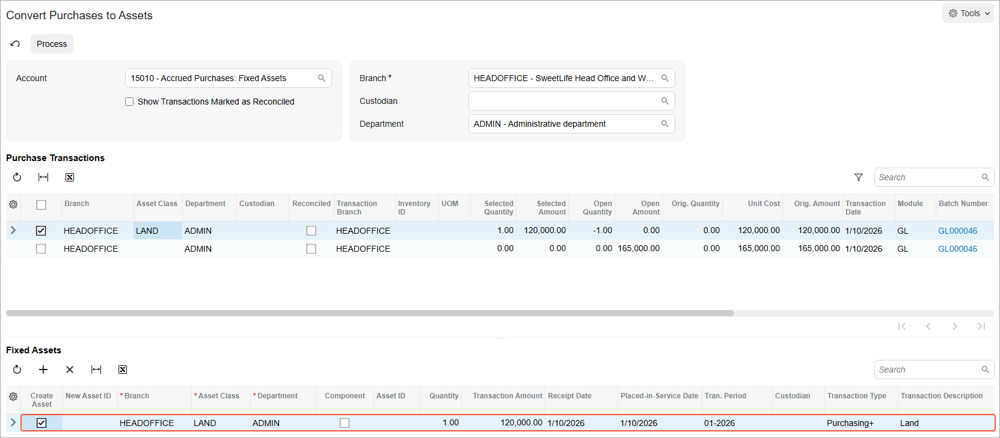
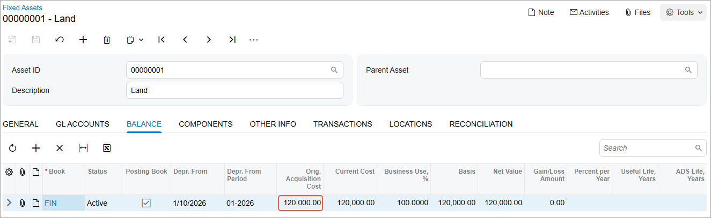

# Conversion of a Purchase: To Convert a Purchase to an Asset {#_3276d403-d9d7-490d-be64-aee4c223d367 .task}

The following activity will walk you through the process of creating a fixed asset by converting the purchase of an item.

## Story {#section_npc_ljv_vxb .section}

Suppose that on January 10, 2026, the *HEADOFFICE* branch of SweetLife Fruits &amp; Jams purchased an office building and the land that holds and surrounds it. Acting as a SweetLife accountant, you need to create a fixed asset in the system by converting this purchase.

## Configuration Overview {#section_tz4_djx_cnb .section}

In the *U100* dataset, the following tasks have been performed to support this activity:

-   On the [Enable/Disable Features](CS_10_00_00.md) \(CS100000\) form, the *Fixed Asset Management* feature has been enabled.
-   On the [Chart of Accounts](GL_20_25_00.md) \(GL202500\) form, the needed GL accounts have been created.
-   On the [Fixed Assets Preferences](FA_10_10_00.md) \(FA101000\) form, the **Automatically Release Acquisition Transactions** check box has been cleared. With this check box cleared, acquisition transactions are created with the *On Hold* status, and you will have to release these transactions manually on the [Release FA Transactions](FA_50_30_00.md) \(FA503000\) form.

## Process Overview {#section_qpc_ljv_vxb .section}

In this activity, you will first create and release a purchasing transaction on the [Journal Transactions](GL_30_10_00.md) \(GL301000\) form. On the [Convert Purchases to Assets](FA_50_45_00.md) \(FA504500\) form, you will convert the purchased land to the *Land* fixed asset. On the [Release FA Transactions](FA_50_30_00.md) \(FA503000\) form, you will release the purchasing transaction. Finally, you will review the settings of the created fixed asset on the [Fixed Assets](FA_30_30_00.md) \(FA303000\) form.

## System Preparation {#section_spc_ljv_vxb .section}

Before you begin converting a purchase to a fixed asset, do the following:

1.  Launch the Acumatica ERP website with the *U100* dataset preloaded, and sign in as an accountant by using the *johnson* username and the *123* password.
2.  In the info area, in the upper-right corner of the top pane of the Acumatica ERP screen, click the Business Date menu button, and select *1/10/2026* on the calendar.
3.  In the company to which you are signed in, be sure that you have implemented the fixed asset functionality by performing the following prerequisite activities: [Fixed Assets: To Set Up the System for Fixed Asset Management](../ImplementationGuide/config_FixedAssets_Implem_Activity_System.md), [Fixed Assets: To Configure the Fixed Asset Functionality](../ImplementationGuide/config_FixedAssets_Implem_Activity_FixedAssets_Subledger.md), and [Fixed Assets: To Create Fixed Asset Classes](../ImplementationGuide/config_FixedAssets_Implem_Activity_FixedAsset_Classes.md).
4.  On the Company and Branch Selection menu on the top pane of the Acumatica ERP screen, select the *SweetLife Head Office and Wholesale Center* branch.

## Step 1: Creating a Purchasing Transaction {#section_upc_ljv_vxb .section}

To create a purchasing transaction, do the following:

1.  On the [Journal Transactions](GL_30_10_00.md) \(GL301000\) form, add a new record.
2.  In the Summary area, specify the following settings:
    -   **Module**: *GL*
    -   **Transaction Date**: *1/10/2026* \(inserted automatically\)
    -   **Post Period**: *01-2026* \(inserted automatically\)
    -   **Description**: `Purchasing office building and land`
3.  On the **Details** tab, click **Add Row** on the table toolbar, and specify the following settings in the added row:
    -   **Branch**: *HEADOFFICE*
    -   **Account**: *30100 \(Capital Stock\)*
    -   **Credit Amount**: `285000`
    -   **Transaction Description**: `Land and office building`
4.  Click **Add Row** on the table toolbar again, and specify the following settings in the added row:
    -   **Branch**: *HEADOFFICE*
    -   **Account**: *15010 \(Accrued Purchases: Fixed Assets\)*
    -   **Debit Amount**: `120000`
    -   **Transaction Description**: `Land`
5.  Click **Add Row** on the table toolbar again, and specify the following settings in the third row:

    -   **Branch**: *HEADOFFICE*
    -   **Account**: *15010 \(Accrued Purchases: Fixed Assets\)*
    -   **Debit Amount**: `165000`
    -   **Transaction Description**: `Office building`
    The *15010* account is the accrual account that aggregates the cost of purchased fixed assets that have not been placed in service yet.

6.  On the form toolbar, click **Save**.
7.  On the form toolbar, click **Remove Hold**, and then click **Release** to release the transaction.

## Step 2: Converting the Purchase to a Fixed Asset {#section_xpc_ljv_vxb .section}

To create a fixed asset that corresponds to the purchased land, do the following:

1.  Open the [Convert Purchases to Assets](FA_50_45_00.md) \(FA504500\) form.
2.  In the Selection area, make sure that the following settings are specified:

    -   **Account**: *15010*
    -   **Branch**: *HEADOFFICE*
    -   **Department**: *ADMIN*
    The system automatically inserts *ADMIN* in the **Department** column for both rows of the **Purchase Transactions** table.

    **Attention:** The **Purchase Transactions** table displays transactions from purchase receipts. The **Department** column of the table contains the ID of the department to be used for multiple assets created from the selected purchase. The **Fixed Assets** table displays a list of units of the item selected in the **Purchase Transactions** table. The **Department** column of the **Fixed Assets** table contains the department to which each individually created asset should be assigned.

3.  Select the unlabeled check box in the row with the $120,000 transaction in the **Purchase Transactions** table.
4.  In the **Asset Class** column for the row you have selected, select *LAND*. In the **Fixed Assets** table, the system shows the asset to be created.

    By default, the system selects the entire amount of the line to be converted to a fixed asset. If needed, you can change the **Transaction Amount** to convert only part of the purchase to a fixed asset.

    By default, the receipt date and the placed-in-service date of the created asset are set to the **Transaction Date** of the selected purchase. The transaction description copied from the description of the GL entry corresponding to the purchase, which is the **Transaction Description** of the line on the [Journal Transactions](GL_30_10_00.md) \(GL301000\) form, is used as the description of the asset that you are creating. You can modify any of these default settings, if needed. The following screenshot shows the fixed asset that will be converted from the purchase.

    

5.  On the form toolbar, click **Process**.

    The system creates the fixed asset and generates the acquisition transaction.

## Step 3: Releasing the Fixed Asset Transaction {#section_eqc_ljv_vxb .section}

To release the fixed asset transaction, do the following:

1.  Open the [Release FA Transactions](FA_50_30_00.md) \(FA503000\) form.
2.  In the table, select the unlabeled check box for the only transaction.
3.  On the form toolbar, click **Release**.
4.  Open the Fixed Asset Transactions \(FA3010PL\) list of records, and click the **Reference Number** link of the only transaction.
5.  On the [Fixed Asset Transactions](FA_30_10_00.md) \(FA301000\) form, which is opened, review the generated transactions.

    On release of the transaction, the system generated the following fixed asset transactions:

    -   A *Purchasing+* transaction: With this transaction, the system updates the FA Accrual account that has been specified on the [Fixed Assets Preferences](FA_10_10_00.md) \(FA101000\) form and the Fixed Assets account that has been specified for the fixed asset class of the fixed asset. This transaction credits the *15010* account in the amount of $120,000 and debits the *15100* account in the same amount.
    -   A *Reconciliation+* transaction: With this transaction, the system updates the FA Accrual account and the account debited by the FA purchase to reconcile the converted amount. In this particular transaction, the FA Accrual account and the account debited by the FA purchase are the same. Because the full amount of the purchase has been reconciled, the purchase of $120,000 will not be available for further conversion on the [Convert Purchases to Assets](FA_50_45_00.md) \(FA504500\) form.

## Step 4: Reviewing the *Land* Fixed Asset {#section_hqc_ljv_vxb .section}

To review the settings of the new fixed asset that was converted from the purchase, do the following:

1.  While you are still on the [Fixed Asset Transactions](FA_30_10_00.md) \(FA301000\) form, click the link in the **Asset** column for one of the rows.
2.  On the [Fixed Assets](FA_30_30_00.md) \(FA303000\) form, which is opened, review the fixed asset.

    The **Description** box displays the description of the fixed asset, which was copied from the **Transaction Description** specified for the purchase transaction on the [Journal Transactions](GL_30_10_00.md) \(GL301000\) form, which you created in Step 1. The **Placed-in-Service Date** of the *Land* asset \(the **General** tab\) is *1/10/2026*. \(You can override this date if you want to place the asset in service later.\) Because the land has an indefinite life span, the **Useful Life, Years** box is empty.

3.  Review the settings of the created asset on the **Balance** tab, as shown in the screenshot below.

    The asset is assigned to the *FIN* book and has the **Orig. Acquisition Cost** of $120,000. The **Placed-in-Service Period** \(displayed on the **General** tab\) is calculated based on the **Placed-in-Service Date** according to the book calendar. The the *Purchasing+* transaction is posted to this period.

    

**Parent topic:**[Converting Purchases to Fixed Assets](../UserGuide/FixedAssets_Converting_Purchase_Mapref.md)

