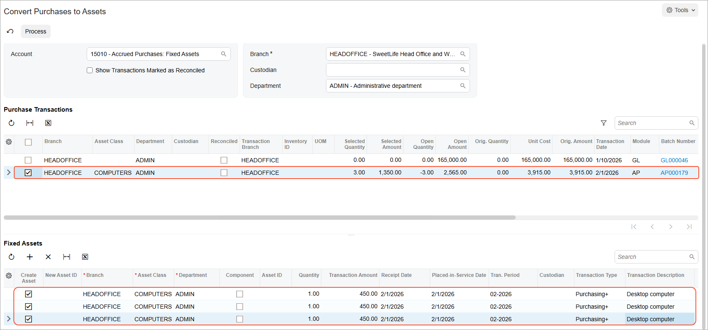
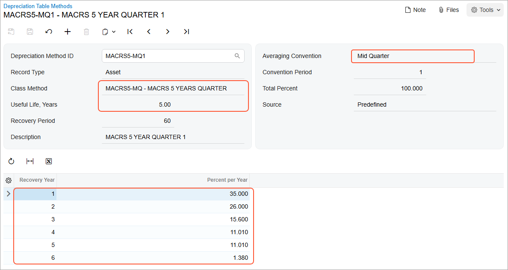

# Conversion of a Purchase: To Convert a Purchase to Multiple Assets {#_e70bc5e2-6f05-4db2-acfa-45a45787dc0e .task}

The following activity will walk you through the process of converting a purchase to multiple fixed assets.

## Story {#section_xqc_ljv_vxb .section}

Suppose that on February 1, 2026, SweetLife Fruits &amp; Jams purchased three desktop computers for the *HEADOFFICE* branch, one server, and five anti-virus software licenses. Acting as a SweetLife accountant, you need to convert this purchase to multiple fixed assets.

## Configuration Overview {#section_tz4_djx_cnb .section}

In the *U100* dataset, the following tasks have been performed to support this activity:

-   On the [Enable/Disable Features](CS_10_00_00.md) \(CS100000\) form, the *Fixed Asset Management* feature has been enabled.
-   On the [Chart of Accounts](GL_20_25_00.md) \(GL202500\) form, the needed GL accounts have been created.
-   On the [Vendors](AP_30_30_00.md) \(AP303000\) form, the *COMPULINK* vendor has been created.
-   On the [Fixed Assets Preferences](FA_10_10_00.md) \(FA101000\) form, the **Automatically Release Acquisition Transactions** check box has been cleared. With this check box cleared, acquisition transactions are created with the *On Hold* status, and you will have to release these transactions manually on the [Release FA Transactions](FA_50_30_00.md) \(FA503000\) form.

## Process Overview {#section_arc_ljv_vxb .section}

In this activity, on the [Bills and Adjustments](AP_30_10_00.md) \(AP301000\) form, you will create an AP bill with three lines for the purchase of computer equipment. On the [Convert Purchases to Assets](FA_50_45_00.md) \(FA504500\) form, you will convert the bill lines to fixed assets. On the [Release FA Transactions](FA_50_30_00.md) \(FA503000\) form, you will release the purchasing transactions. Finally, on the [Fixed Assets](FA_30_30_00.md) \(FA303000\) form, you will review one of the created assets; then you will review the settings of its depreciation method on the [Depreciation Table Methods](FA_20_26_00.md) \(FA202600\) form.

## System Preparation {#section_crc_ljv_vxb .section}

Before you begin converting a purchase to multiple fixed assets, do the following:

1.  Launch the Acumatica ERP website with the *U100* dataset preloaded, and sign in as an accountant by using the *johnson* username and the *123* password.
2.  In the info area, in the upper-right corner of the top pane of the Acumatica ERP screen, click the Business Date menu button, and select *2/1/2026* on the calendar.
3.  In the company to which you are signed in, be sure that you have implemented the fixed asset functionality by performing the following prerequisite activities: [Fixed Assets: To Set Up the System for Fixed Asset Management](../ImplementationGuide/config_FixedAssets_Implem_Activity_System.md), [Fixed Assets: To Configure the Fixed Asset Functionality](../ImplementationGuide/config_FixedAssets_Implem_Activity_FixedAssets_Subledger.md), and [Fixed Assets: To Create Fixed Asset Classes](../ImplementationGuide/config_FixedAssets_Implem_Activity_FixedAsset_Classes.md).
4.  On the Company and Branch Selection menu on the top pane of the Acumatica ERP screen, select the *SweetLife Head Office and Wholesale Center* branch.

## Step 1: Creating a Purchasing Transaction {#section_erc_ljv_vxb .section}

In this step, you will create an AP bill to record the purchase of the items. This bill causes the purchasing transaction to be generated. To create the bill, do the following:

1.  On the [Bills and Adjustments](AP_30_10_00.md) \(AP301000\) form, add a new record.
2.  In the Summary area, specify the following settings:
    -   **Type**: *Bill*
    -   **Vendor**: *COMPULINK*
    -   **Date**: *2/1/2026*
    -   **Post Period**: *02-2026* \(inserted automatically\)
    -   **Description**: `Purchased computers and software`
3.  On the **Details** tab, click **Add Row** on the table toolbar, and specify the following settings in the first row:
    -   **Branch**: *HEADOFFICE*
    -   **Transaction Descr.**: `Desktop computer`
    -   **Quantity**: `3`
    -   **Unit Cost**: `450`
    -   **Account**: *15010 \(Accrued Purchases: Fixed Assets\)*
4.  Click **Add Row** on the table toolbar again, and specify the following settings in the second row:
    -   **Branch**: *HEADOFFICE*
    -   **Transaction Descr.**: `Server`
    -   **Quantity**: `1`
    -   **Unit Cost**: `915`
    -   **Account**: *15010 \(Accrued Purchases: Fixed Assets\)*
5.  Click **Add Row** on the table toolbar again, and specify the following settings in the third row:
    -   **Branch**: *HEADOFFICE*
    -   **Transaction Descr.**: `Anti-virus software`
    -   **Quantity**: `5`
    -   **Unit Cost**: `330`
    -   **Account**: *15010 \(Accrued Purchases: Fixed Assets\)*
6.  On the form toolbar, click **Save** to save your changes.
7.  On the form toolbar, click **Remove Hold**, and then click **Release** to release the AP bill.

## Step 2: Converting Fixed Assets {#section_grc_ljv_vxb .section}

To covert the lines of the AP bill to fixed assets, do the following:

1.  Open the [Convert Purchases to Assets](FA_50_45_00.md) \(FA504500\) form.
2.  In the **Department** box of the Selection area, select *ADMIN*.
3.  In the **Purchase Transactions** table, in the row with an **Orig. Amount** of *3,915.00*, select *COMPUTERS* in the **Asset Class** column, and then select the unlabeled check box for the row.

    The system adds a line in the **Fixed Assets** table with the **Create Asset** check box selected.

4.  In the **Fixed Assets** table, in the **Transaction Amount** column, specify `450`.
5.  In the **Transaction Description** column for the new row, specify `Desktop computer`.
6.  In the **Fixed Assets** table, click **Add Row** on the table toolbar, and specify the following settings in the row:
    -   **Asset Class**: *COMPUTERS* \(inserted automatically\)
    -   **Transaction Amount**: `450`
    -   **Transaction Description**: `Desktop computer`
7.  Click **Add Row** again on the table toolbar to add the third row, and specify the following settings for the row:

    -   **Asset Class**: *COMPUTERS* \(inserted automatically\)
    -   **Transaction Amount**: `450`
    -   **Transaction Description**: `Desktop computer`
    Notice that in the **Purchase Transactions** table, the **Selected Amount** is now *1,350.00*. The following screenshot shows the three converted fixed assets.

    

8.  To convert the server to a fixed asset, in the **Fixed Assets** table, click **Add Row** on the table toolbar, and specify the following settings in the added row:
    -   **Asset Class**: *COMPUTERS* \(inserted automatically\)
    -   **Transaction Amount**: `915`
    -   **Transaction Description**: `Server`
9.  To convert the five software licenses to fixed assets, perform the following instruction five times: Click **Add Row** on the table toolbar, and specify the following settings in each row:
    -   **Asset Class**: *SOFTWARE*
    -   **Transaction Amount**: `330`
    -   **Transaction Description**: `Anti-virus software`
10. On the form toolbar, click **Process**.
11. Open the [Asset Summary](FA_40_20_00.md) \(FA402000\) form to review the converted assets.

## Step 3: Releasing the Purchasing Transactions { .section}

To release the purchasing transactions, do the following:

1.  Open the [Release FA Transactions](FA_50_30_00.md) \(FA503000\) form.
2.  Select the unlabeled check box for the only *Purchasing* transaction in the table and on the form toolbar, click **Release**.

## Step 4: Reviewing the Fixed Asset Settings {#section_lrc_ljv_vxb .section}

To review the settings of one of the new fixed assets, do the following:

1.  On the [Fixed Assets](FA_30_30_00.md) \(FA303000\) form, open the *Server* fixed asset.
2.  On the **Balance** tab, review the asset's depreciation method.

    For the assets of the *COMPUTERS* class, you have selected the *MACRS5-MQ* table method as the depreciation method. Depreciation amounts calculated by the table methods depend on the date when the asset was acquired. The *MACRS5-MQ* method is the class method that groups four *MACRS5* methods that are used based on the quarter in which the asset was acquired.

    The *Server* asset was acquired in the first quarter; that is why *MACRS5-MQ1* is specified as the depreciation method for this asset.

3.  Click the link in the **Depreciation Method** column, and on the [Depreciation Table Methods](FA_20_26_00.md) \(FA202600\) form, which the system has opened, review the settings of the depreciation method, as shown in the screenshot below.

    The averaging convention for this method is *Mid Quarter*; it defines the depreciation percent for the first and last year of the asset's life based on the quarter in which the asset was acquired. The **Class Method** box shows the class for this depreciation method, which is *MACRS5-MQ*. The **Useful Life** for each method of the *MACRS5-MQ* class is 5 years. The **Recovery Period** is the useful life in months.

    The table at the bottom of the form lists fixed deprecation percents for each recovery year. Year 1 is the year when the asset is acquired, and Year 6 is the year when the asset will be disposed of.

    

**Parent topic:**[Converting Purchases to Fixed Assets](../UserGuide/FixedAssets_Converting_Purchase_Mapref.md)

