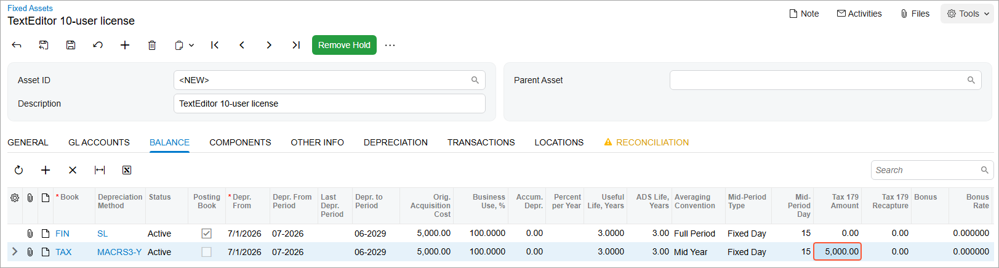
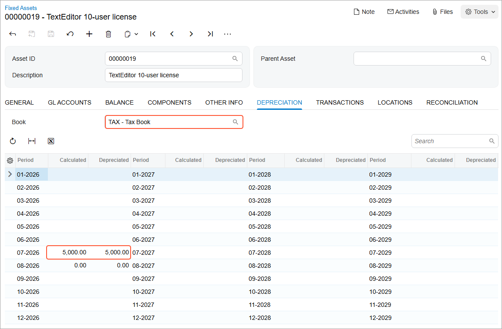

# Asset Migration: To Apply the Section 179 Deduction \(Optional\) {#_5708230e-2f58-4e3d-a67e-a83c22b1619a .task}

The following activity will walk you through the process of applying the Section 179 deduction to a fixed asset.

## Story {#section_b1h_ljv_vxb .section}

Suppose that on July 1, 2026, SweetLife Fruits &amp; Jams purchased a 10-user license of the TextEditor word processor to be used by the workers of the Sales department. The accountant of SweetLifedecided to apply the Section 179 deduction for this software. Acting as the SweetLife accountant, you need to create this fixed asset in the system, depreciate it, and recover the asset's cost.

## Configuration Overview {#section_tz4_djx_cnb .section}

In the *U100* dataset, the following tasks have been performed to support this activity:

-   On the [Enable/Disable Features](CS_10_00_00.md) \(CS100000\) form, the *Fixed Asset Management* feature has been enabled.
-   On the [Chart of Accounts](GL_20_25_00.md) \(GL202500\) form, the needed GL accounts have been created.
-   On the [Fixed Assets Preferences](FA_10_10_00.md) \(FA101000\) form, the **Automatically Release Acquisition Transactions** check box has been selected.
-   On the [Vendors](AP_30_30_00.md) \(AP303000\) form, the *COMPULINK* vendor has been created.

## Process Overview {#section_e1h_ljv_vxb .section}

In this activity, you will first update the settings of an asset class on the [Fixed Asset Classes](FA_20_10_00.md) \(FA201000\) form. On the [Bills and Adjustments](AP_30_10_00.md) \(AP301000\) form, you will record a purchase of software licenses. On the [Fixed Assets](FA_30_30_00.md) \(FA303000\) form, you will create a fixed asset and reconcile it with this purchase. On the [Calculate Depreciation](FA_50_20_00.md) \(FA502000\) form, you will depreciate the asset in both books and review how its cost is recovered under Section 179 deduction in one of the books.

## System Preparation {#section_g1h_ljv_vxb .section}

Before you begin creating a partially depreciated fixed asset, do the following:

1.  Launch the Acumatica ERP website with the *U100* dataset preloaded, and sign in as an accountant by using the *johnson* username and the *123* password.
2.  In the info area, in the upper-right corner of the top pane of the Acumatica ERP screen, click the Business Date menu button, and select *7/1/2026* on the calendar.
3.  In the company to which you are signed in, be sure that you have implemented the fixed asset functionality by performing the following prerequisite activities: [Fixed Assets: To Set Up the System for Fixed Asset Management](../ImplementationGuide/config_FixedAssets_Implem_Activity_System.md), [Fixed Assets: To Configure the Fixed Asset Functionality](../ImplementationGuide/config_FixedAssets_Implem_Activity_FixedAssets_Subledger.md), and [Fixed Assets: To Create Fixed Asset Classes](../ImplementationGuide/config_FixedAssets_Implem_Activity_FixedAsset_Classes.md).
4.  On the Company and Branch Selection menu on the top pane of the Acumatica ERP screen, select the *SweetLife Head Office and Wholesale Center* branch.

## Step 1: Updating the Settings of the Fixed Asset Class {#section_i1h_ljv_vxb .section}

To update the settings of the *SOFTWARE* asset class, do the following:

1.  On the [Fixed Asset Classes](FA_20_10_00.md) \(FA201000\) form, open the *SOFTWARE* class.
2.  On the **Depreciation** tab, select the **Sect. 179** check box in the row for the *TAX* book.
3.  On the form toolbar, click **Save** to save your changes.

## Step 2: Creating a Bill for the Purchased Software {#section_k1h_ljv_vxb .section}

To create a bill for the purchased software, do the following:

1.  On the [Bills and Adjustments](AP_30_10_00.md) \(AP301000\) form, create a new record.
2.  In the Summary area, specify the following settings:
    -   **Type**: *Bill*
    -   **Vendor**: *COMPULINK*
    -   **Date**: *7/1/2026* \(inserted automatically\)
    -   **Post Period**: *07-2026*
    -   **Description**: `TextEditor 10-user license`
3.  On the **Details** tab, click **Add Row** on the table toolbar, and specify the following settings for the added row:
    -   **Branch**: *HEADOFFICE*
    -   **Transaction Descr.**: `TextEditor 10-user license`
    -   **Ext. Cost**: `5000`
    -   **Account**: *15010 \(Accrued Purchases: Fixed Assets\)*
4.  On the form toolbar, click **Remove Hold**, and then click **Release** to release the bill.

## Step 3: Creating and Reconciling a Fixed Asset {#section_m1h_ljv_vxb .section}

To create a fixed asset and reconcile it with the purchase, do the following:

1.  On the [Fixed Assets](FA_30_30_00.md) \(FA303000\) form, create a new record.
2.  In the Summary area, specify the following settings:
    -   **Asset ID**: Inserted automatically
    -   **Description**: `TextEditor 10-user license`
3.  On the **General** tab, specify the following settings:
    -   **Asset Class**: *SOFTWARE*
    -   **Asset Type**: *SOFTWARE* \(inserted automatically when you select the fixed asset class\)
    -   **Useful Life, Years**: *3* \(inserted automatically when you select the fixed asset class\)
    -   **Receipt Date**: *7/1/2026*
    -   **Placed-in-Service Date**: *7/1/2026*
    -   **Orig. Acquisition Cost**: `5000`
    -   **Branch**: *HEADOFFICE*
    -   **Department**: *SALES*
4.  On the **Balance** tab, in the row for the *TAX* book, enter `5000` in the **Tax 179 Amount** column, as shown in the following screenshot.

    

5.  On the form toolbar, click **Save** to save the asset.
6.  On the form toolbar, click **Remove Hold** to give the asset the *Active* status.
7.  On the form toolbar, click **Save** to save the asset again.
8.  On the **Reconciliation** tab, reconcile the asset's cost with the $5,000 bill as follows:
    1.  Select the unlabeled check box in the row with the **Orig. Amount** of $5,000.
    2.  On the table toolbar, click **Process**.
    3.  On the form toolbar, click **Save** to save your changes.

## Step 4: Depreciating the Asset {#section_o1h_ljv_vxb .section}

To depreciate the fixed asset, do the following:

1.  Open the [Calculate Depreciation](FA_50_20_00.md) \(FA502000\) form.
2.  In the **To Period** box, enter *07-2026*.
3.  In the **Action** box, select *Depreciate*.
4.  In the table, select both rows with the *TextEditor 10-user license* asset \(one for the *FIN* book, and one for the *TAX* book\).
5.  On the form toolbar, click **Process**.
6.  On the [Fixed Assets](FA_30_30_00.md) \(FA303000\) form, review the **Depreciation** tab for the *FIN* book and for the *TAX* book. \(To do this, in the box above the table, you select the book you want to review.\)

    The depreciation for the *FIN* book is calculated by the usual rule because you have not selected the **Sect. 179** check box for this book in the settings of the *SOFTWARE* class.

    In the *TAX* book, the cost of the *TextEditor 10-user license* asset has been fully recovered in the first period of the first year, as shown in the following screenshot.

    

7.  On the **Balance** tab, review the **Accum. Depr.** and **Net Value** columns, and notice that the net value in the *TAX* book is now *0.00*.

**Parent topic:**[Migrating Fixed Assets](../UserGuide/FixedAssets_Data_Migration_Mapref.md)

