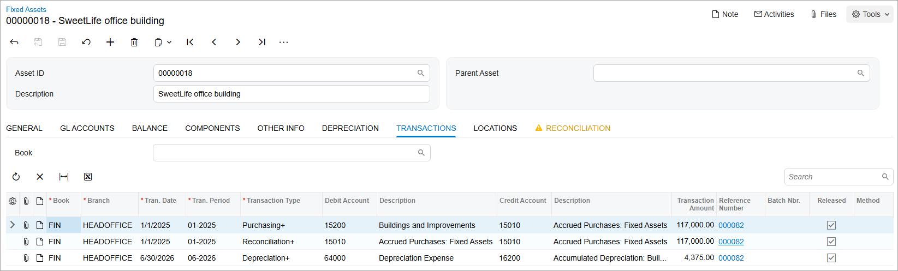
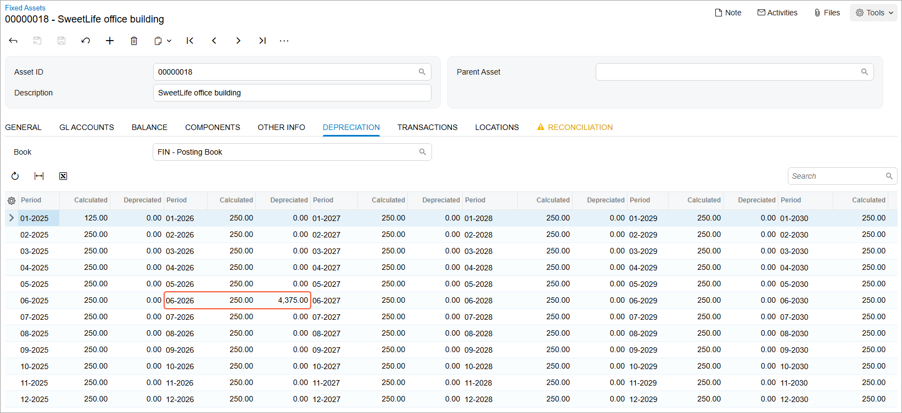
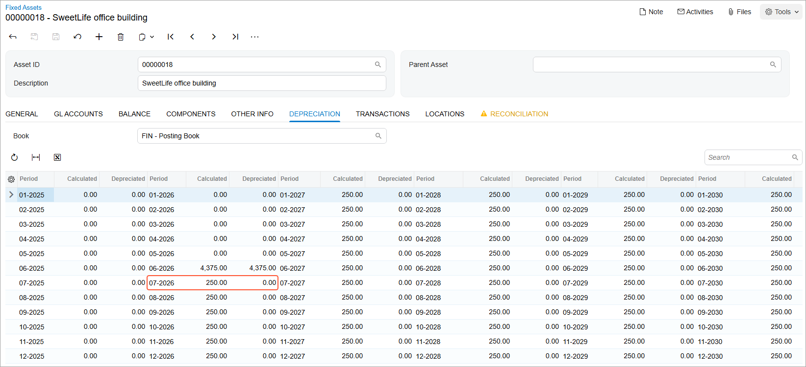

# Asset Migration: To Create a Partially Depreciated Asset {#_8edd4a76-d724-4da4-8978-fefd8a5c5ee2 .task}

The following activity will walk you through the process of manually creating a partially depreciated fixed asset while migrating assets from a legacy system.

## Story {#section_dyg_ljv_vxb .section}

The accountant of SweetLife Fruits &amp; Jams wants to start using Acumatica ERP for production use on 7/1/2026. Before this date, multiple fixed assets of SweetLife Fruits &amp; Jams were maintained in the legacy system from 1/1/2025 through 6/30/2026 and data should be migrated through this date.

Acting as the SweetLife accountant, you need to migrate the existing assets with accumulated depreciation without updating the general ledger. You have decided to manually create the asset for the SweetLife office building, which has been in use since 1/1/2025. It has an acquisition cost of $117,000 and accumulated depreciation of $4,375.

## Configuration Overview {#section_tz4_djx_cnb .section}

In the *U100* dataset, the following tasks have been performed to support this activity:

-   On the [Enable/Disable Features](CS_10_00_00.md) \(CS100000\) form, the *Fixed Asset Management* feature has been enabled.
-   On the [Chart of Accounts](GL_20_25_00.md) \(GL202500\) form, the needed GL accounts have been created.

## Process Overview {#section_hyg_ljv_vxb .section}

In this activity, you will turn on initialization mode on the [Fixed Assets Preferences](FA_10_10_00.md) \(FA101000\) form. On the [Fixed Assets](FA_30_30_00.md) \(FA303000\) form, you will create a fixed asset and specify the accumulated depreciation amount for it. You will then calculate depreciation for the asset on the same form. On the [Fixed Assets Preferences](FA_10_10_00.md) form, you will select the **Show Accurate Depreciation** check box and review the calculated depreciation amounts for the asset. Finally, you will clear the **Show Accurate Depreciation** check box on the [Fixed Assets Preferences](FA_10_10_00.md) form.

## System Preparation {#section_jyg_ljv_vxb .section}

Before you begin creating a partially depreciated fixed asset, do the following:

1.  Launch the Acumatica ERP website with the *U100* dataset preloaded, and sign in as an accountant by using the *johnson* username and the *123* password.
2.  In the info area, in the upper-right corner of the top pane of the Acumatica ERP screen, click the Business Date menu button, and select *1/1/2025* on the calendar.
3.  In the company to which you are signed in, be sure that you have implemented the fixed asset functionality by performing the following prerequisite activities: [Fixed Assets: To Set Up the System for Fixed Asset Management](../ImplementationGuide/config_FixedAssets_Implem_Activity_System.md), [Fixed Assets: To Configure the Fixed Asset Functionality](../ImplementationGuide/config_FixedAssets_Implem_Activity_FixedAssets_Subledger.md), and [Fixed Assets: To Create Fixed Asset Classes](../ImplementationGuide/config_FixedAssets_Implem_Activity_FixedAsset_Classes.md).
4.  On the Company and Branch Selection menu on the top pane of the Acumatica ERP screen, select the *SweetLife Head Office and Wholesale Center* branch.

## Step 1: Turning On Initialization Mode {#section_lyg_ljv_vxb .section}

To turn on initialization mode, do the following:

1.  Open the [Fixed Assets Preferences](FA_10_10_00.md) \(FA101000\) form.
2.  In the **Posting Settings** section, clear the **Update GL** check box.
3.  On the form toolbar, click **Save**.

## Step 2: Creating a Fixed Asset {#section_nyg_ljv_vxb .section}

To create a partially depreciated fixed asset, do the following:

1.  On the [Fixed Assets](FA_30_30_00.md) \(FA303000\) form, create a new record.
2.  In the Summary area, specify the following settings for the new asset:
    -   **Asset ID**: Inserted automatically
    -   **Description**: `SweetLife office building`
    -   **Asset Class**: *BUILDING*
    -   **Asset Type**: *BUILDING* \(inserted automatically based on the fixed asset class\)
    -   **Useful Life, Years**: *39* \(inserted automatically based on the fixed asset class\)
    -   **Receipt Date**: *1/1/2025*
    -   **Placed-in-Service Date**: *1/1/2025*
    -   **Orig. Acquisition Cost**: `117000`
    -   **Branch**: *HEADOFFICE*
    -   **Department**: *ADMIN*
3.  On the **Balance** tab, specify the following settings in the row for the *FIN* book:
    -   **Last Depr. Period**: *06-2026*
    -   **Accum. Depr.**: `4375`
4.  On the form toolbar, click **Save** to save the asset.
5.  On the form toolbar, click **Remove Hold** and then click **Save** to save the asset with the *Active* status.
6.  Review the **Transactions** tab, which is shown in the screenshot below.

    The system has generated the *Purchasing+* and *Depreciation+* transactions to register the asset's acquisition cost and the accumulated depreciation amount, and the *Reconciliation+* transaction to set the unreconciled cost to *0*. Although the transactions are marked as released, they do not update the general ledger, so the **Batch Nbr.** column is empty.

    

## Step 3: Calculating Depreciation for the Fixed Asset {#section_qyg_ljv_vxb .section}

To calculate depreciation for the fixed asset, do the following:

1.  While you are still reviewing the asset on the [Fixed Assets](FA_30_30_00.md) \(FA303000\) form, click **Calculate Depreciation** on the More menu.

    The system calculates the depreciation by using the depreciation method and recovery period specified for the asset. If the entered accumulated depreciation does not equal the calculated value, the system calculates the depreciation adjustment to be posted in the first open period.

2.  On the **Depreciation** tab, select *FIN* in the **Book** box, and review the calculated depreciation amounts \(see the screenshot below\).

    The **Calculated** column displays the calculated depreciation amounts for the periods. The total calculated depreciation for the periods from 01-2025 through 06-2026 is $4,375 \($125 + $250 \* 17\). The **Depreciated** column shows the recorded depreciation amounts. For the periods from 01-2025 through 06-2026, the recorded depreciation is $0.00. The accumulated depreciation that you have entered \($4,375\) is recorded to the last depreciation period \(06-2026\).

    

3.  Open the [Fixed Assets Preferences](FA_10_10_00.md) \(FA101000\) form.
4.  Select the **Show Accurate Depreciation** check box in the **Other** section, and save your changes.

    When this check box is selected, on the **Depreciation** tab of the [Fixed Assets](FA_30_30_00.md) form, the system shows the depreciation amounts recorded for the previous financial periods, along with the depreciation adjustment calculated for the current period.

5.  On the [Fixed Assets](FA_30_30_00.md) form, open the *SweetLife office building* asset, and review the **Depreciation** tab, as shown in the screenshot below.

    For the periods listed before the current period, in the **Depreciated** column, the system shows the depreciation amounts that have been recorded to the Accumulated Depreciation account for the asset: $0.00 for the periods through 05-2026, and $4,375 for the last depreciation period \(06-2026\). For the current period \(07-2026\), in the **Calculated** column, the system shows the calculated depreciation plus the calculated depreciation adjustment. Because the calculated depreciation amount \($4,375\) is equal to the entered accumulated depreciation, no adjustment is needed for the asset in 07-2026. For the periods after the current period, in the **Calculated** column, the system shows the depreciation amounts calculated according to the settings of the asset. If no changes to the asset's cost are made, when the asset is depreciated, these amounts will be posted to the Accumulated Depreciation account.

    

6.  On the [Fixed Assets Preferences](FA_10_10_00.md) form, clear the **Show Accurate Depreciation** check box, and click **Save** to save your changes.

**Parent topic:**[Migrating Fixed Assets](../UserGuide/FixedAssets_Data_Migration_Mapref.md)

