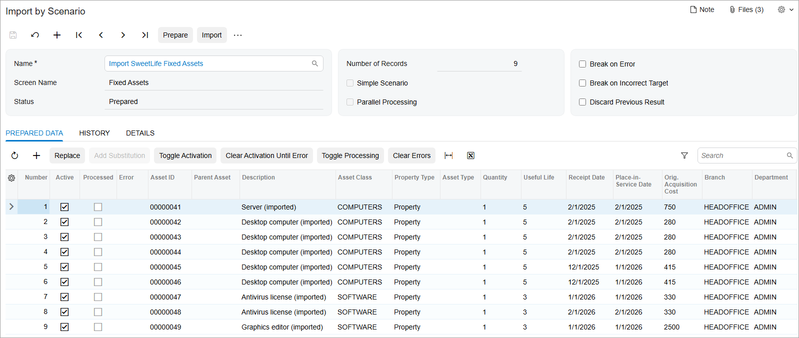
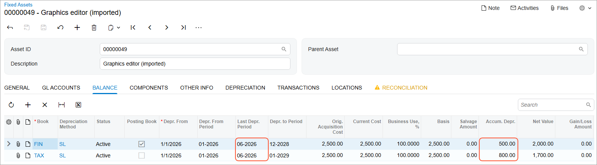

# Asset Migration: To Migrate Fixed Assets {#_06e8adca-8292-490e-9101-856aad2b9d87 .task}

The following activity will walk you through the process of preparing an import scenario for data migration and using it to migrate fixed assets.

## Story {#section_czg_ljv_vxb .section}

Suppose that in the middle of 2026, SweetLife Fruits &amp; Jams is migrating its fixed assets to Acumatica ERP from a legacy system. The trial balances for the previous periods have already been imported into Acumatica ERP.

Because the company has been maintaining its fixed assets since 2025, it has multiple fixed assets in the old database, and the depreciation of these assets has been accumulated from the start of their useful life through June 2026.

Acting as a SweetLife administrator, you need to import these assets along with the accumulated depreciation and start fully operating in Acumatica ERP on 7/1/2026.

## Configuration Overview {#section_tz4_djx_cnb .section}

In the *U100* dataset, the following tasks have been performed to support this activity:

-   On the [Enable/Disable Features](CS_10_00_00.md) \(CS100000\) form, the *Fixed Asset Management* feature has been enabled.
-   On the [Chart of Accounts](GL_20_25_00.md) \(GL202500\) form, the needed GL accounts have been created.

## Process Overview {#section_gzg_ljv_vxb .section}

In this activity, you will do the following:

1.  On the [Numbering Sequences](CS_20_10_10.md) \(CS201010\) form, you will disable the auto-numbering of fixed assets.
2.  On the [Fixed Asset Classes](FA_20_10_00.md) \(FA201000\) form, you will update the settings of an asset class by adding a book to it. On the [Generate Book Calendars](FA_50_10_00.md) \(FA501000\) form, you will generate book calendars for this book.
3.  On the [Data Providers](SM_20_60_15.md) \(SM206015\) form, you will create a new data provider and upload the [ACU\_Import\_Fixed\_Assets\_F310.xlsx](Files/ACU_Import_Fixed_Assets_F310.xlsx) file for it.
4.  On the [Import Scenarios](SM_20_60_25.md) \(SM206025\) form, you will create an import scenario based on an XML file.
5.  On the [Import by Scenario](SM_20_60_36.md) \(SM206036\) form, you will migrate the fixed assets to the system.
6.  Finally, you will run the [FA Balance](FA_63_00_00.md) \(FA630000\) report and review one of the imported assets on the [Fixed Assets](FA_30_30_00.md) \(FA303000\) form.

## System Preparation {#section_izg_ljv_vxb .section}

Before you begin creating a partially depreciated fixed asset, do the following:

1.  Launch the Acumatica ERP website with the *U100* dataset preloaded, and sign in as an accountant by using the *gibbs* username and the *123* password.
2.  In the info area, in the upper-right corner of the top pane of the Acumatica ERP screen, click the Business Date menu button, and select *7/1/2026* on the calendar.
3.  In the company to which you are signed in, be sure that you have implemented the fixed asset functionality by performing the following prerequisite activities: [Fixed Assets: To Set Up the System for Fixed Asset Management](../ImplementationGuide/config_FixedAssets_Implem_Activity_System.md), [Fixed Assets: To Configure the Fixed Asset Functionality](../ImplementationGuide/config_FixedAssets_Implem_Activity_FixedAssets_Subledger.md), and [Fixed Assets: To Create Fixed Asset Classes](../ImplementationGuide/config_FixedAssets_Implem_Activity_FixedAsset_Classes.md).
4.  On the Company and Branch Selection menu on the top pane of the Acumatica ERP screen, select the *SweetLife Head Office and Wholesale Center* branch.
5.  Download the [ACU\_Import\_Fixed\_Assets\_F310.xlsx](Files/ACU_Import_Fixed_Assets_F310.xlsx) file that you will import in Step 2 and the [FA303000-Import\_SweetLife\_Fixed\_Assets.xml](Files/FA303000-Import_SweetLife_Fixed_Assets.xml) file that you will import in Step 3.

## Step 1: Disabling Auto-Numbering for Fixed Assets {#section_kzg_ljv_vxb .section}

To keep the original asset IDs as they have been specified in the imported file, you need to disable auto-numbering of the *FASSET* numbering sequence before you import the data. To disable auto-numbering, do the following:

1.  Open the [Numbering Sequences](CS_20_10_10.md) \(CS201010\) form.
2.  In the **Numbering ID** box, select *FASSET*.
3.  Select the **Manual Numbering** check box.
4.  On the form toolbar, click **Save** to save the changes.

## Step 2: Updating Class Settings and Generating a Calendar { .section}

Because the migrated assets have two books, you need to add book 2 \(*TAX*\) to the *COMPUTERS* fixed asset class. Also, for the *TAX* book, you need to generate a book calendar that matches that of the *FIN* book. To add the book and generate a calendar for it, do the following:

1.  On the [Fixed Asset Classes](FA_20_10_00.md) \(FA201000\) form, open the *COMPUTERS* class.
2.  On the **Depreciation** tab, click **Add Row** on the table toolbar and specify the following settings for the new row:
    -   **Book**: *TAX*
    -   **Posting Book**: Cleared
    -   **Class Method**: *MACRS5-MQ*
    -   **Useful Life, Years**: *5* \(inserted automatically\)
    -   **Averaging Convention**: *Mid Quarter* \(inserted automatically\)
    -   **Mid-Period Type**: *Fixed Day* \(inserted automatically\)
    -   **Mid-Period Day**: *15* \(inserted automatically\)
3.  On the form toolbar, click **Save** to save your changes.
4.  On the [Generate Book Calendars](FA_50_10_00.md) \(FA501000\) form, specify the following settings in the Selection area:
    -   **From Year**: *2025*
    -   **To Year**: *2065*
5.  In the table, select the unlabeled check box for the *TAX* book and click **Process** on the form toolbar.

## Step 3: Preparing the Data Provider {#section_mzg_ljv_vxb .section}

To create the data provider, do the following:

1.  On the [Data Providers](SM_20_60_15.md) \(SM206015\) form, add a new record.
2.  In the **Name** box, type `Import Fixed Assets`.
3.  In the **Provider Type** box, select *Excel Provider*.
4.  On the form toolbar, click **Save** to save the changes.
5.  On the form title bar, click **Files**, and upload the [ACU\_Import\_Fixed\_Assets\_F310.xlsx](Files/ACU_Import_Fixed_Assets_F310.xlsx) file, which you have downloaded earlier.
6.  Open the **Schema** tab, and in the table of the **Source Objects** pane, select the **Active** check box in the *Template* row.
7.  On the toolbar of the **Source Objects** pane, click **Fill Schema Objects**.
8.  On the toolbar of the **Source Fields** pane, click **Fill Schema Fields**. The system populates the schema fields copied from the uploaded file.
9.  On the form toolbar, click **Save** to save your changes.

## Step 4: Preparing the *Import SweetLife Fixed Assets* Scenario { .section}

To import fixed assets, you will use a scenario that is based on the predefined *ACU Import Fixed Assets* scenario and defines how the data from the source file should be imported into the system as fixed asset records. To prepare the *Import SweetLife Fixed Assets* scenario, do the following:

1.  Open the [Import Scenarios](SM_20_60_25.md) \(SM206025\) form and create a new record.
2.  On the form toolbar, click **Clipboard** and select **Import from XML**.
3.  In the **Upload XML File** dialog box, which is displayed, click **Choose file** and select the [FA303000-Import\_SweetLife\_Fixed\_Assets.xml](Files/FA303000-Import_SweetLife_Fixed_Assets.xml) file that you downloaded earlier.
4.  Click **Open** and click **Upload** to upload the file.

    The system uploads the import scenario from the XML file.

## Step 5: Importing the Data {#section_szg_ljv_vxb .section}

To import the data, do the following:

1.  Open the [Import by Scenario](SM_20_60_36.md) \(SM206036\) form.
2.  In the **Name** box, select *Import SweetLife Fixed Assets*. This is the import scenario that you have created.
3.  On the form title bar, click **Files**, and upload the [ACU\_Import\_Fixed\_Assets\_F310.xlsx](Files/ACU_Import_Fixed_Assets_F310.xlsx) file, which you have downloaded earlier.
4.  On the form toolbar, click **Prepare** to prepare the already-uploaded list of fixed assets for import. The system uploads the data to the table \(see the following screenshot\).

    

5.  On the form toolbar, click **Import**. The system processes the records and creates the fixed assets. The processed records have the **Processed** check boxes selected on the **Prepared Data** tab.

## Step 6: Reviewing the Results of the Import {#section_uzg_ljv_vxb .section}

To review the results of the data import, do the following:

1.  Open the [FA Balance](FA_63_00_00.md) \(FA630000\) report form.
2.  On the **Report Parameters** tab, specify the following settings:
    -   **Company/Branch**: *HEADOFFICE*
    -   **Book**: *FIN*
3.  On the report form toolbar, click **Run Report**; review the report. The report lists the fixed assets that you have uploaded from the import scenario in the previous step.
4.  On the [Fixed Assets](FA_30_30_00.md) \(FA303000\) form, open the *Graphics editor \(imported\)* asset, and review the **Balance** tab to make sure that the accumulated depreciation has been imported with all other data, as shown in the following screenshot.

    

5.  On the [Fixed Assets Preferences](FA_10_10_00.md) \(FA101000\) form, select the **Update GL** box.
6.  Click **Save** to save your changes. Now you can maintain the imported fixed assets.
7.  On the [Numbering Sequences](CS_20_10_10.md) \(CS201010\) form, select *FASSET* in the **Numbering ID** box, and clear the **Manual Numbering** check box.
8.  On the form toolbar, click **Save** to save your changes.

**Parent topic:**[Migrating Fixed Assets](../UserGuide/FixedAssets_Data_Migration_Mapref.md)

