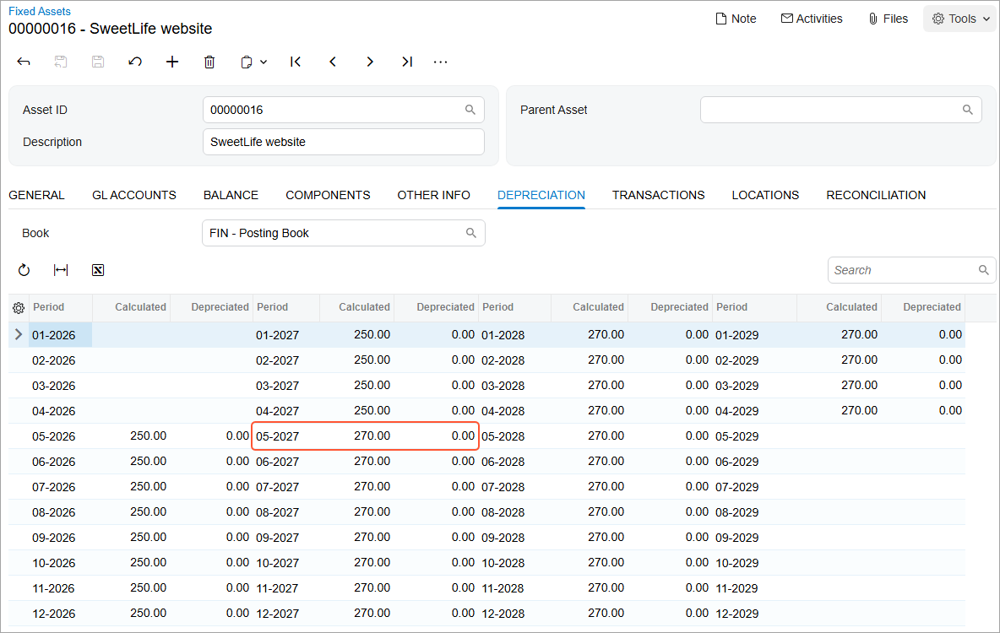
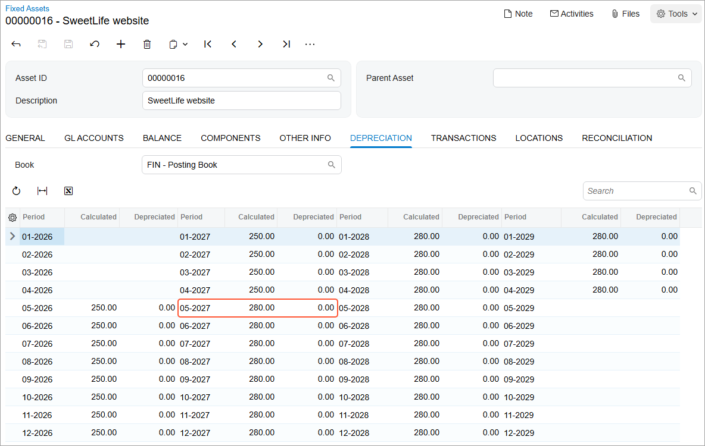
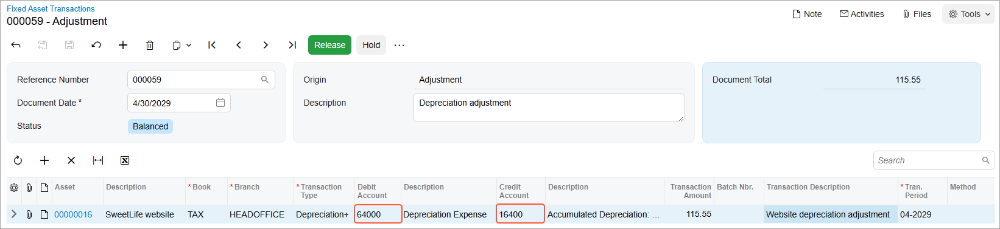

# Depreciation of Additions: Process Activity {#_2ee6ec64-a069-45de-a1f5-3ef5acbc5773 .task}

The following activity will walk you through the process of performing full depreciation of an addition to a fixed asset.

## Story {#section_hcg_ljv_vxb .section}

Suppose that on May 2, 2027, SweetLife Fruits &amp; Jams paid for the additional search engine optimization of the website. The company’s management has decided to capitalize these expenses.

To capitalize the additional site optimization, acting as a SweetLife accountant, you need to make an addition to the fixed asset for the website; the addition should be made on the start of the second year of website usage. Then you need to calculate depreciation for the entire useful life of the asset. To make the asset's net value in the *FIN* book 0 at the end of the useful life, you need to switch the depreciation method for this particular asset to the *Remaining Value* method. After that, you need to completely depreciate the website asset in two books and make a depreciation adjustment for the *TAX* book.

## Configuration Overview {#section_tz4_djx_cnb .section}

In the *U100* dataset, the following tasks have been performed to support this activity:

-   On the [Enable/Disable Features](CS_10_00_00.md) \(CS100000\) form, the *Fixed Asset Management* feature has been enabled.
-   On the [Chart of Accounts](GL_20_25_00.md) \(GL202500\) form, the needed GL accounts have been created.
-   On the [Fixed Assets Preferences](FA_10_10_00.md) \(FA101000\) form, the **Automatically Release Depreciation Transactions** check box has been selected.

## Process Overview {#section_lcg_ljv_vxb .section}

In this activity, you will create an AP bill on the [Bills and Adjustments](AP_30_10_00.md) \(AP301000\) form and convert this purchase on the [Convert Purchases to Assets](FA_50_45_00.md) \(FA504500\) form. On the [Fixed Assets](FA_30_30_00.md) form, you will calculate depreciation for the *SweetLife website* asset. On the [Calculate Depreciation](FA_50_20_00.md) \(FA502000\) form, you will recalculate depreciation for the fixed asset. Finally, on the [Fixed Asset Transactions](FA_30_10_00.md) \(FA301000\) form, you will create and release a depreciation adjustment transaction.

## System Preparation {#section_ncg_ljv_vxb .section}

Before you begin performing the full depreciation of an addition to a fixed asset, do the following:

1.  Launch the Acumatica ERP website with the *U100* dataset preloaded, and sign in as an accountant by using the *johnson* username and the *123* password.
2.  In the info area, in the upper-right corner of the top pane of the Acumatica ERP screen, click the Business Date menu button, and select *5/2/2027* on the calendar.
3.  In the company to which you are signed in, be sure that you have implemented the fixed asset functionality by performing the following prerequisite activities: [Fixed Assets: To Set Up the System for Fixed Asset Management](../ImplementationGuide/config_FixedAssets_Implem_Activity_System.md), [Fixed Assets: To Configure the Fixed Asset Functionality](../ImplementationGuide/config_FixedAssets_Implem_Activity_FixedAssets_Subledger.md), and [Fixed Assets: To Create Fixed Asset Classes](../ImplementationGuide/config_FixedAssets_Implem_Activity_FixedAsset_Classes.md).
4.  Make sure that you have created the fixed assets by performing the following prerequisite activities: [Conversion of a Purchase: To Convert a Purchase to an Asset](FixedAssets_Converting_Purchase_To_Convert_to_Asset.md), [Conversion of a Purchase: To Convert a Purchase to Multiple Assets](FixedAssets_Converting_Purchase_To_Convert_to_Multiple_Assets.md), [Fixed Asset Creation: To Create and Reconcile an Asset](FixedAssets_Adding_Fixed_Asset_To_Create_Fixed_Asset.md), [Fixed Asset Creation: To Create an Asset with Multiple Units](FixedAssets_Adding_Fixed_Asset_To_Add_FA_with_Multiple_Units.md), and [Non-Default Asset Settings: Process Activity](FixedAssets_Changing_Default_Settings_Process_Activity.md).
5.  Make sure that you have created the *SweetLife website* fixed asset and calculated its depreciation in two books by performing the [Asset Depreciation: To Calculate Depreciation in Two Books](FixedAssets_Depreciation_Perform_Depr_in_Two_Books.md) prerequisite activity.
6.  On the Company and Branch Selection menu on the top pane of the Acumatica ERP screen, select the *SweetLife Head Office and Wholesale Center* branch.

## Step 1: Updating the Fixed Asset Preferences {#section_pcg_ljv_vxb .section}

To update the fixed asset preferences, do the following:

1.  Open the [Fixed Assets Preferences](FA_10_10_00.md) \(FA101000\) form.
2.  In the **Depreciation History View** box \(**Other** section\), select *By Book*.
3.  On the form toolbar, click **Save** to save your changes.

## Step 2: Calculating Depreciation with the *Remaining Value* Method {#section_rcg_ljv_vxb .section}

To create an addition to the fixed asset and calculate its depreciation with the *Remaining Value* method, do the following:

1.  On the [Bills and Adjustments](AP_30_10_00.md) \(AP301000\) form, add a new record.
2.  In the Summary area, specify the following settings for the new record:
    -   **Type**: *Bill*
    -   **Vendor**: *BLUELINE*
    -   **Date**: *5/2/2027* \(inserted automatically\)
    -   **Post Period**: *05-2027* \(inserted automatically\)
    -   **Description**: `Website optimization`
3.  On the **Details** tab, click **Add Row** on the table toolbar, and specify the following settings in the added row:
    -   **Branch**: *HEADOFFICE*
    -   **Transaction Descr.**: `Website optimization`
    -   **Ext. Cost**: `720`
    -   **Account**: *15010 \(Accrued Purchases: Fixed Assets\)*
4.  On the form toolbar, click **Remove Hold** and then click **Release** to release the AP bill.
5.  Open the [Convert Purchases to Assets](FA_50_45_00.md) \(FA504500\) form.
6.  In the **Account** box, make sure that *15010* is selected.
7.  In the **Purchase Transactions** table, select the unlabeled check box in the row with the **Orig. Amount** set to *720*.
8.  In the **Fixed Assets** table, do the following:
    1.  Click **Add Row** on the table toolbar.
    2.  In the table, clear the **Create Asset** check box for the new row.
    3.  In the **Asset ID** column of the row, select *SweetLife website*; leave the other settings of the row unchanged.
9.  Click **Process** on the form toolbar to make the addition.
10. On the [Fixed Assets](FA_30_30_00.md) \(FA303000\) form, open the *SweetLife website* fixed asset.
11. On the More menu, click **Calculate Depreciation**.
12. Review the **Depreciation** tab, as shown in the following screenshot.

    

    When you are depreciating a fixed asset with an addition, the depreciation amount is calculated as follows:

    -   Before the addition is made, the system calculates depreciation based on the cost of the original asset. For the *SweetLife website* asset for the periods before the addition \(from 05-2026 through 04-2027\), the calculated depreciation in the *FIN* book is $250 \($9000 / 36\).
    -   Starting from the date when the addition was made \(5/2/2027\), the depreciation for the period is calculated as the sum of the depreciation of the original asset plus the depreciation of the addition calculated for the period. The addition is depreciated as if it is a separate asset acquired on the addition date, with the basis equal to the addition cost \($720\) and the same depreciation method and recovery period that the original asset has. In the *FIN* book, the addition is depreciated using the *SL \(Straight-Line\)* method, so the cost of the addition is spread among 36 months; the calculated depreciation expense for the addition is $20 \($720 / 36\) per month.
    Thus, the resulting depreciation expenses in the *FIN* book for each period from 05-2027 through 04-2029 total $270 \($250 + $20\). The addition amount is not completely depreciated at the end of the useful life of the asset, because the addition period is later than the asset's acquisition period. At the end of the recovery period of the asset \(04-2029\), the addition is depreciated by $480 \($20 \* 24\). That is, the addition's net value of $240 \($720 – 24 \* $20\) will be undepreciated at the end of the life of the asset.

    To completely recover the cost of the addition during the rest of the useful life of the original asset, you can change the *Straight-Line* method to the *Remaining Value* method for this particular asset.

13. On the **Balance** tab, select *RV* in the **Depreciation Method** column for the first row.
14. Save your changes.

    This will make the system fully depreciate the additions until the end of the recovery period of this fixed asset.

15. On the More menu, click **Calculate Depreciation**.
16. Review the **Depreciation** tab \(see the screenshot below\). Because the system fully depreciates the addition through 24 months \(from 05-2027 through 04-2029\), the depreciation expenses for the addition are $30 \($720 / 24\), and the total depreciation expenses are $280 per month. At the end of the asset's life, the entire cost of the asset and the asset addition will be fully depreciated.

    

## Step 3: Fully Depreciating the Fixed Asset {#section_xcg_ljv_vxb .section}

To depreciate the *SweetLife website* asset through its entire life, do the following:

1.  Open the [Calculate Depreciation](FA_50_20_00.md) \(FA502000\) form.
2.  In the **To Period** box, select *05-2029*, and in the **Action** box, select *Depreciate*.

    Notice that you have two records for the *SweetLife website* asset in the table: one for the *FIN* book, and the other for the *TAX* book.

3.  Select the check boxes in the rows of both records for the *SweetLife website* asset in the table to generate depreciation transactions for both books.
4.  On the form toolbar, click **Process**.

    The system generates depreciation transactions for both books for all periods, from the asset being placed into service through the end of its useful life. The generated transactions are automatically released, because the **Automatically Release Depreciation Transactions** check box is selected on the [Fixed Assets Preferences](FA_10_10_00.md) \(FA101000\) form.

5.  Open the [FA Balance](FA_63_00_00.md) \(FA630000\) report form.
6.  On the **Report Parameters** tab, clear the **Book** box.
7.  On the report form toolbar, click **Run Report**.
8.  Review the generated report.

    The *SweetLife website* asset's balance now has the *Fully Depreciated* status for both books. This means that the asset was depreciated through all the periods of its useful life. The status of the asset on the **General** tab of the [Fixed Assets](FA_30_30_00.md) \(FA303000\) form is also *Fully Depreciated*.

    As you can see, the net value of the *SweetLife website* asset is $0.00 in the *FIN* book. In the *TAX* book, you have a small undepreciated expense of $115.55, which is the undepreciated amount of the addition that has been done on 5/2/2027. You can depreciate this amount manually by making an adjustment transaction.

## Step 4: Making a Depreciation Adjustment {#section_cdg_ljv_vxb .section}

To manually create a depreciation adjustment transaction, do the following:

1.  Open the [Fixed Asset Transactions](FA_30_10_00.md) \(FA301000\) form.
2.  On the form toolbar, click **Add New Record**, and specify the following settings in the Summary area:
    -   **Document Date**: *4/30/2029*
    -   **Description**: `Depreciation adjustment`
3.  Click **Add Row** on the table toolbar, and specify the following settings in the added row:
    -   **Asset**: *SweetLife website*
    -   **Book**: *TAX*
    -   **Transaction Type**: *Depreciation+*
    -   **Transaction Amount**: `115.55`
    -   **Transaction Description**: `Website depreciation adjustment`
4.  On the form toolbar, click **Save** to save your changes.

    After you select the transaction type, the system automatically populates the needed debit and credit accounts, as shown in the following screenshot.

    

5.  On the form toolbar, click **Release** to release the transaction.
6.  On the [FA Balance](FA_63_00_00.md) \(FA630000\) report form, clear the **Book** box on the **Report Parameters** tab.
7.  Click **Run Report** on the report form toolbar.
8.  Review the generated report. The net value of the *SweetLife website* asset is now $0.00 in both books.

**Parent topic:**[Depreciating Additions to Fixed Assets](../UserGuide/FixedAssets_Depreciating_Additions_Mapref.md)

