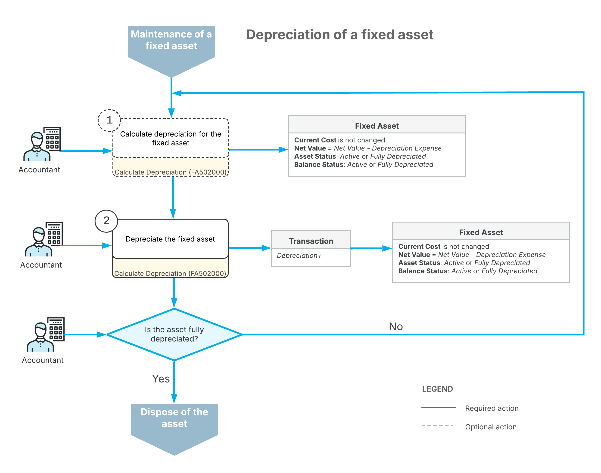

# Asset Depreciation: General Information {#_9c65de10-b4a6-4076-bb17-5a0fc133b42c .concept}

A fixed asset's lifecycle differs slightly depending on whether it has been depreciated. You depreciate fixed assets to match the expense recognition for an asset to the revenue generated by that asset.

**Tip:** Some assets, such as land and some intangibles, have an infinite useful life and are not depreciated; these are called *non-depreciable* assets.

You can calculate the depreciation and depreciate an asset only after you have released the fixed asset transactions related to an asset's acquisition. These transactions might include, for example, the *Purchasing+* transaction that the system generates after you have created an asset by using the [Fixed Assets](FA_30_30_00.md) \(FA303000\) form, or the *Purchasing+* and *Reconciliation+* transactions that the system generates after you have created an asset by using the [Convert Purchases to Assets](FA_50_45_00.md) \(FA504500\) form. \(For details on transaction types, see [Types of Fixed Asset Transactions](FA__con_Transaction_Types.md).\)

## Learning Objectives { .section}

In this chapter, you will learn how to do the following:

-   Calculate depreciation for a single fixed asset
-   Depreciate multiple fixed assets
-   Calculate depreciation in two depreciation books

## Applicable Scenarios { .section}

Depreciation is used to spread the cost of an asset over its entire useful service life—that is, the period over which the asset is used. By depreciating a fixed asset, you match the expenses—that is, the asset's cost allocated to the years in which the asset is used—to the revenues earned from using this asset during the asset's useful life.

## Processing the Calculation of Depreciation { .section}

You process the calculation of the depreciation expenses for fixed assets by using the [Calculate Depreciation](FA_50_20_00.md) \(FA502000\) form. On this form, you specify selection criteria for the fixed assets to be listed, and the period to which the depreciation should be calculated. You also specify the action to be performed on the processed fixed assets. To do this, you select one of the following options in the **Action** box:

-   *Calculate Only*: The system calculates depreciation expenses for the processed fixed assets, and generates no transactions. After this processing, you can view the calculated amounts for each processed fixed asset in the **Calculated** column on the **Depreciation** tab of the [Fixed Assets](FA_30_30_00.md) form. You can use these amounts for planning purposes.

-   *Depreciate*: For the processed fixed assets, the system calculates depreciation expenses and generates the *Calculated+* transactions. Once these transactions are released, their type automatically changes to *Depreciation+*. After this processing, you can view the calculated and depreciated amounts for each processed fixed asset in the **Calculated** and **Depreciated** columns on the **Depreciation** tab of the [Fixed Assets](FA_30_30_00.md) form.

    **Tip:** For the *Depreciate* option to be available for selection, make sure that the **Update GL** check box is selected in the **Posting Settings** section on the [Fixed Assets Preferences](FA_10_10_00.md) \(FA101000\) form.

Once you have selected the needed action, you can start processing for all the listed assets or only those you select. You can process all listed fixed assets by clicking **Process All** on the form toolbar. To perform the selected action on only some fixed assets listed in the table, you select the check boxes next to the required assets and then click **Process** on the form toolbar.

You can also calculate depreciation for a particular fixed asset on the [Fixed Assets](FA_30_30_00.md) form. On this form, you select the required asset, and on the More menu \(under **Processing**\), you click **Calculate Depreciation**. No transactions are generated with this process. To depreciate the asset, you need to use the [Calculate Depreciation](FA_50_20_00.md) form.

The system prevents the depreciation of assets with the *Straight-Line* calculation method and the *Full Period* or *Full Day* averaging convention, because if the asset had additions, the asset's **Net Value** specified on the **Balance** tab of the [Fixed Assets](FA_30_30_00.md) \(FA303000\) form may not be equal to *0*, although the net value is expected to be *0*. Thus, the system excludes from depreciation the lines corresponding to the asset's book that has the following settings:

-   The *Straight-Line* calculation method with the *Full Period* or *Full Day* averaging convention
-   The **Accelerated Depreciation for SL Depr. Method** check box selected for the depreciation method on the [Fixed Asset Classes](FA_20_10_00.md) \(FA201000\) form
-   At least one addition was created outside of the period specified in the **Depr. From Period** column on the **Balance** tab of the [Fixed Assets](FA_30_30_00.md) \(FA303000\) form

To depreciate such assets with the *Straight-Line* calculation method and the *Full Period* or *Full Day* averaging convention, you should change the depreciation method to a method based on the *Remaining Value* calculation method on the **Balance** tab of the [Fixed Assets](FA_30_30_00.md) \(FA202500\) form.

## Depreciation Calculation in Multiple Books { .section}

If a fixed asset belongs to an asset class with multiple books, you can calculate depreciation of this fixed asset in all these books at once.

A fixed asset can be assigned to only the depreciation books that are assigned to the class to which this fixed asset belongs. If you create a new book and the asset class for it has already been created, you have to assign the newly created book to this class \(and, optionally, other existing classes\) manually.

If you create a new class after you have defined a new book, the system will automatically assign this new class to all books defined in the system. If needed, you can remove any specified book from the settings of the fixed asset class.

You calculate depreciation in multiple books by selecting the needed asset on the [Fixed Assets](FA_30_30_00.md) \(FA303000\) form and clicking **Calculate Depreciation** on the More menu.

The system displays the calculated depreciation on the **Depreciation** tab of this form.

## Depreciation History { .section}

You can view the depreciation history of an asset on the **Depreciation** tab of the [Fixed Assets](FA_30_30_00.md) \(FA303000\) form. You can view an asset's depreciation history differently, depending on the **Depreciation History View** option selected on the [Fixed Assets Preferences](FA_10_10_00.md) \(FA101000\) form:

-   If the *By Book* option is selected, you can filter depreciation history by book. In this case, you select a book to display its information on the form. The depreciation history is a table that has years as columns and periods per year as rows.
-   If the *Side by Side* option is selected, all the books to which the asset is assigned are displayed simultaneously. In this case, depreciation history is represented as a table with depreciation periods as rows and books as columns.

## Suspending of Depreciation { .section}

Sometimes it is necessary to stop calculating the depreciation of a fixed asset for some number of financial periods. In this case, you can suspend the depreciation of the asset. Suspension stops depreciation; then when you restart depreciation, the system resumes depreciation calculation and extends the asset life for the number of periods the asset has been suspended to ensure full depreciation. Suspension can be used if, for example, some asset is not used \(but is not disposed of\) and becomes temporarily inactive.

In Acumatica ERP, you can suspend an asset with the *Active* status starting from the current business date. After you suspend an asset, the system stops posting the depreciation transactions to the books, thus suspending the depreciation process. The asset status is changed to *Suspended*.

The system generates a line to the asset depreciation history for suspended assets with the amount of *0* for each period that you did not depreciate. You can view the history of asset depreciation on the **Depreciation** tab of the [Fixed Assets](FA_30_30_00.md) \(FA303000\) form.

To start the depreciating the asset again, you resume the depreciation of the asset starting at the beginning of the financial period you specified.

## Workflow of Fixed Asset Depreciation { .section}

The following diagram shows the process of depreciating a fixed asset.

As the diagram shows, the depreciation of a fixed asset involves these steps:

1.  When the asset has been placed in use, you start to depreciate the fixed asset on the [Calculate Depreciation](FA_50_20_00.md) \(FA502000\) form. Optionally, you can first calculate depreciation for the asset by selecting *Calculate Only* in the **Action** box of the form. The calculated depreciation will be shown in the **Calculated** column on the **Depreciation** tab of the [Fixed Assets](FA_30_30_00.md) \(FA303000\) form.
2.  You depreciate the fixed asset on the [Calculate Depreciation](FA_50_20_00.md) form by selecting *Depreciate* in the **Action** box, selecting the asset in the table, and clicking **Process**.

    You can depreciate fixed assets by using different depreciation methods for different depreciation books. If the asset has been fully depreciated in a book through its entire life, its balance is assigned the *Fully Depreciated* status in this book. You repeat these steps as needed until it is time to dispose of the asset.

**Parent topic:**[Depreciating Fixed Assets](../UserGuide/FixedAssets_Depreciation_Mapref.md)

