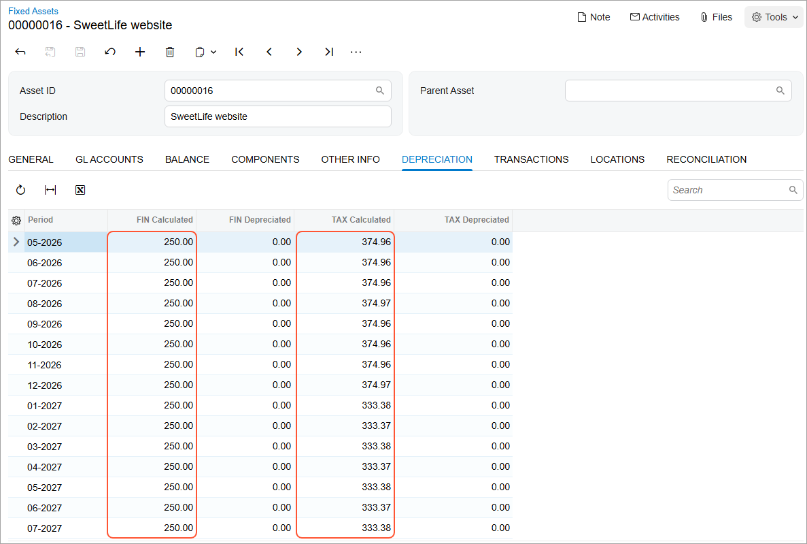

# Asset Depreciation: To Calculate Depreciation in Two Books {#_65463fbf-a8d4-4591-ae67-ea794fad983a .task}

The following activity will walk you through the process of depreciating fixed assets by using two depreciation books.

## Story { .section}

Suppose that on May 2, 2026, SweetLife Fruits &amp; Jams paid $9,000 to Blueline Advertisement for the development of a new website. You want to process the website as a new fixed asset of the *SOFTWARE* type and depreciate it through three years. For the company's internal accounting, you want to use the straight-line depreciation method, and for tax reporting, you want to depreciate the asset by using the *MACRS3-Y* method.

To be able to depreciate the fixed asset with two different methods at the same time, acting as a SweetLife accountant, you need to create a separate book to be used for taxes and depreciate this asset in two books.

## Configuration Overview {#section_tz4_djx_cnb .section}

In the *U100* dataset, the following tasks have been performed to support this activity:

-   On the [Enable/Disable Features](CS_10_00_00.md) \(CS100000\) form, the *Fixed Asset Management* feature has been enabled.
-   On the [Chart of Accounts](GL_20_25_00.md) \(GL202500\) form, the needed GL accounts have been created.
-   On the [Fixed Assets Preferences](FA_10_10_00.md) \(FA101000\) form, the **Automatically Release Depreciation Transactions** check box has been cleared.

## Process Overview { .section}

In this activity, you will create a non-posting book on the [Books](FA_20_50_00.md) \(FA205000\) form, generate a calendar on the [Book Calendars](FA_30_40_00.md) \(FA206000\) form, and generate years for the calendar on the [Generate Book Calendars](FA_50_10_00.md) \(FA501000\) form. On the [Fixed Asset Classes](FA_20_10_00.md) \(FA201000\) form, you will update the *SOFTWARE* asset class by adding the non-posting book to it.

On the [Bills and Adjustments](AP_30_10_00.md) \(AP301000\) form, you will create a purchase of the website; then you will convert this purchase to a fixed asset on the [Convert Purchases to Assets](FA_50_45_00.md) \(FA504500\) form. Finally, on the [Fixed Assets](FA_30_30_00.md) \(FA303000\) form, you will calculate depreciation of the fixed asset in the posting book and non-posting book.

## System Preparation { .section}

Before you begin calculating the depreciation of an asset in two books, do the following:

1.  Launch the Acumatica ERP website with the *U100* dataset preloaded, and sign in as an accountant by using the *johnson* username and the *123* password.
2.  In the info area, in the upper-right corner of the top pane of the Acumatica ERP screen, click the Business Date menu button, and select *5/2/2026* on the calendar.
3.  In the company to which you are signed in, be sure that you have implemented the fixed asset functionality by performing the following prerequisite activities: [Fixed Assets: To Set Up the System for Fixed Asset Management](../ImplementationGuide/config_FixedAssets_Implem_Activity_System.md), [Fixed Assets: To Configure the Fixed Asset Functionality](../ImplementationGuide/config_FixedAssets_Implem_Activity_FixedAssets_Subledger.md), and [Fixed Assets: To Create Fixed Asset Classes](../ImplementationGuide/config_FixedAssets_Implem_Activity_FixedAsset_Classes.md).
4.  Make sure that you have created the fixed assets by performing the following prerequisite activities: [Conversion of a Purchase: To Convert a Purchase to an Asset](FixedAssets_Converting_Purchase_To_Convert_to_Asset.md), [Conversion of a Purchase: To Convert a Purchase to Multiple Assets](FixedAssets_Converting_Purchase_To_Convert_to_Multiple_Assets.md), [Fixed Asset Creation: To Create and Reconcile an Asset](FixedAssets_Adding_Fixed_Asset_To_Create_Fixed_Asset.md), [Fixed Asset Creation: To Create an Asset with Multiple Units](FixedAssets_Adding_Fixed_Asset_To_Add_FA_with_Multiple_Units.md), and [Non-Default Asset Settings: Process Activity](FixedAssets_Changing_Default_Settings_Process_Activity.md).
5.  On the Company and Branch Selection menu on the top pane of the Acumatica ERP screen, select the *SweetLife Head Office and Wholesale Center* branch.

## Step 1: Creating a Non-Posting Book { .section}

To create a new book for calculating depreciation for tax reporting and to generate the calendar, do the following:

1.  Open the [Books](FA_20_50_00.md) \(FA205000\) form.
2.  On the form toolbar, click **Add Row** on the table toolbar, and specify the following settings in the added row:
    -   **Book ID**: `TAX`
    -   **Description**: `Tax Book`
    -   **Posting Book**: Cleared
    -   **Mid-Period Type**: *Fixed Day*
    -   **Mid-Period Day**: `15`
3.  On the form toolbar, click **Save** to save your changes.
4.  On the form toolbar, click **Calendar Setup**.
5.  On the [Book Calendars](FA_30_40_00.md) \(FA206000\) form, which the system has opened, enter *1/1/2026* in the **Year Starts On** box, leave *Month* in the **Period Type** box, and click **Create Periods** on the form toolbar.

    The calendar for the year 2026 is set up.

    **Attention:** The calendar generated for the tax book can differ from the posting book calendar and does not have to match the general ledger calendar.

6.  On the form toolbar, click **Save** to save your changes.
7.  Open the [Generate Book Calendars](FA_50_10_00.md) \(FA501000\) form.
8.  In the **From Year** box, enter *2026*, and in the **To Year** box, enter `2030`.
9.  Select the unlabeled check box in the row of the *TAX* book, and click **Process** on the form toolbar. The system generates the calendar for the *TAX* book from 2026 through 2030.

## Step 2: Updating the Settings of the Fixed Asset Class { .section}

To depreciate a fixed asset in two books, you must assign the corresponding fixed asset class to both books. Because the *SOFTWARE* fixed asset class has already been created, you need to update its settings and assign it to the new depreciation book. Do the following:

1.  On the [Fixed Asset Classes](FA_20_10_00.md) \(FA201000\) form, open the *SOFTWARE* fixed asset class.
2.  On the **Depreciation** tab, click **Add Row** on the table toolbar, and specify the following settings in the row:
    -   **Book**: *TAX*
    -   **Posting Book**: Cleared
    -   **Class Method**: *MACRS3-Y*
    -   **Useful Life, Years**: `3`
    -   **Averaging Convention**: *Mid Year*
3.  On the form toolbar, click **Save** to save your changes.

## Step 3: Creating a Fixed Asset for the Website { .section}

To create a fixed asset for the website, do the following:

1.  On the [Bills and Adjustments](AP_30_10_00.md) \(AP301000\) form, add a new record.
2.  In the Summary area, specify the following settings for an AP bill:
    -   **Type**: *Bill*
    -   **Vendor**: *BLUELINE*
    -   **Date**: *5/2/2026* \(inserted automatically\)
    -   **Post Period**: *05-2026* \(inserted automatically\)
    -   **Description**: `Website development`
3.  On the **Details** tab, click **Add Row** on the table toolbar, and specify the following settings in the added row:
    -   **Branch**: *HEADOFFICE*
    -   **Transaction Descr.**: `SweetLife website`
    -   **Ext. Cost**: `9000`
    -   **Account**: *15010 \(Accrued Purchases: Fixed Assets\)*
4.  On the form toolbar, click **Remove Hold** and then click **Release** to release the bill.
5.  Open the [Convert Purchases to Assets](FA_50_45_00.md) \(FA504500\) form.
6.  In the Selection area, make sure that *15010* is selected in the **Account** box.
7.  In the **Purchase Transactions** table, in the row with the **Orig. Amount** set to *9,000*, do the following:
    1.  In the **Asset Class** column, select *SOFTWARE*.
    2.  In the **Department** column, select *ADMIN*.
    3.  Select the unlabeled check box for the row.
8.  On the form toolbar, click **Process** to convert the purchase to an asset.
9.  On the [Fixed Assets](FA_30_30_00.md) \(FA303000\) form, select the *SweetLife website* fixed asset.
10. On the **Balance** tab, review the settings for both books. The **Balance** tab displays the settings of the fixed asset and the actual balance for each book.
11. On the **Transactions** tab, review the generated transactions.

    The system has generated a pair of reconciliation and acquisition transactions for each book. All transactions were released automatically, because the **Automatically Release Acquisition Transactions** check box is selected on the [Fixed Assets Preferences](FA_10_10_00.md) \(FA101000\) form. The transactions generated for the *TAX* book are not posted to the general ledger, so they do not have batch numbers specified in the **Batch Nbr.** column.

## Step 4: Updating the Fixed Asset Preferences { .section}

To update the fixed asset preferences, do the following:

1.  Open the [Fixed Assets Preferences](FA_10_10_00.md) \(FA101000\) form.
2.  Select the **Automatically Release Depreciation Transactions** check box to cause future depreciation transactions to be released automatically after they are generated.
3.  In the **Depreciation History View** box \(**Other** section\), select *Side by Side*.

    This option specifies the way the depreciation history is displayed on the **Depreciation** tab of the [Fixed Assets](FA_30_30_00.md) \(FA303000\) form. With *Side by Side* selected, the system shows the calculated and depreciated amounts for all configured books in separate columns.

4.  On the form toolbar, click **Save**.

## Step 5: Calculating Depreciation in Two Books { .section}

To calculate depreciation for the *SweetLife website* asset, do the following:

1.  On the [Fixed Assets](FA_30_30_00.md) \(FA303000\) form, open the *SweetLife website* asset.
2.  On the More menu \(under **Processing**\), click **Calculate Depreciation**.
3.  Review the **Depreciation** tab, which is shown in the screenshot below.

    The **FIN Calculated** column displays the depreciation that was calculated for the *FIN* book. Because the book uses the straight-line method, the system spreads the amount of $9,000 across 36 months \(3 years\)—that is, the depreciation expense for each month is $250 \($9,000 / 36 = $250\). The **TAX Calculated** column displays the depreciation that was calculated for the *TAX* book. The system uses a different method of calculating depreciation for the *TAX* book \(*MACRS3-Y*\), so the depreciation expenses differ from those calculated for the *FIN* book.

    

**Parent topic:**[Depreciating Fixed Assets](../UserGuide/FixedAssets_Depreciation_Mapref.md)

