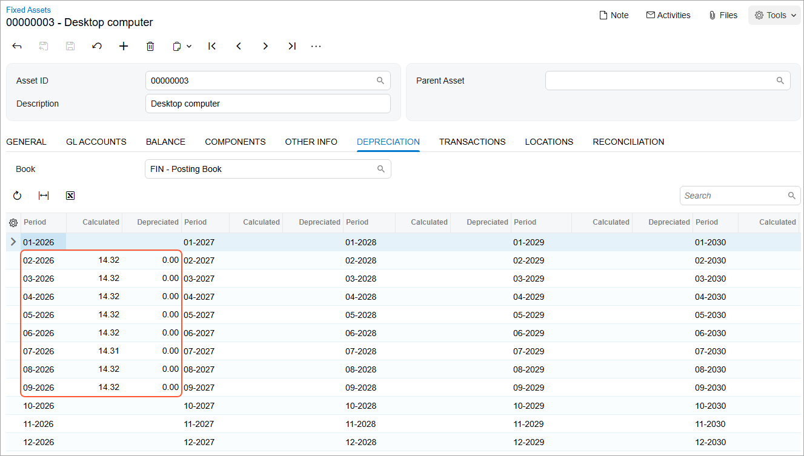

# Asset Depreciation: To Calculate Depreciation {#_25816167-0b49-475a-927c-54d32d5cc1f8 .task}

The following activity will walk you through the process of calculating depreciation for fixed assets.

## Story {#section_xlf_ljv_vxb .section}

Suppose that the fixed assets belonging to SweetLife Fruits &amp; Jams have to be depreciated through September 2026. Acting as a SweetLife accountant, you need to calculate depreciation for the fixed assets that you have created through the specified period.

## Configuration Overview {#section_tz4_djx_cnb .section}

In the *U100* dataset, the following tasks have been performed to support this activity:

-   On the [Enable/Disable Features](CS_10_00_00.md) \(CS100000\) form, the *Fixed Asset Management* feature has been enabled.
-   On the [Chart of Accounts](GL_20_25_00.md) \(GL202500\) form, the needed GL accounts have been created.

## Process Overview {#section_amf_ljv_vxb .section}

In this activity, on the [Calculate Depreciation](FA_50_20_00.md) \(FA502000\) form, you will calculate depreciation for all fixed assets through September 2026. On the [Fixed Assets](FA_30_30_00.md) \(FA303000\) form, you will review the calculated depreciation of one fixed asset. Finally, on the [FA Balance Projection by Account](FA_67_00_10.md) \(FA670010\) form, you will run a report and review the calculated accumulated depreciation and net balance for all fixed assets.

## System Preparation {#section_cmf_ljv_vxb .section}

Before you begin calculating depreciation, do the following:

1.  Launch the Acumatica ERP website with the *U100* dataset preloaded, and sign in as an accountant by using the *johnson* username and the *123* password.
2.  In the info area, in the upper-right corner of the top pane of the Acumatica ERP screen, click the Business Date menu button, and select *9/30/2026* on the calendar.
3.  In the company to which you are signed in, be sure that you have implemented the fixed asset functionality by performing the following prerequisite activities: [Fixed Assets: To Set Up the System for Fixed Asset Management](../ImplementationGuide/config_FixedAssets_Implem_Activity_System.md), [Fixed Assets: To Configure the Fixed Asset Functionality](../ImplementationGuide/config_FixedAssets_Implem_Activity_FixedAssets_Subledger.md), and [Fixed Assets: To Create Fixed Asset Classes](../ImplementationGuide/config_FixedAssets_Implem_Activity_FixedAsset_Classes.md).
4.  Make sure that you have created the fixed assets by performing the following prerequisite activities: [Conversion of a Purchase: To Convert a Purchase to an Asset](FixedAssets_Converting_Purchase_To_Convert_to_Asset.md), [Conversion of a Purchase: To Convert a Purchase to Multiple Assets](FixedAssets_Converting_Purchase_To_Convert_to_Multiple_Assets.md), [Fixed Asset Creation: To Create and Reconcile an Asset](FixedAssets_Adding_Fixed_Asset_To_Create_Fixed_Asset.md), [Fixed Asset Creation: To Create an Asset with Multiple Units](FixedAssets_Adding_Fixed_Asset_To_Add_FA_with_Multiple_Units.md), and [Non-Default Asset Settings: Process Activity](FixedAssets_Changing_Default_Settings_Process_Activity.md).
5.  Make sure that you have split the *Land* fixed asset by performing the [Splitting of Assets: Process Activity](FixedAssets_Splitting_Process_Activity.md) prerequisite activity.
6.  On the Company and Branch Selection menu on the top pane of the Acumatica ERP screen, select the *SweetLife Head Office and Wholesale Center* branch.

## Step: Calculating Depreciation {#section_emf_ljv_vxb .section}

To calculate depreciation for fixed assets, do the following:

1.  Open the [Calculate Depreciation](FA_50_20_00.md) \(FA502000\) form.
2.  In the Selection area, specify the following settings:
    -   **Company/Branch**: *HEADOFFICE*
    -   **Book**: *FIN*
    -   **To Period**: *09-2026* \(inserted automatically\)

        This is the financial period through which the system will calculate depreciation.

    -   **Action**: *Calculate Only*

        When the system performs this action, it will not generate depreciation transactions.

3.  On the form toolbar, click **Process All**. The system calculates depreciation through the specified period for each fixed asset.
4.  On the [Fixed Assets](FA_30_30_00.md) \(FA303000\) form, open the *Desktop computer* asset and review the **Depreciation** tab, as shown in the following screenshot.

    

    The system calculates depreciation from the period the fixed asset was put into use \(**Depr. from Period** on the **Balance** tab\) through the period you specified in the **To Period** box. The **Depreciated** column currently shows *0.00* for the calculated periods, because no depreciation transactions have been released.

5.  Open the [FA Balance Projection by Account](FA_67_00_10.md) \(FA670010\) report form.
6.  On the **Report Parameters** tab, specify the following settings:
    -   **Company/Branch**: *HEADOFFICE*
    -   **Book**: *FIN \(Posting Book\)*
    -   **Period From**: *02-2026*
    -   **Period To**: *09-2026*
7.  Click **Run Report**, and review the generated report.

    The generated report displays the projection of fixed asset balances for the specified financial periods, grouped by account-subaccount pairs. The calculated accumulated depreciation is also shown on the report.

**Parent topic:**[Depreciating Fixed Assets](../UserGuide/FixedAssets_Depreciation_Mapref.md)

