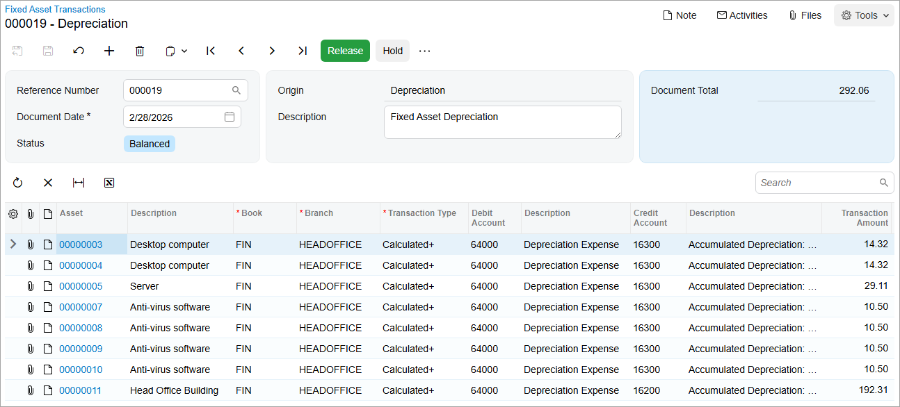
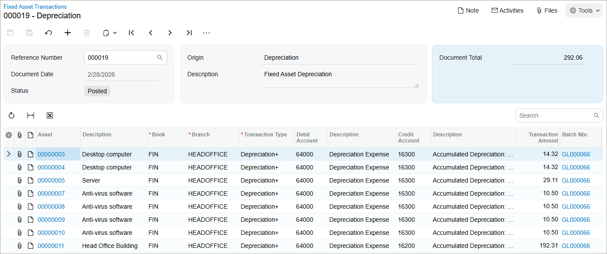

# Asset Depreciation: To Depreciate Assets {#_50ddea02-195e-43b1-af68-ed2cc6f83aab .task}

The following activity will walk you through the process of depreciating fixed assets.

## Story {#section_bnf_ljv_vxb .section}

Suppose that the accountant of SweetLife Fruits &amp; Jams has calculated the depreciation of the company's fixed assets through September 2026 and made sure that the calculation is correct. Acting as the SweetLife accountant, you need to depreciate the fixed assets through February 2026.

## Configuration Overview {#section_tz4_djx_cnb .section}

In the *U100* dataset, the following tasks have been performed to support this activity:

-   On the [Enable/Disable Features](CS_10_00_00.md) \(CS100000\) form, the *Fixed Asset Management* feature has been enabled.
-   On the [Chart of Accounts](GL_20_25_00.md) \(GL202500\) form, the needed GL accounts have been created.
-   On the [Fixed Assets Preferences](FA_10_10_00.md) \(FA101000\) form, the **Automatically Release Depreciation Transactions** check box has been cleared. Depreciation transactions are created with the *On Hold* status and you will have to release these transactions manually on the [Release FA Transactions](FA_50_30_00.md) \(FA503000\) form.

## Process Overview {#section_enf_ljv_vxb .section}

In this activity, you will depreciate fixed assets on the [Calculate Depreciation](FA_50_20_00.md) \(FA502000\) form. On the [Release FA Transactions](FA_50_30_00.md) \(FA503000\) form, you will release the depreciation transactions. On the [Fixed Assets](FA_30_30_00.md) \(FA303000\) form, you will review the depreciation amount for one of the assets.

## System Preparation {#section_gnf_ljv_vxb .section}

Before you begin depreciating fixed assets, do the following:

1.  Launch the Acumatica ERP website with the *U100* dataset preloaded, and sign in as an accountant by using the *johnson* username and the *123* password.
2.  In the info area, in the upper-right corner of the top pane of the Acumatica ERP screen, click the Business Date menu button, and select *2/28/2026* on the calendar.
3.  In the company to which you are signed in, be sure that you have implemented the fixed asset functionality by performing the following prerequisite activities: [Fixed Assets: To Set Up the System for Fixed Asset Management](../ImplementationGuide/config_FixedAssets_Implem_Activity_System.md), [Fixed Assets: To Configure the Fixed Asset Functionality](../ImplementationGuide/config_FixedAssets_Implem_Activity_FixedAssets_Subledger.md), and [Fixed Assets: To Create Fixed Asset Classes](../ImplementationGuide/config_FixedAssets_Implem_Activity_FixedAsset_Classes.md).
4.  Make sure that you have created the fixed assets by performing the following prerequisite activities: [Conversion of a Purchase: To Convert a Purchase to an Asset](FixedAssets_Converting_Purchase_To_Convert_to_Asset.md), [Conversion of a Purchase: To Convert a Purchase to Multiple Assets](FixedAssets_Converting_Purchase_To_Convert_to_Multiple_Assets.md), [Fixed Asset Creation: To Create and Reconcile an Asset](FixedAssets_Adding_Fixed_Asset_To_Create_Fixed_Asset.md), [Fixed Asset Creation: To Create an Asset with Multiple Units](FixedAssets_Adding_Fixed_Asset_To_Add_FA_with_Multiple_Units.md), and [Non-Default Asset Settings: Process Activity](FixedAssets_Changing_Default_Settings_Process_Activity.md).
5.  Make sure that you have split the *Land* fixed asset by performing the [Splitting of Assets: Process Activity](FixedAssets_Splitting_Process_Activity.md) prerequisite.
6.  On the Company and Branch Selection menu on the top pane of the Acumatica ERP screen, select the *SweetLife Head Office and Wholesale Center* branch.

## Step 1: Depreciating Fixed Assets {#section_inf_ljv_vxb .section}

To depreciate fixed assets, do the following:

1.  Open the [Calculate Depreciation](FA_50_20_00.md) \(FA502000\) form.
2.  In the Selection area, specify the following settings:
    -   **Company/Branch**: *HEADOFFICE*
    -   **Book**: *FIN \(Posting Book\)*
    -   **To Period**: *02-2026* \(inserted automatically\)

        This is the financial period through which the system will depreciate assets.

    -   **Action**: *Depreciate*

        When the system performs this action, it will calculate depreciation and generate depreciation transactions.

3.  On the form toolbar, click **Process All**. For each asset in the table, the system calculates depreciation through the specified period and generates the depreciation transaction, which is not released yet.

## Step 2: Releasing the Depreciation Transactions {#section_mnf_ljv_vxb .section}

To release the generated depreciation transactions, do the following:

1.  Open the [Release FA Transactions](FA_50_30_00.md) \(FA503000\) form.
2.  Click the link in the **Reference Number** column for the only row displayed in the table.
3.  On the [Fixed Asset Transactions](FA_30_10_00.md) \(FA301000\) form, which the system has opened, review the entries of the fixed asset transaction generated for the 02-2026 period, as shown in the following screenshot.

    

    The generated fixed asset transaction includes entries of the *Calculated+* type—one for each fixed asset for the *02-2026* period.

4.  On the form toolbar, click **Release**.

    The system has released and posted the fixed asset transaction and displayed the corresponding GL batch number in the **Batch Nbr.** column for each depreciation entry, as the following screenshot shows. The type of each entry was changed from *Calculated+* to *Depreciation+* as these entries were posted. Each *Depreciation+* entry debits the Depreciation Expense account \(*64000*\) in the amount of the depreciation calculated for the period for the particular asset, and credits the Accumulated Depreciation contra account specified for the fixed asset in the same amount.

    

## Step 3: Reviewing a Depreciated Fixed Asset {#section_qnf_ljv_vxb .section}

To review a depreciated fixed asset, do the following:

1.  On the [Fixed Assets](FA_30_30_00.md) \(FA303000\) form, open the *Head Office Building* asset.
2.  Review the **Depreciation** tab.

    The **Calculated** column shows the calculated depreciation for the 02-2026 period. Because the depreciation transaction was released for 02-2026, the **Depreciated** column shows the actual depreciation amount.

**Parent topic:**[Depreciating Fixed Assets](../UserGuide/FixedAssets_Depreciation_Mapref.md)

