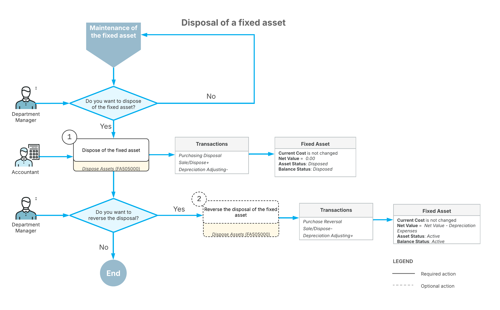

# Asset Disposal: General Information {#_13375671-0b2a-4ca1-be77-f2454834efc0 .concept}

Acumatica ERP supports a variety of fixed asset disposal methods, and you can dispose of assets individually or through mass processing. Acumatica ERP updates the appropriate GL accounts as a result of disposal.

If necessary, you can reverse disposal.

## Learning Objectives {#section_rv2_ljv_vxb .section}

In this chapter, you will learn how to do dispose of a single fixed asset.

## Applicable Scenarios {#section_tv2_ljv_vxb .section}

You dispose of a fixed asset in the following cases:

-   The asset reached the end of its useful life.
-   The asset has a reduced productivity at the end of its life.
-   The asset has been sold.

## Disposal Methods {#section_vv2_ljv_vxb .section}

As a first step, you configure the disposal methods; then you select the required disposal method when you dispose of an asset. For an example that demonstrates the configuration of disposal methods, see [Fixed Assets: To Configure the Fixed Asset Functionality](../ImplementationGuide/config_FixedAssets_Implem_Activity_FixedAssets_Subledger.md).

## Asset Disposal {#section_xv2_ljv_vxb .section}

You can dispose of fixed assets in either of the following ways:

-   To dispose of an individual asset, you generally use the [Fixed Assets](FA_30_30_00.md) \(FA303000\) form. Alternatively, you can use the [Asset Summary](FA_40_20_00.md) \(FA402000\) form.
-   To perform mass disposal of assets with the same disposal method \(or dispose of a single asset\), you use the [Dispose Assets](FA_50_50_00.md) \(FA505000\) form.

The status of the disposed asset is changed from *Active* to *Disposed*. After asset disposal, the system automatically displays the following information on the **General** tab of the [Fixed Assets](FA_30_30_00.md) form: the date of disposal, the disposal method, and the proceeds amount from the disposal of the asset.

## Updated GL Accounts as a Result of Fixed Asset Disposal {#section_aw2_ljv_vxb .section}

When a fixed asset is disposed of, the system records the proceeds from the disposal, as well as any gain or loss in its disposal. The system generates *Sales/Disposal+*, *Depreciation Adjusting–*, and *Purchasing Disposal* transactions. Generally, the accounting transactions can be illustrated as follows.

|Account|Debit|Credit|
|-------|-----|------|
|Gain Account / Loss account|0.00 or loss amount \(book value – proceeds amount, if the book value is greater than the proceeds amount\)|Gain amount \(proceeds amount – book value, if the book value is smaller than the proceeds amount\) or 0.00|
|Fixed Assets account|0.00|Acquisition cost|
|Accumulated Depreciation account|Accumulated depreciation amount|0.00|
|Proceeds account|Proceeds amount|0.00|

The gain or loss is calculated and recorded in the Gain Account or Loss account. To calculate the gain or loss amount, the system deducts the accumulated depreciation amount plus the salvage amount from the acquisition cost and compares the calculated amount with the proceeds from disposal. If there is a gain on disposal, the Gain account is updated. If there is a loss on disposal, the Loss account is updated.

## Workflow of Fixed Asset Disposal { .section}

The following diagram shows the process of disposing of a fixed asset.

As the diagram shows, the disposal of a fixed asset involves these steps:

1.  On the [Dispose Assets](FA_50_50_00.md) \(FA505000\) form, you dispose of the asset. Reasons for disposal include the sale of the asset, damage to the asset, a reduction of the asset’s productivity, or the asset being taken out of service. After the asset is disposed of, it has a net value of *0.00* and the *Disposed* status.
2.  Optionally, you can reverse the disposal of the fixed asset if you have specified disposal parameters incorrectly or erroneously disposed of the asset. When you reverse disposal, the system reverses the transactions of the disposal. After the reversal of the disposal, the status of the asset changes from *Disposed* to *Active*.

    For details, see [To Reverse Asset Disposal](FA__how_Disposal_Reverse.md).

**Parent topic:**[Disposing of Fixed Assets](../UserGuide/FixedAssets_Disposal_Mapref.md)

