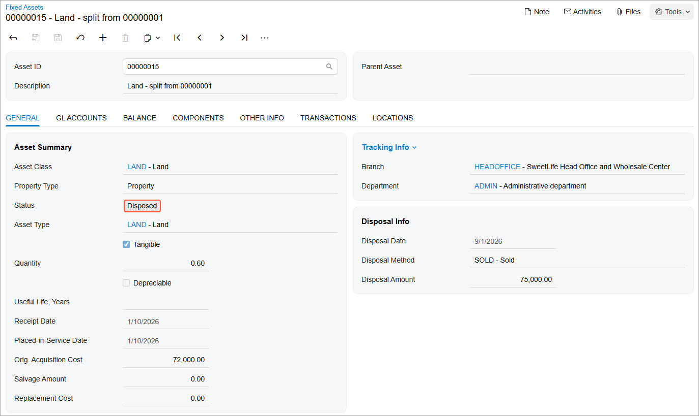

# Asset Disposal: Process Activity {#_79274762-bd4e-4a72-bb70-0ab5624e7e8a .task}

The following activity will walk you through the process of disposing of a fixed asset.

## Story { .section}

Suppose that the management of SweetLife Fruits &amp; Jams has decided to sell a part of the land near the Head Office building for $75,000. After the split of the original *Land* asset, the land near the building is now represented by the *Land - split from 00000001* fixed asset, which has a current cost of $72,000.

To process the sale of the land, acting as a SweetLife accountant, you need to dispose of the fixed asset by using the *SOLD* disposal method, which you created earlier.

## Configuration Overview {#section_tz4_djx_cnb .section}

In the *U100* dataset, the following tasks have been performed to support this activity:

-   On the [Enable/Disable Features](CS_10_00_00.md) \(CS100000\) form, the *Fixed Asset Management* feature has been enabled.
-   On the [Chart of Accounts](GL_20_25_00.md) \(GL202500\) form, the needed GL accounts have been created.
-   On the [Fixed Assets Preferences](FA_10_10_00.md) \(FA101000\) form, the **Automatically Release Disposal Transactions** check box has been cleared. Thus, disposal transactions are created with the *On Hold* status, and you will have to release these transactions manually on the [Release FA Transactions](FA_50_30_00.md) \(FA503000\) form.

## Process Overview { .section}

In this activity, on the [Fixed Assets](FA_30_30_00.md) \(FA303000\) form, you will dispose of a fixed asset and release the disposal transaction on the [Release FA Transactions](FA_50_30_00.md) \(FA503000\) form. On the [Invoices and Memos](AR_30_10_00.md) \(AR301000\) form, you will create an AR invoice to account for the sale of the asset. Finally, on the [Account Summary](GL_40_10_00.md) \(GL401000\) form, you will review the balances of the GL accounts involved in the disposal of the asset.

## System Preparation { .section}

Before you begin disposing of a fixed asset, do the following:

1.  Launch the Acumatica ERP website with the *U100* dataset preloaded, and sign in as an accountant by using the *johnson* username and the *123* password.
2.  In the info area, in the upper-right corner of the top pane of the Acumatica ERP screen, click the Business Date menu button, and select *9/1/2026* on the calendar.
3.  In the company to which you are signed in, be sure that you have implemented the fixed asset functionality by performing the following prerequisite activities:[Fixed Assets: To Set Up the System for Fixed Asset Management](../ImplementationGuide/config_FixedAssets_Implem_Activity_System.md), [Fixed Assets: To Configure the Fixed Asset Functionality](../ImplementationGuide/config_FixedAssets_Implem_Activity_FixedAssets_Subledger.md), and [Fixed Assets: To Create Fixed Asset Classes](../ImplementationGuide/config_FixedAssets_Implem_Activity_FixedAsset_Classes.md).
4.  Make sure that you have created the *Land* fixed asset by converting a purchase by performing the [Conversion of a Purchase: To Convert a Purchase to an Asset](FixedAssets_Converting_Purchase_To_Convert_to_Asset.md) prerequisite activity.
5.  Make sure that you have split the *Land* fixed asset by performing [Splitting of Assets: Process Activity](FixedAssets_Splitting_Process_Activity.md), which is also a prerequisite.
6.  On the Company and Branch Selection menu on the top pane of the Acumatica ERP screen, select the *SweetLife Head Office and Wholesale Center* branch.

## Step 1: Disposing of a Fixed Asset { .section}

To dispose of a fixed asset, do the following:

1.  On the [Fixed Assets](FA_30_30_00.md) \(FA303000\) form, open the *Land - split from 00000001* fixed asset that has the current cost of $72,000.
2.  On the More menu \(under **Processing**\), click **Dispose**.
3.  In the **Disposal Parameters** dialog box, which is opened, specify the following settings:
    -   **Disposal Date**: *9/1/2026* \(inserted automatically\)
    -   **Disposal Period**: *09-2026* \(inserted automatically\)
    -   **Proceeds Amount**: `75000`
    -   **Disposal Method**: *SOLD*
    -   **Proceeds Account**: *11010 \(AR Accrual Account\)* \(inserted automatically\)
    -   **Reason**: `Sold`
4.  Click **OK**. The system generates the disposal transactions, which have not been released yet.
5.  Open the [Release FA Transactions](FA_50_30_00.md) \(FA503000\) form.
6.  Select the unlabeled check box for the only transaction, and click **Release** on the form toolbar.
7.  In the **Processing** dialog box, click **Processed**, and click the link in the **Reference Number** column. On the [Fixed Asset Transactions](FA_30_10_00.md) \(FA301000\) form, which the system has opened, review the disposal transactions that have been generated:
    -   A *Purchasing Disposal* transaction that credits the Fixed Assets account \(*15100*\) in the amount of $72,000 \(the asset's acquisition cost\) and debits the Gain/Loss on Fixed Asset Disposal account \(*90000*\) to dispose of the cost of the asset.
    -   A *Sale/Dispose+* transaction that credits the Gain/Loss on Fixed Asset Disposal account \(*90000*\) in the amount of $75,000 \(proceeds amount\), and debits the Proceeds account \(*11010*\) in the proceeds amount of $75,000. Because you have disposed of a non-depreciable asset, no transaction has been generated to update the accumulated depreciation account.
8.  On the [Fixed Assets](FA_30_30_00.md) \(FA303000\) form, open the *Land - split from 00000001* asset. Notice that this asset now has a status of *Disposed*, as shown in the following screenshot.

    

## Step 2: Creating an AR Invoice { .section}

To create an AR invoice for the buyer of the land, do the following:

1.  On the [Invoices and Memos](AR_30_10_00.md) \(AR301000\) form, create a new record.
2.  In the Summary area, specify the following settings:
    -   **Customer**: *FRUITICO*
    -   **Date**: *9/1/2026* \(inserted automatically\)
    -   **Post Period**: *09-2026* \(inserted automatically\)
    -   **Description**: `Selling land near the Head Office building`
3.  On the **Details** tab, click **Add Row** on the table toolbar, and specify the following settings in the added row:
    -   **Branch**: *HEADOFFICE* \(inserted automatically\)
    -   **Transaction Descr.**: `Selling land near the Head Office building`
    -   **Ext. Price**: `75000`
    -   **Account**: *11010 \(AR Accrual Account\)*
4.  On the form toolbar, click **Remove Hold** and click **Release** to release the invoice.

## Step 3: Reviewing the Account Balances { .section}

To review the account balances, do the following:

1.  Open the [Account Summary](GL_40_10_00.md) \(GL401000\) form.
2.  In the **Period** box, specify *09-2026*.
3.  Review the balances of the *11000 \(Accounts Receivable\)*, *11010 \(AR Accrual Account\)*, *15100 \(Land\)*, and *90000 \(Gain/Loss of Fixed Asset Disposal\)* accounts.

    The ending balance of the *11010 \(AR Accrual Account\)* account now equals the beginning balance because you have released an invoice when the land was sold, so this amount was recorded to the *11000 \(Accounts Receivable\)* account.

    The balance of the *15100 \(Land\)* account was decreased by $72,000, which is the cost of the disposed asset. The resulting balance of the *90000 \(Gain/Loss of Fixed Asset Disposal\)* expense account is –$3,000, which means that disposing of the asset yields a profit of $3,000.

**Parent topic:**[Disposing of Fixed Assets](../UserGuide/FixedAssets_Disposal_Mapref.md)

