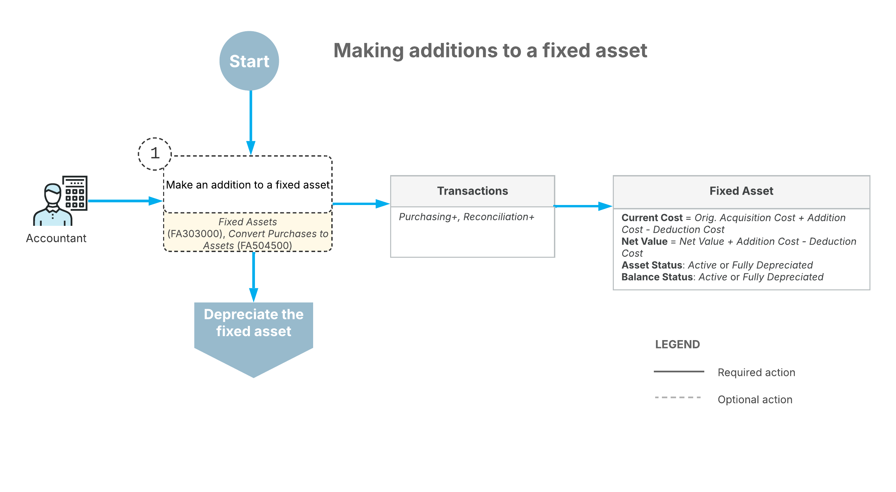

# Additions to Assets: General Information {#_b151dad2-a0b8-48cf-a8a6-0bc525066ee0 .concept}

You can change the cost of fixed assets by making additions to and deductions from fixed assets. This chapter is focused on making additions to fixed assets.

## Learning Objectives { .section}

In this chapter, you will learn how to do the following:

-   Create an addition to an existing fixed asset by converting a purchase
-   Create an addition to an existing fixed asset manually

## Applicable Scenarios { .section}

You make additions to fixed assets if you want to capitalize additional expenses related to a fixed asset.

## Additions to Fixed Assets { .section}

When an addition is made to a fixed asset, it increases the current cost and the net value of the asset. The depreciation expenses for the next periods are calculated based on the new current cost, and the system also makes depreciation adjustments for the already-depreciated periods, if needed.

You can make an addition to a fixed asset in two ways:

-   By converting a purchase into an addition:

    You convert a purchase into an addition to an existing asset on the [Convert Purchases to Assets](FA_50_45_00.md) \(FA504500\) form. For the unit you want to convert to a fixed asset, in the lower table of the form, you clear the check box in the **Create Asset** column and select the needed asset in the **Asset ID** column.

-   By making an addition manually:

    You make an addition to a fixed asset manually on the **Reconciliation** tab of the [Fixed Assets](FA_30_30_00.md) \(FA303000\) form.

For both ways of making an addition to an asset, when the acquisition transaction is released, the system creates *Purchasing+* and *Reconciliation+* transactions. The *Purchasing+* transaction is posted to the period specified in the **Tran. Period** column for the addition. This is the period in which the current cost of the asset will be increased. The *Reconciliation+* transaction is posted to the period of the GL transaction that is used for reconciliation. If the *Purchasing+* and *Reconciliation+* transactions are posted to different periods, the addition amount will be kept in the FA Accrual account until the start of the later period.

**Attention:** Before making additions to a fixed asset, make sure that the asset has been fully reconciled.

## Workflow of Fixed Asset Additions { .section}

The following diagram shows the process of making additions to fixed assets.

Optionally, you can make additions to fixed assets on the [Fixed Assets](FA_30_30_00.md) \(FA303000\) or [Convert Purchases to Assets](FA_50_45_00.md) \(FA504500\) form to capitalize additional expenses. An addition increases the current cost and the net value of the asset.

The system calculates the depreciation expenses for the next periods based on the new current cost; if needed, it makes depreciation adjustments for the already-depreciated periods.

**Parent topic:**[Making Additions to Fixed Assets](../UserGuide/FixedAssets_Making_Additions_Mapref.md)

