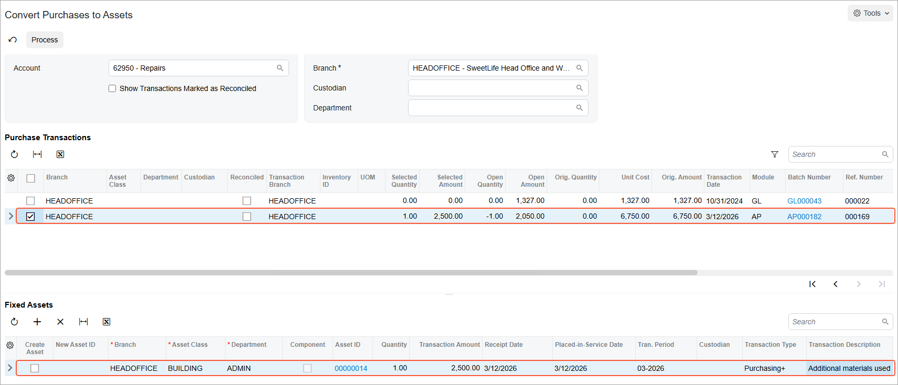
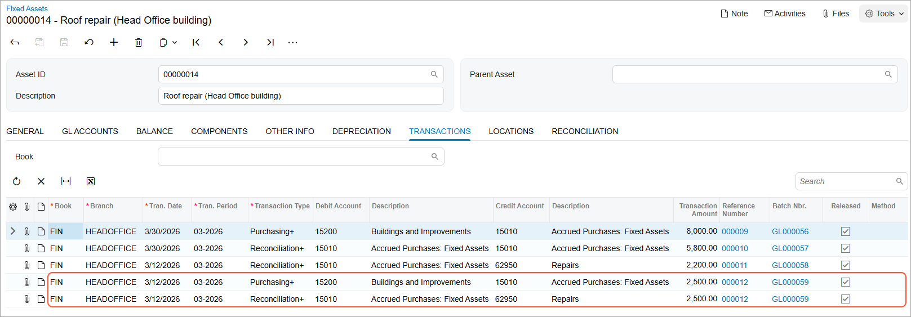

# Additions to Assets: To Make an Addition by Converting a Purchase {#_8a3dfd4f-8464-42c2-9e40-3ed48cef1438 .task}

The following activity will walk you through the process of making an addition to a fixed asset. You will make this addition by converting a purchase.

## Story {#section_t4d_ljv_vxb .section}

Suppose that the accountant of SweetLife Fruits &amp; Jams recognized that Frontsource Ltd. used materials for roof repair in the amount of $4,700. A portion of this amount, $2,200, was reconciled earlier. The accountant has decided to process the rest of this amount as an addition to the existing roof repair asset in order to depreciate this cost. Acting as the SweetLife accountant, you need to make this addition to the existing fixed asset.

## Configuration Overview {#section_tz4_djx_cnb .section}

In the *U100* dataset, the following tasks have been performed to support this activity:

-   On the [Enable/Disable Features](CS_10_00_00.md) \(CS100000\) form, the *Fixed Asset Management* feature has been enabled.
-   On the [Chart of Accounts](GL_20_25_00.md) \(GL202500\) form, the needed GL accounts have been created.
-   On the [Fixed Assets Preferences](FA_10_10_00.md) \(FA101000\) form \(**Posting Settings** section\), the **Automatically Release Acquisition Transactions** check box has been selected.

## Process Overview {#section_w4d_ljv_vxb .section}

In this activity, on the [Convert Purchases to Assets](FA_50_45_00.md) \(FA504500\) form, you will convert a purchasing transaction to an addition to an existing fixed asset. On the [Fixed Assets](FA_30_30_00.md) \(FA303000\) form, you will review the updated cost of the fixed asset. Then you will review the generated GL transaction on the [Journal Transactions](GL_30_10_00.md) \(GL301000\) form.

## System Preparation {#section_y4d_ljv_vxb .section}

Before you begin making an addition to a fixed asset by converting a purchase, do the following:

1.  Launch the Acumatica ERP website with the *U100* dataset preloaded, and sign in as an accountant by using the *johnson* username and the *123* password.
2.  In the info area, in the upper-right corner of the top pane of the Acumatica ERP screen, click the Business Date menu button, and select *3/12/2026* on the calendar.
3.  In the company to which you are signed in, be sure that you have implemented the fixed asset functionality by performing the following prerequisite activities: [Fixed Assets: To Set Up the System for Fixed Asset Management](../ImplementationGuide/config_FixedAssets_Implem_Activity_System.md), [Fixed Assets: To Configure the Fixed Asset Functionality](../ImplementationGuide/config_FixedAssets_Implem_Activity_FixedAssets_Subledger.md), and [Fixed Assets: To Create Fixed Asset Classes](../ImplementationGuide/config_FixedAssets_Implem_Activity_FixedAsset_Classes.md).
4.  Make sure that you have entered the purchasing transaction for repair work by performing [Non-Default Asset Settings: Process Activity](FixedAssets_Changing_Default_Settings_Process_Activity.md), which is also a prerequisite activity.
5.  On the Company and Branch Selection menu on the top pane of the Acumatica ERP screen, select the *SweetLife Head Office and Wholesale Center* branch.

## Step 1: Converting a Purchase to an Addition to a Fixed Asset {#section_apd_ljv_vxb .section}

To make an addition to an existing fixed asset, do the following:

1.  Open the [Convert Purchases to Assets](FA_50_45_00.md) \(FA504500\) form.
2.  In the **Account** box of the Selection area, select *62950 \(Repairs\)*.
3.  In the **Purchase Transactions** table, select the unlabeled check box in the row with the original amount of $6,750 posted to the *62950* account. \(See the screenshot below.\) The open amount of this entry is currently $4,550.
4.  In the **Fixed Assets** table \(which provides a list of units of the item selected for conversion in the **Purchase Transactions** table\), click **Add Row** on the table toolbar, and clear the **Create Asset** check box in the added row, because you are going to make an addition to an existing asset.
5.  In the **Asset ID** column of the added row, select the *Roof repair \(Head Office building\)* asset, and specify `2500` \($4,700 – $2,200\) in the **Transaction Amount** column \(also shown in the screenshot below\).

    The system automatically inserts *ADMIN* in the **Department** column and *BUILDING* in the **Asset Class** column, because these are the settings of the fixed asset that you selected in the **Purchase Transactions** table.

    

6.  In the **Transaction Description** column of this row, type `Additional materials used`.
7.  Click **Process** on the form toolbar to add the cost of these materials to the asset.

## Step 2: Reviewing the Updated Fixed Asset {#section_dpd_ljv_vxb .section}

To review the *Roof repair \(Head Office building\)* asset, which has been updated with an addition, do the following:

1.  On the [Fixed Assets](FA_30_30_00.md) \(FA303000\) form, open the *Roof repair \(Head Office building\)* asset.
2.  Go to the **Balance** tab. Notice that the current cost of the fixed asset has been increased by the amount of the addition and is now $10,500 \($8,000 + $2,500\), while the **Orig. Acquisition Cost** remains unchanged.
3.  On the **Transactions** tab, review the transactions that were generated when the addition was processed, as shown in the following screenshot.

    

4.  Click the link in the **Batch Number** column, and review the generated batch on the [Journal Transactions](GL_30_10_00.md) \(GL301000\) form.

    The system has created and released the following transactions:

    -   A *Purchasing+* transaction that updates the current cost and the basis of the asset, and generates a GL transaction that debits the Fixed Assets account \(*15200*\) and credits the FA Accrual account \(*15010*\).
    -   A *Reconciliation+* transaction that updates the unreconciled amount of the asset, debits the FA Accrual account \(15010\), and credits the GL account that was used in the AP bill \(*62950*\). The transaction also decreases the open amount of the reconciled GL entry to avoid converting the same amount to a fixed asset multiple times.

**Parent topic:**[Making Additions to Fixed Assets](../UserGuide/FixedAssets_Making_Additions_Mapref.md)

