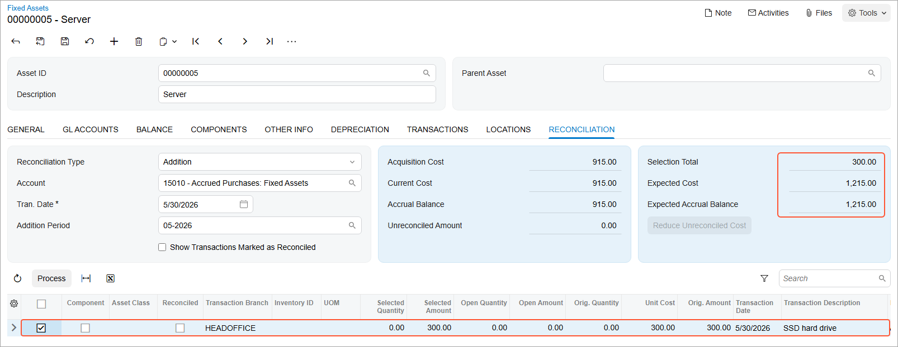

# Additions to Assets: To Make a Manual Addition {#_41e21414-c2a1-43db-ba38-ecfcaf7c9cfa .task}

The following activity will walk you through the process of making a manual addition to an existing fixed asset.

## Story {#section_iqd_ljv_vxb .section}

Suppose that on May 30, 2026, the system administrator of SweetLife Fruits &amp; Jams installed a new SSD hard drive on the server. The accountant of SweetLife decided to add this cost to the current cost of the *Server* asset. Acting as the SweetLife accountant, you need to create a purchasing transaction and reconcile the transaction amount.

## Configuration Overview {#section_tz4_djx_cnb .section}

In the *U100* dataset, the following tasks have been performed to support this activity:

-   On the [Enable/Disable Features](CS_10_00_00.md) \(CS100000\) form, the *Fixed Asset Management* feature has been enabled.
-   On the [Chart of Accounts](GL_20_25_00.md) \(GL202500\) form, the needed GL accounts have been created.
-   On the [Vendors](AP_30_30_00.md) \(AP303000\) form, the *COMPULINK* vendor has been created.
-   On the [Fixed Assets Preferences](FA_10_10_00.md) \(FA101000\) form \(**Posting Settings** section\), the **Automatically Release Acquisition Transactions** check box has been selected.

## Process Overview {#section_lqd_ljv_vxb .section}

In this activity, you will create a purchasing transaction on the [Bills and Adjustments](AP_30_10_00.md) \(AP301000\) form. On the **Reconciliation** tab of the [Fixed Assets](FA_30_30_00.md) \(FA303000\) form, you will manually create an addition to the fixed asset and reconcile the amount. On the **Balance** tab of this form, you will review the updated cost of the fixed asset.

## System Preparation {#section_nqd_ljv_vxb .section}

Before you begin making a manual addition to a fixed asset, do the following:

1.  Launch the Acumatica ERP website with the *U100* dataset preloaded, and sign in as an accountant by using the *johnson* username and the *123* password.
2.  In the info area, in the upper-right corner of the top pane of the Acumatica ERP screen, click the Business Date menu button, and select *5/30/2026* on the calendar.
3.  In the company to which you are signed in, be sure that you have implemented the fixed asset functionality by performing the following prerequisite activities: [Fixed Assets: To Set Up the System for Fixed Asset Management](../ImplementationGuide/config_FixedAssets_Implem_Activity_System.md), [Fixed Assets: To Configure the Fixed Asset Functionality](../ImplementationGuide/config_FixedAssets_Implem_Activity_FixedAssets_Subledger.md), and [Fixed Assets: To Create Fixed Asset Classes](../ImplementationGuide/config_FixedAssets_Implem_Activity_FixedAsset_Classes.md).
4.  Make sure that you have created the *Server* fixed asset by performing the [Conversion of a Purchase: To Convert a Purchase to Multiple Assets](FixedAssets_Converting_Purchase_To_Convert_to_Multiple_Assets.md) prerequisite activity.
5.  On the Company and Branch Selection menu on the top pane of the Acumatica ERP screen, select the *SweetLife Head Office and Wholesale Center* branch.

## Step 1: Creating a Purchasing Transaction {#section_pqd_ljv_vxb .section}

To create an AP bill to record a purchasing transaction, do the following:

1.  On the [Bills and Adjustments](AP_30_10_00.md) \(AP301000\) form, add a new record.
2.  In the Summary area, specify the following settings:
    -   **Type**: *Bill*
    -   **Vendor**: *COMPULINK*
    -   **Date**: *5/30/2026* \(inserted automatically\)
    -   **Post Period**: *05-2026*
    -   **Description**: `SSD hard drive`
3.  On the **Details** tab, click **Add Row**, and specify the following settings in the added row:
    -   **Branch**: *HEADOFFICE*
    -   **Transaction Descr.**: `SSD hard drive`
    -   **Ext. Cost**: `300`
    -   **Account**: *15010 \(Accrued Purchases: Fixed Assets\)*
4.  On the form toolbar, click **Remove Hold**, and then click **Release** to release the AP bill.

## Step 2: Reconciling the Transaction Amount {#section_rqd_ljv_vxb .section}

To make the addition to the cost of the *Server* fixed asset, do the following:

1.  On the [Fixed Assets](FA_30_30_00.md) \(FA303000\) form, open the *Server* fixed asset.
2.  In the Summary area of the **Reconciliation** tab, specify the following settings:
    -   **Reconciliation Type**: *Addition*
    -   **Account**: *15010*
    -   **Tran. Date**: *5/30/2026* \(the date of the *Purchasing+* transaction generated for the addition\)
    -   **Addition Period**: *05-2026* \(the period to which the *Purchasing+* transaction generated for the addition is posted\)
3.  In the table on this tab, select the unlabeled check box in the row with the original amount of $300, and specify `300` in the **Selected Amount** column, as shown in the following screenshot.

    

4.  On the table toolbar, click **Process**.
5.  On the form toolbar, click **Save** to save the transactions generated by the reconciliation process.
6.  On the **Transactions** tab, review the transactions that were created when the addition was processed.
7.  Click the link in the **Batch Nbr.** column, and review the generated batch on the [Journal Transactions](GL_30_10_00.md) \(GL301000\) form. In the generated batch, the first two rows were generated by the *Reconciliation+* transaction, and the next two rows were generated by the *Purchasing+* transaction.

    The system has created and released the following transactions:

    -   A *Purchasing+* transaction that updates the current cost and the basis of the asset, and generates a GL transaction that debits the Fixed Assets account \(*15300*\) and credits the FA Accrual account \(*15010*\).
    -   A *Reconciliation+* transaction that updates the unreconciled amount of the asset, debits the FA Accrual account \(*15010*\), and credits the GL account \(*15010*\) that was used in the AP bill. The transaction also decreases the open amount of the converted GL entry to avoid converting the same amount to a fixed asset multiple times.

**Parent topic:**[Making Additions to Fixed Assets](../UserGuide/FixedAssets_Making_Additions_Mapref.md)

