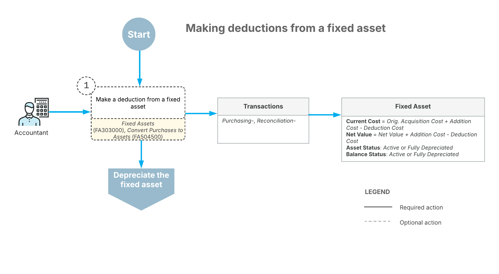

# Deductions from Assets: General Information {#_9c095af9-9948-4d2c-9e63-e2026d55e57e .concept}

You can change the cost of fixed assets by making additions to and deductions from fixed assets. This chapter focuses on making deductions from fixed assets.

## Learning Objectives { .section}

In this chapter, you will learn how to do the following:

-   Create a debit adjustment
-   Make a deduction from a fixed asset

## Applicable Scenarios { .section}

You make a deduction from a fixed asset in the following cases:

-   You need to decrease the cost of the asset to reflect its impairment.
-   You need to process a credit note from the vendor related to the asset.

## Deductions from Fixed Assets { .section}

When a deduction is made from a fixed asset, it reduces the current cost and the net value of the asset. The depreciation expenses for the next periods are calculated based on the new current cost, and the system also makes depreciation adjustments for the already-depreciated periods, if needed.

**Attention:** Before making deductions from a fixed asset, make sure that the asset's accrual balance is non-zero and the asset has been fully reconciled.

You use the **Reconciliation** tab of the [Fixed Assets](FA_30_30_00.md) \(FA303000\) form to make a deduction from an asset. When you decrease the net book value of an asset, *Reconciliation–* transactions are generated automatically.

## Workflow of Fixed Asset Deductions { .section}

The following diagram shows the process of making deductions from fixed assets.

Optionally, you can make deductions from fixed assets on the [Fixed Assets](FA_30_30_00.md) \(FA303000\) or [Convert Purchases to Assets](FA_50_45_00.md) \(FA504500\) form to record the assets' impairment. A deduction reduces the current cost and the net value of the asset.

The system calculates the depreciation expenses for the next periods based on the new current cost; if needed, it makes depreciation adjustments for the already-depreciated periods.

**Parent topic:**[Making Deductions from Fixed Assets](../UserGuide/FixedAssets_Making_Deductions_Mapref.md)

