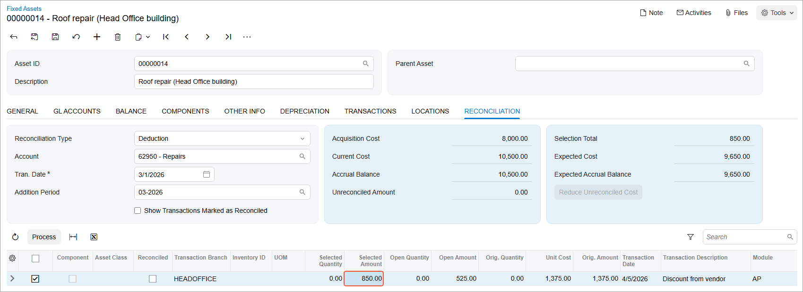

# Deductions from Assets: Process Activity {#_c12b6957-8234-417a-b761-476a8dc30fe7 .task}

The following activity will walk you through the process of making a deduction from a fixed asset.

## Story {#section_yyd_ljv_vxb .section}

Suppose that on April 5, 2026, SweetLife Fruits &amp; Jams received a credit memo of $1,375 from Frontsource, Ltd., which gave SweetLife a large discount on materials purchased in March. The accountant of SweetLife decided to process $850 of this amount as a deduction from the roof repair cost. Acting as the SweetLife accountant, you need to create a debit adjustment and make a deduction from the asset.

## Configuration Overview {#section_tz4_djx_cnb .section}

In the *U100* dataset, the following tasks have been performed to support this activity:

-   On the [Enable/Disable Features](CS_10_00_00.md) \(CS100000\) form, the *Fixed Asset Management* feature has been enabled.
-   On the [Chart of Accounts](GL_20_25_00.md) \(GL202500\) form, the needed GL accounts have been created.
-   On the [Fixed Assets Preferences](FA_10_10_00.md) \(FA101000\) form \(**Posting Settings** section\), the **Automatically Release Acquisition Transactions** check box has been selected.
-   On the [Vendors](AP_30_30_00.md) \(AP303000\) form, the *FRONTSRC* vendor has been configured.

## Process Overview {#section_bzd_ljv_vxb .section}

In this activity, you will create and release a debit adjustment on the [Bills and Adjustments](AP_30_10_00.md) \(AP301000\) form. On the [Fixed Assets](FA_30_30_00.md) \(FA303000\) form, you will make a deduction from the *Roof repair \(Head Office building\)* asset. On the **Transactions** tab, you will review the transactions created for the deduction, and on the **Balance** tab, you will review the updated current cost of the asset.

## System Preparation {#section_dzd_ljv_vxb .section}

Before you begin making a deduction from a fixed asset, do the following:

1.  Launch the Acumatica ERP website with the *U100* dataset preloaded, and sign in as an accountant by using the *johnson* username and the *123* password.
2.  In the info area, in the upper-right corner of the top pane of the Acumatica ERP screen, click the Business Date menu button, and select *4/5/2026* on the calendar.
3.  In the company to which you are signed in, be sure that you have implemented the fixed asset functionality by performing the following prerequisite activities: [Fixed Assets: To Set Up the System for Fixed Asset Management](../ImplementationGuide/config_FixedAssets_Implem_Activity_System.md), [Fixed Assets: To Configure the Fixed Asset Functionality](../ImplementationGuide/config_FixedAssets_Implem_Activity_FixedAssets_Subledger.md), and [Fixed Assets: To Create Fixed Asset Classes](../ImplementationGuide/config_FixedAssets_Implem_Activity_FixedAsset_Classes.md).
4.  Make sure that you have entered an addition to the roof repair materials by converting a purchase by performing the [Additions to Assets: To Make an Addition by Converting a Purchase](FixedAssets_Making_Additions_To_Convert_a_Purchase.md) prerequisite activity.
5.  On the Company and Branch Selection menu on the top pane of the Acumatica ERP screen, select the *SweetLife Head Office and Wholesale Center* branch.

## Step 1: Creating a Debit Adjustment {#section_fzd_ljv_vxb .section}

To create and release a debit adjustment, do the following:

1.  On the [Bills and Adjustments](AP_30_10_00.md) \(AP301000\) form, add a new record.
2.  In the Summary area, specify the following settings:
    -   **Type**: *Debit Adj.*
    -   **Vendor**: *FRONTSRC*
    -   **Date**: *4/5/2026* \(inserted automatically\)
    -   **Post Period**: *04-2026* \(inserted automatically\)
    -   **Description**: `Discount on purchased materials`
3.  On the **Details** tab, click **Add Row** on the table toolbar, and specify the following settings in the added row:
    -   **Branch**: *HEADOFFICE*
    -   **Transaction Descr.**: `Discount from vendor`
    -   **Ext. Cost**: `1375`
    -   **Account**: *62950 \(Repairs\)*
4.  On the form toolbar, click **Remove Hold**, and then click **Release** to release the debit adjustment.

## Step 2: Making a Deduction {#section_hzd_ljv_vxb .section}

To make a deduction from the roof repair asset, do the following:

1.  On the [Fixed Assets](FA_30_30_00.md) \(FA303000\) form, open the *Roof repair \(Head Office building\)* asset.
2.  On the **Reconciliation** tab, specify the following settings:
    -   **Reconciliation Type**: *Deduction*
    -   **Account**: *62950*
    -   **Tran. Date**: *3/1/2026*
    -   **Addition Period**: *03-2026*
3.  Select the unlabeled check box in the row with the original amount of $1,375 posted to the *62950* account.
4.  In the **Selected Amount** column, enter `850`, as shown in the following screenshot.

    

5.  On the table toolbar, click **Process** to process the deduction.
6.  On the form toolbar, click **Save** to save the created transactions.
7.  On the **Transactions** tab, review the transactions created for the deduction.

    The system has created and released the following transactions:

    -   A *Purchasing–* transaction that updates the current cost and the basis of the asset, and generates a GL transaction that debits the FA Accrual account \(*15010*\) and credits the Fixed Asset account \(*15200*\).
    -   A *Reconciliation–* transaction that credits the FA Accrual account \(*15010*\) and debits the GL account that was used in the AP bill \(*62950*\). The transaction also decreases the open amount of the reconciled GL entry to avoid converting the same amount to a fixed asset multiple times. *Reconciliation–* transactions are generated automatically when you decrease the net book value of an asset.
8.  On the **Balance** tab, review the current cost of the fixed asset. The current cost of the asset has been decreased and is now $9,650 \($10,500 – $850\).

**Parent topic:**[Making Deductions from Fixed Assets](../UserGuide/FixedAssets_Making_Deductions_Mapref.md)

