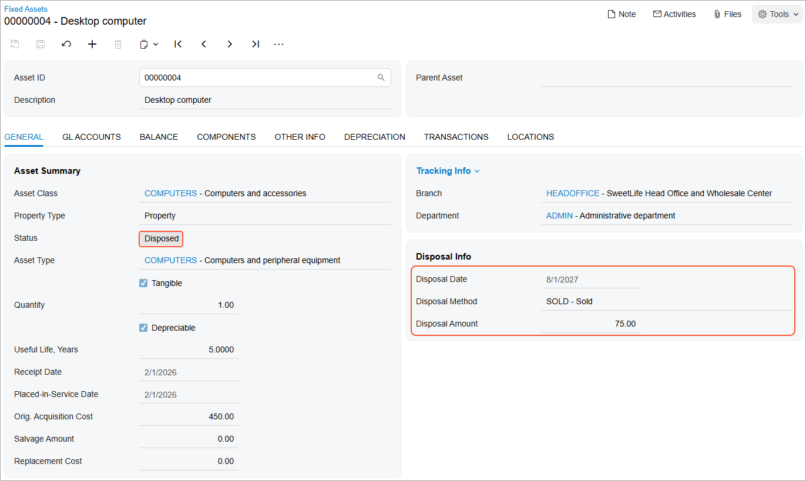

# Assets with Depreciation: To Dispose of an Asset {#_31bc7db9-b2e3-451b-a034-373ad2b9be05 .task}

The following activity will walk you through the process of disposing of an asset with accumulated depreciation.

## Story { .section}

Suppose that on August 1, 2027, the management of the SweetLife Fruits &amp; Jams company decided to sell one desktop computer for $75 to Cakeado Cafe. Acting as a SweetLife accountant, you need to dispose of the asset and create an invoice for the buyer of the computer.

## Configuration Overview {#section_tz4_djx_cnb .section}

In the *U100* dataset, the following tasks have been performed to support this activity:

-   On the [Enable/Disable Features](CS_10_00_00.md) \(CS100000\) form, the *Fixed Asset Management* feature has been enabled.
-   On the [Chart of Accounts](GL_20_25_00.md) \(GL202500\) form, the needed GL accounts have been created.
-   On the [Fixed Assets Preferences](FA_10_10_00.md) \(FA101000\) form, the **Automatically Release Disposal Transactions** check box has been cleared.

## Process Overview { .section}

In this activity, you will dispose of the fixed asset on the [Dispose Assets](FA_50_50_00.md) \(FA505000\) form. On the [Fixed Assets](FA_30_30_00.md) \(FA303000\) form, you will review the settings of the disposed asset and the generated transactions. Finally, on the [Invoices and Memos](AR_30_10_00.md) \(AR301000\) form, you will create an AR invoice to record the sale of this fixed asset.

## System Preparation { .section}

Before you begin disposing of a fixed asset with depreciation, do the following:

1.  Launch the Acumatica ERP website with the *U100* dataset preloaded, and sign in as an accountant by using the *johnson* username and the *123* password.
2.  In the info area, in the upper-right corner of the top pane of the Acumatica ERP screen, click the Business Date menu button, and select *8/1/2027* on the calendar.
3.  In the company to which you are signed in, be sure that you have implemented the fixed asset functionality by performing the following prerequisite activities: [Fixed Assets: To Set Up the System for Fixed Asset Management](../ImplementationGuide/config_FixedAssets_Implem_Activity_System.md), [Fixed Assets: To Configure the Fixed Asset Functionality](../ImplementationGuide/config_FixedAssets_Implem_Activity_FixedAssets_Subledger.md), and [Fixed Assets: To Create Fixed Asset Classes](../ImplementationGuide/config_FixedAssets_Implem_Activity_FixedAsset_Classes.md).
4.  Make sure that you have created the fixed assets by performing the [Conversion of a Purchase: To Convert a Purchase to Multiple Assets](FixedAssets_Converting_Purchase_To_Convert_to_Multiple_Assets.md) prerequisite activity.
5.  On the Company and Branch Selection menu on the top pane of the Acumatica ERP screen, select the *SweetLife Head Office and Wholesale Center* branch.

## Step 1: Updating the Fixed Asset Preferences { .section}

To update the fixed asset preferences so that the system releases disposal transactions, do the following:

1.  Open the [Fixed Assets Preferences](FA_10_10_00.md) \(FA101000\) form.
2.  In the **Posting Settings** section, select the **Automatically Release Disposal Transactions** check box.
3.  On the form toolbar, click **Save** to save your changes.

## Step 2: Disposing of the Fixed Asset { .section}

To dispose of the fixed asset, do the following:

1.  Open the [Dispose Assets](FA_50_50_00.md) \(FA505000\) form.
2.  In the Selection area, specify the following settings:
    -   **Company/Branch**: *HEADOFFICE*
    -   **Disposal Date**: *8/1/2027* \(inserted automatically\)
    -   **Disposal Period**: *08-2027* \(inserted automatically\)
    -   **Disposal Method**: *SOLD*
    -   **Total Proceeds Amount**: `75`
    -   **Proceeds Allocation**: *Automatic*
    -   **Proceeds Account**: *11010 \(AR Accrual Account\)*
    -   **Before Disposal**: *Depreciate*
3.  Select the unlabeled check box in the row of the *Desktop computer* asset in the table, and click **Process** on the form toolbar. The system generates depreciation and disposal transactions and releases them automatically.

    **Attention:** If the **Automatically Release Depreciation Transactions** check box had been cleared on the [Fixed Assets Preferences](FA_10_10_00.md) \(FA101000\) form, you would have had to depreciate the asset by using the [Calculate Depreciation](FA_50_20_00.md) \(FA502000\) form before disposing of it.

4.  In the **Processing** dialog box, click the link in the **Asset ID** column, and on the [Fixed Assets](FA_30_30_00.md) \(FA303000\) form, which the system has opened, review the generated transactions on the **Transactions** tab.

    The system has automatically depreciated the asset from the *02-2026* to *08-2027* periods, and then disposed of the asset. The following transactions have been generated and released:

    -   *Depreciation+* transactions that debit the Depreciation Expense account \(*64000*\) for the depreciation amount and credit the Accumulated Depreciation account \(*16300*\) for the same amount. The system has generated multiple *Depreciation+* transactions to depreciate the asset until the disposal date.
    -   A *Purchasing Disposal* transaction that credits the Fixed Asset account \(*15300*\) and debits the Gain/Loss of Fixed Asset Disposal account \(*90000*\) in the asset's cost \($450\) to record the cost disposal.
    -   A *Depreciation Adjusting–* transaction that debits the Accumulated Depreciation account in the total amount of the accumulated depreciation \($235.50\) for all the depreciation periods, and credits the Gain/Loss of Fixed Asset Disposal account \(*90000*\) in the same amount.
    -   A *Sale/Dispose+* transaction that credits the Gain/Loss of Fixed Asset Disposal account \(*90000*\) and debits the Proceeds account \(*11010*\) in the proceeds amount of $75.
5.  Review the **General** tab \(see the screenshot below\).

    The status of the fixed asset has changed to *Disposed*. In the **Disposal Info** section, the **Disposal Date**, **Disposal Method**, and **Disposal Amount** boxes show disposal information for this asset.

    

## Step 3: Creating an Invoice for the Sale of the Fixed Asset { .section}

To create an invoice to record the sale of the desktop computer, do the following:

1.  On the [Invoices and Memos](AR_30_10_00.md) \(AR301000\) form, create a new record.
2.  In the Summary area, specify the following settings:
    -   **Type**: *Invoice*
    -   **Customer**: *CAKEADO*
    -   **Date**: *8/1/2027* \(inserted automatically\)
    -   **Post Period**: *08-2027* \(inserted automatically\)
    -   **Description**: `Sale of desktop computer`
3.  On the **Details** tab, click **Add Row** on the table toolbar, and specify the following settings in the added row:
    -   **Branch**: *HEADOFFICE*
    -   **Transaction Descr.**: `Sale of desktop computer`
    -   **Ext. Price**: `75`
    -   **Account**: *11010 \(AR Accrual Account\)*
4.  On the form toolbar, click **Remove Hold**, and then click **Release** to release the invoice.

**Parent topic:**[Managing Fixed Assets with Depreciation](../UserGuide/FixedAssets_Managing_Depreciable_FA_Mapref.md)

