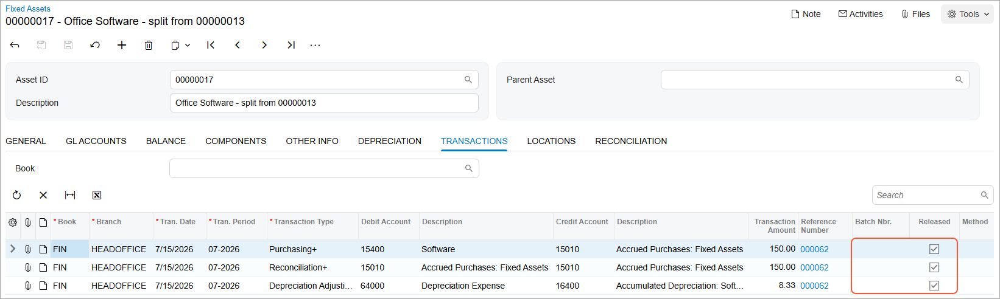
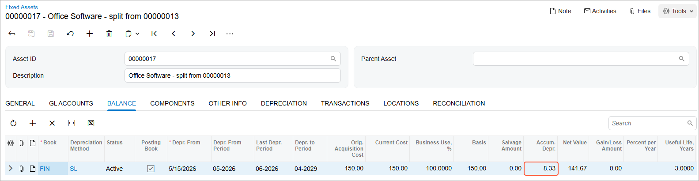

# Assets with Depreciation: To Split an Asset {#_8b4f2eec-f980-4a05-b8f3-9c36409946fc .task}

The following activity will walk you through the process of splitting an asset with depreciation.

## Story {#section_u3g_ljv_vxb .section}

Suppose that on July 15, 2026, the management of SweetLife Fruits &amp; Jams decided to transfer one computer and one office software license from the Head Office branch to the Retail branch of the company. Previously, a SweetLife accountant processed five office software licenses as one *Office Software* fixed asset with a quantity of *5*. To be able to transfer one license to another department, you need to split this license so that you have an individual fixed asset with a quantity of *1*.

## Configuration Overview {#section_tz4_djx_cnb .section}

In the *U100* dataset, the following tasks have been performed to support this activity:

-   On the [Enable/Disable Features](CS_10_00_00.md) \(CS100000\) form, the *Fixed Asset Management* feature has been enabled.
-   On the [Chart of Accounts](GL_20_25_00.md) \(GL202500\) form, the needed GL accounts have been created.
-   On the [Fixed Assets Preferences](FA_10_10_00.md) \(FA101000\) form, the **Automatically Release Split Transactions** check box has been cleared.

## Process Overview {#section_x3g_ljv_vxb .section}

In this activity, you will depreciate the original fixed asset on the [Calculate Depreciation](FA_50_20_00.md) \(FA502000\) form. On the [Split Assets](FA_50_60_00.md) \(FA506000\) form, you will split the asset. For the new asset, you will review the generated transactions on the **Transactions** tab of the [Fixed Assets](FA_30_30_00.md) \(FA303000\) form. On the **Balance** tab, you will review the accumulated depreciation for the asset split from the original asset.

## System Preparation {#section_z3g_ljv_vxb .section}

Before you begin splitting an asset with depreciation, do the following:

1.  Launch the Acumatica ERP website with the *U100* dataset preloaded, and sign in as an accountant by using the *johnson* username and the *123* password.
2.  In the info area, in the upper-right corner of the top pane of the Acumatica ERP screen, click the Business Date menu button, and select *7/15/2026* on the calendar.
3.  In the company to which you are signed in, be sure that you have implemented the fixed asset functionality by performing the following prerequisite activities: [Fixed Assets: To Set Up the System for Fixed Asset Management](../ImplementationGuide/config_FixedAssets_Implem_Activity_System.md), [Fixed Assets: To Configure the Fixed Asset Functionality](../ImplementationGuide/config_FixedAssets_Implem_Activity_FixedAssets_Subledger.md), and [Fixed Assets: To Create Fixed Asset Classes](../ImplementationGuide/config_FixedAssets_Implem_Activity_FixedAsset_Classes.md).
4.  Make sure that you have created the fixed assets by performing the following prerequisite activities: [Conversion of a Purchase: To Convert a Purchase to an Asset](FixedAssets_Converting_Purchase_To_Convert_to_Asset.md), [Conversion of a Purchase: To Convert a Purchase to Multiple Assets](FixedAssets_Converting_Purchase_To_Convert_to_Multiple_Assets.md), [Fixed Asset Creation: To Create and Reconcile an Asset](FixedAssets_Adding_Fixed_Asset_To_Create_Fixed_Asset.md), [Fixed Asset Creation: To Create an Asset with Multiple Units](FixedAssets_Adding_Fixed_Asset_To_Add_FA_with_Multiple_Units.md), and [Non-Default Asset Settings: Process Activity](FixedAssets_Changing_Default_Settings_Process_Activity.md).
5.  Make sure that you have created the *Office software* asset by performing the [Fixed Asset Creation: To Create an Asset with Multiple Units](FixedAssets_Adding_Fixed_Asset_To_Add_FA_with_Multiple_Units.md) prerequisite activity.
6.  On the Company and Branch Selection menu on the top pane of the Acumatica ERP screen, select the *SweetLife Head Office and Wholesale Center* branch.

## Step 1: Updating the Fixed Asset Preferences {#section_bjg_ljv_vxb .section}

To update the fixed asset preferences so that split transactions are released by the system, do the following:

1.  Open the [Fixed Assets Preferences](FA_10_10_00.md) \(FA101000\) form.
2.  In the **Posting Settings** section, select the **Automatically Release Split Transactions** check box.
3.  On the form toolbar, click **Save** to save your changes.

## Step 2: Depreciating the Fixed Asset {#section_djg_ljv_vxb .section}

To depreciate the *Office software* asset through 06-2026, do the following:

1.  On the [Calculate Depreciation](FA_50_20_00.md) \(FA502000\) form, specify the following settings in the Selection area:
    -   **Book**: *FIN*
    -   **To Period**: *06-2026*
    -   **Action**: *Depreciate*
2.  In the table, select the unlabeled check box for the *Office Software* asset, and on the form toolbar, click **Process**.
3.  On the [Fixed Assets](FA_30_30_00.md) \(FA303000\) form, open the *Office Software* asset.
4.  On the **Depreciation** tab, review the **Depreciated** column for periods from 05-2026 to 06-2026.

## Step 3: Splitting the Fixed Asset {#section_fjg_ljv_vxb .section}

To split the *Office Software* fixed asset, do the following:

1.  Open the [Split Assets](FA_50_60_00.md) \(FA506000\) form.
2.  In the Selection area, specify the following settings:
    -   **Fixed Asset**: *Office Software*
    -   **Split Date**: *7/15/2026* \(inserted automatically\)
    -   **Split Period**: *07-2026* \(inserted automatically\)
3.  On the table toolbar, click **Add Row**, and in the **Quantity** column of the new row, enter `1`.

    The system automatically inserts *150* in the **Cost** column and *20* in the **Ratio** column.

4.  On the form toolbar, click **Split**.
5.  On the [Fixed Assets](FA_30_30_00.md) \(FA303000\) form, open the new asset that was created from the split and review the transactions generated for the split on the **Transactions** tab \(see the screenshot below\).

    Note that split transactions are released, but they are not posted to the general ledger, because they do not change the balances of the GL accounts.

    

6.  On the **Balance** tab, review the accumulated depreciation for the asset split from *Office software*, as shown in the following screenshot.

    

    The accumulated depreciation amount for two months is $8.33, which is split to the new asset from the *Office software* asset by the specified ratio \(20% of $20.83\).

**Parent topic:**[Managing Fixed Assets with Depreciation](../UserGuide/FixedAssets_Managing_Depreciable_FA_Mapref.md)

