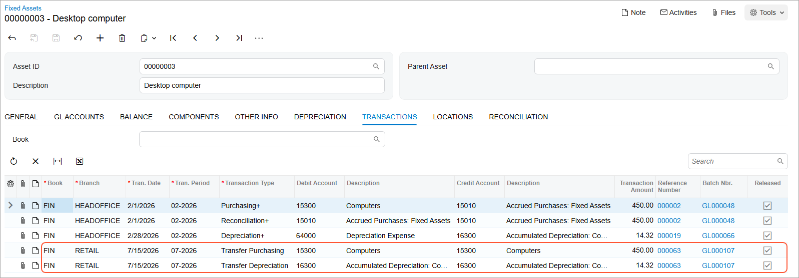
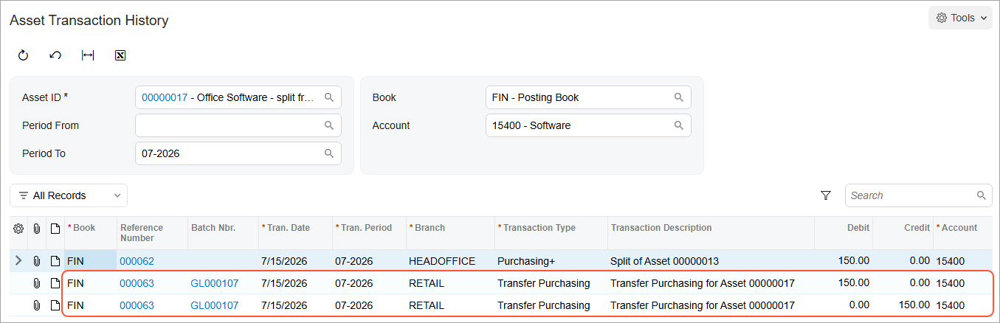

# Assets with Depreciation: To Transfer Assets {#_41245bed-f78c-4e11-9998-05693b125874 .task}

The following activity will walk you through the process of transferring an asset with depreciation from one branch to another branch.

## Story {#section_sjg_ljv_vxb .section}

Suppose that now that the software license has been split, you need to transfer one computer and one office software license from the Administrative department of the Head Office branch to the Development department of the Retail branch of SweetLife Fruits &amp; Jams. Acting as a SweetLife accountant, you need to perform this transfer.

## Configuration Overview {#section_tz4_djx_cnb .section}

In the *U100* dataset, the following tasks have been performed to support this activity:

-   On the [Enable/Disable Features](CS_10_00_00.md) \(CS100000\) form, the *Fixed Asset Management* feature has been enabled.
-   On the [Chart of Accounts](GL_20_25_00.md) \(GL202500\) form, the needed GL accounts have been created.
-   On the [Fixed Assets Preferences](FA_10_10_00.md) \(FA101000\) form, the **Automatically Release Transfer Transactions** check box has been selected.

## Process Overview {#section_vjg_ljv_vxb .section}

In this activity, you will transfer assets to another branch on the [Transfer Assets](FA_50_70_00.md) \(FA507000\) form and review the generated transactions on the **Transactions** tab of this form. On the [Asset Balance by Accounts](FA_40_30_00.md) \(FA403000\) form, you will review the settings of one of the transferred assets, and on the [Asset Transaction History](FA_40_40_00.md) \(FA404000\) form, you will review the transactions that updated this fixed asset.

## System Preparation {#section_xjg_ljv_vxb .section}

Before you begin transferring assets with depreciation, do the following:

1.  Launch the Acumatica ERP website with the *U100* dataset preloaded, and sign in as an accountant by using the *johnson* username and the *123* password.
2.  In the info area, in the upper-right corner of the top pane of the Acumatica ERP screen, click the Business Date menu button, and select *7/15/2026* on the calendar.
3.  In the company to which you are signed in, be sure that you have implemented the fixed asset functionality by performing the following prerequisite activities: [Fixed Assets: To Set Up the System for Fixed Asset Management](../ImplementationGuide/config_FixedAssets_Implem_Activity_System.md), [Fixed Assets: To Configure the Fixed Asset Functionality](../ImplementationGuide/config_FixedAssets_Implem_Activity_FixedAssets_Subledger.md), and [Fixed Assets: To Create Fixed Asset Classes](../ImplementationGuide/config_FixedAssets_Implem_Activity_FixedAsset_Classes.md).
4.  Make sure that you have created the fixed assets by performing the following prerequisite activities: [Conversion of a Purchase: To Convert a Purchase to an Asset](FixedAssets_Converting_Purchase_To_Convert_to_Asset.md), [Conversion of a Purchase: To Convert a Purchase to Multiple Assets](FixedAssets_Converting_Purchase_To_Convert_to_Multiple_Assets.md), [Fixed Asset Creation: To Create and Reconcile an Asset](FixedAssets_Adding_Fixed_Asset_To_Create_Fixed_Asset.md), [Fixed Asset Creation: To Create an Asset with Multiple Units](FixedAssets_Adding_Fixed_Asset_To_Add_FA_with_Multiple_Units.md), and [Non-Default Asset Settings: Process Activity](FixedAssets_Changing_Default_Settings_Process_Activity.md).
5.  Make sure that you have created the *Office software* asset by performing the [Fixed Asset Creation: To Create an Asset with Multiple Units](FixedAssets_Adding_Fixed_Asset_To_Add_FA_with_Multiple_Units.md) prerequisite activity.
6.  Make sure that you have split the *Office software* asset by performing the [Assets with Depreciation: To Split an Asset](FixedAssets_Managing_Depreciable_FA_To_Split.md) prerequisite activity.
7.  On the Company and Branch Selection menu on the top pane of the Acumatica ERP screen, select the *SweetLife Head Office and Wholesale Center* branch.

## Step 1: Reviewing the Fixed Asset Preferences {#section_zjg_ljv_vxb .section}

To review the fixed asset preferences, do the following:

1.  Open the [Fixed Assets Preferences](FA_10_10_00.md) \(FA101000\) form.
2.  In the **Posting Settings** section, make sure that the **Automatically Release Transfer Transactions** check box is selected.
3.  On the form toolbar, click **Save**.

## Step 2: Transferring the Assets {#section_bkg_ljv_vxb .section}

To transfer the assets from the Head Office branch to the Retail branch, do the following:

1.  Open the [Transfer Assets](FA_50_70_00.md) \(FA507000\) form.
2.  In the Selection area, specify the following settings:
    -   **Company**: *SWEETLIFE*
    -   **Transfer Date**: *7/15/2026*
    -   **Transfer Period**: *07-2026*
    -   **Branch**: *HEADOFFICE*
    -   **Department**: *ADMIN*
    -   **Asset Class**: Cleared
3.  In the **Transfer To** section, specify the following settings:

    -   **Branch**: *RETAIL*
    -   **Department**: *DEV*
    -   **Asset Class**: Cleared
    The system narrows the list of the fixed assets displayed in the table based on the values specified in the **Branch**, **Department**, and **Asset Class** boxes. After you specify these settings, the system displays the fixed assets that belong to the Administrative department of the *HEADOFFICE* branch.

4.  In the table, select the unlabeled check boxes in the rows of a *Desktop computer* asset and the *Office software - split from 00000013* asset.
5.  On the form toolbar, click **Process**. The system generates the transfer transactions. It also releases them because the **Automatically Release Transfer Transactions** check box is selected on the [Fixed Assets Preferences](FA_10_10_00.md) \(FA101000\) form.
6.  On the [Fixed Assets](FA_30_30_00.md) \(FA303000\) form, open the *Desktop computer* asset and review the **Transactions** tab, as shown in the following screenshot.

    

    The system has created and released two transactions:

    -   A *Transfer Purchasing* transaction that records the transfer of the asset from one branch to another branch. This transaction debits the Fixed Asset account \(*15300*\) in the amount of the asset's current cost, and credits the Fixed Asset account \(*15300*\) in the same amount.
    -   A *Transfer Depreciation* transaction that transfers the accumulated depreciation between the branches. This transaction credits the Accumulated Depreciation account \(*16300*\) in the amount of the depreciation accumulated for the asset, and debits the Accumulated Depreciation account \(*16300*\) in the same amount.

## Step 3: Reviewing the Account Balances for an Asset {#section_fkg_ljv_vxb .section}

To review the account balances for one of the transferred assets, do the following:

1.  Open the [Asset Balance by Accounts](FA_40_30_00.md) \(FA403000\) form.
2.  In the Selection area, specify the following settings:

    -   **Asset ID**: *Office software - split from 00000013*
    -   **Fin Period**: *07-2026*
    -   **Book**: *FIN*
    In the selected period, the values in the **Period to Date** column convey that the amount of $150 \(the asset's cost\) was depreciated in the amount of $8.33 \(the accumulated depreciation\).

3.  In the table, click the line for the *15400* account, and on the form toolbar, click **Asset Transaction History**.
4.  On the [Asset Transaction History](FA_40_40_00.md) \(FA404000\) form, which the system has opened, review the transactions that update the selected account through the *07-2026* period, as shown in the following screenshot.

    

**Parent topic:**[Managing Fixed Assets with Depreciation](../UserGuide/FixedAssets_Managing_Depreciable_FA_Mapref.md)

