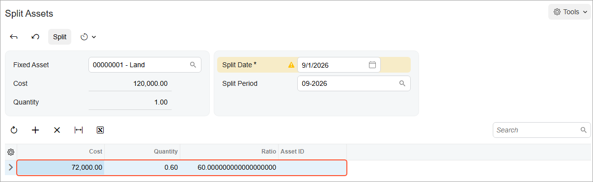

# Splitting of Assets: Process Activity {#_9765486c-c3ae-4190-9d8c-18dd2cbaeb87 .task}

The following activity will walk you through the process of splitting a fixed asset.

## Story {#section_bs2_ljv_vxb .section}

Suppose that on September 1, 2026, the management of SweetLife Fruits &amp; Jams decided to sell a part of the land near the office building. Earlier, an accountant had recorded the land near and under the office building as a single fixed asset. To process the sale of the part of the land, acting as the SweetLife accountant, you need to split the *Land* fixed asset into two assets.

## Configuration Overview {#section_tz4_djx_cnb .section}

In the *U100* dataset, the following tasks have been performed to support this activity:

-   On the [Enable/Disable Features](CS_10_00_00.md) \(CS100000\) form, the *Fixed Asset Management* feature has been enabled.
-   On the [Chart of Accounts](GL_20_25_00.md) \(GL202500\) form, the needed GL accounts have been created.
-   On the [Fixed Assets Preferences](FA_10_10_00.md) \(FA101000\) form, the **Automatically Release Split Transactions** check box has been cleared. Thus, split transactions are created with the *On Hold* status, and you will have to release these transactions manually on the [Release FA Transactions](FA_50_30_00.md) \(FA503000\) form.

## Process Overview {#section_es2_ljv_vxb .section}

In this activity, you will open the original asset on the [Fixed Assets](FA_30_30_00.md) \(FA303000\) form and initiate the splitting process; you will split it on the [Split Assets](FA_50_60_00.md) \(FA506000\) form. You will then release the split transaction on the [Release FA Transactions](FA_50_30_00.md) \(FA503000\) form and review the current cost of the original asset on the [Fixed Assets](FA_30_30_00.md) form.

## System Preparation {#section_gs2_ljv_vxb .section}

Before you begin splitting a fixed asset, do the following:

1.  Launch the Acumatica ERP website with the *U100* dataset preloaded, and sign in as an accountant by using the *johnson* username and the *123* password.
2.  In the info area, in the upper-right corner of the top pane of the Acumatica ERP screen, click the Business Date menu button, and select *9/1/2026* on the calendar.
3.  In the company to which you are signed in, be sure that you have implemented the fixed asset functionality by performing the following prerequisite activities: [Fixed Assets: To Set Up the System for Fixed Asset Management](../ImplementationGuide/config_FixedAssets_Implem_Activity_System.md), [Fixed Assets: To Configure the Fixed Asset Functionality](../ImplementationGuide/config_FixedAssets_Implem_Activity_FixedAssets_Subledger.md), and [Fixed Assets: To Create Fixed Asset Classes](../ImplementationGuide/config_FixedAssets_Implem_Activity_FixedAsset_Classes.md).
4.  Make sure that you have created the *Land* fixed asset by converting a purchase by performing the [Conversion of a Purchase: To Convert a Purchase to an Asset](FixedAssets_Converting_Purchase_To_Convert_to_Asset.md) prerequisite.
5.  On the Company and Branch Selection menu on the top pane of the Acumatica ERP screen, select the *SweetLife Head Office and Wholesale Center* branch.

## Step 1: Splitting a Fixed Asset {#section_is2_ljv_vxb .section}

To split the *Land* fixed asset, do the following:

1.  On the [Fixed Assets](FA_30_30_00.md) \(FA303000\) form, open the *Land* fixed asset.
2.  On the More menu \(under **Processing**\), click **Split**. The system opens the [Split Assets](FA_50_60_00.md) \(FA506000\) form with the *Land* asset selected.
3.  In the Selection area of this form, make sure that the following settings are selected:
    -   **Split Date**: *9/1/2026*
    -   **Split Period**: *09-2026*
4.  On the table toolbar, click **Add Row**, and specify `72000` in the **Cost** column of the added row. After you specify the cost, the system will automatically calculate the ratio and quantity for the row \(see the screenshot below\).

    **Tip:** Instead of specifying the cost, you could have specified the ratio of a new asset \(that is, the percentage of the original asset cost to be assigned to the new asset\) or its quantity.

    After the split, the cost of the original asset will be decreased by the specified cost, and a new asset with the specified cost will be created. The asset created by the split belongs to the same branch and department as those of the original asset.

    

5.  On the form toolbar, click **Split**. The system creates the new fixed asset and shows its ID in the **Asset ID** column. Although the asset has been created, the split transactions have not been released yet.

## Step 2: Releasing the Split Transaction {#section_ms2_ljv_vxb .section}

To release the split transaction, do the following:

1.  Open the [Release FA Transactions](FA_50_30_00.md) \(FA503000\) form.
2.  Click the link in the **Reference Number** column of the only row, and review the generated split transaction on the [Fixed Asset Transactions](FA_30_10_00.md) \(FA301000\) form, which the system has opened.

    The generated transaction creates a new fixed asset and transfers the selected cost \($72,000\) from the original asset to the new asset. The created asset belongs to the same department and branch as those of the original asset. The amount of the original asset is decreased by the specified cost. Because you have split the non-depreciable asset, no transaction has been generated to update the accumulated depreciation account.

3.  On the [Release FA Transactions](FA_50_30_00.md) form, select the unlabeled check box for the split transaction and click **Release** on the form toolbar. The account balances remain the same after the release of the transaction, which is why no GL batch is generated for this transaction. After you release the transaction, it has the *Unposted* status, and the **Batch Nbr.** column is empty.

## Step 3: Reviewing the Original Asset {#section_qs2_ljv_vxb .section}

To review the original fixed asset, do the following:

1.  On the [Fixed Assets](FA_30_30_00.md) \(FA303000\) form, open the *Land* fixed asset.
2.  On the **Balance** tab, review the current cost of the asset. The current cost of the asset has decreased by $72,000 and is now $48,000.

**Parent topic:**[Splitting Fixed Assets](../UserGuide/FixedAssets_Splitting_Mapref.md)

