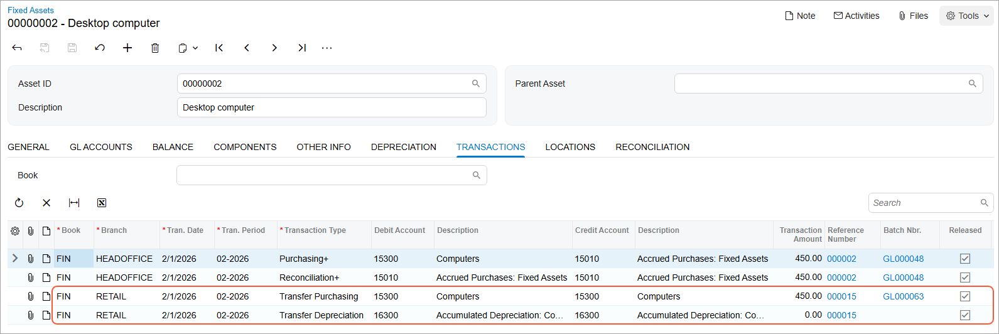
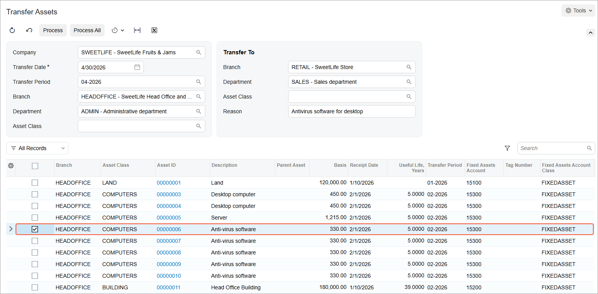

# Asset Transfers: Process Activity {#_a81f90a4-6bf7-4444-912e-e53b34b69a52 .task}

The following activity will walk you through the process of transferring fixed assets.

## Story {#section_oj2_ljv_vxb .section}

Suppose that on April 30, 2026, one of the computers and one anti-virus software license were transferred from the Administrative department of the Head Office branch of SweetLife Fruits &amp; Jams to the Sales department of the company's Retail branch. Acting as a SweetLife accountant, you need to record this transfer in the system.

## Configuration Overview {#section_tz4_djx_cnb .section}

In the *U100* dataset, the following tasks have been performed to support this activity:

-   On the [Enable/Disable Features](CS_10_00_00.md) \(CS100000\) form, the *Fixed Asset Management* feature has been enabled.
-   On the [Chart of Accounts](GL_20_25_00.md) \(GL202500\) form, the needed GL accounts have been created.
-   On the [Fixed Assets Preferences](FA_10_10_00.md) \(FA101000\) form, the **Automatically Release Transfer Transactions** check box has been cleared, which means that transfer transactions will be created with the *On Hold* status. You will have to release these transactions manually on the [Release FA Transactions](FA_50_30_00.md) \(FA503000\) form.

## Process Overview {#section_rj2_ljv_vxb .section}

In this activity, you will first update the fixed asset preferences on the [Fixed Assets Preferences](FA_10_10_00.md) \(FA101000\) form. You will then transfer one of the assets on the [Fixed Assets](FA_30_30_00.md) \(FA303000\) form and review the generated transfer transactions. On the [Transfer Assets](FA_50_70_00.md) \(FA507000\) form, you will transfer the other asset. On the [Journal Transactions](GL_30_10_00.md) \(GL301000\) form, you will review the generated GL transaction. You will return to the [Fixed Assets](FA_30_30_00.md) form and review the location of one of the transferred assets. Finally, you will review the list of assets for a specific branch on the [Asset Summary](FA_40_20_00.md) \(FA402000\) form.

## System Preparation {#section_tj2_ljv_vxb .section}

Before you begin transferring a fixed asset, do the following:

1.  Launch the Acumatica ERP website with the *U100* dataset preloaded, and sign in as an accountant by using the *johnson* username and the *123* password.
2.  In the info area, in the upper-right corner of the top pane of the Acumatica ERP screen, click the Business Date menu button, and select *4/30/2026* on the calendar.
3.  In the company to which you are signed in, be sure that you have implemented the fixed asset functionality by performing the following prerequisite activities: [Fixed Assets: To Set Up the System for Fixed Asset Management](../ImplementationGuide/config_FixedAssets_Implem_Activity_System.md), [Fixed Assets: To Configure the Fixed Asset Functionality](../ImplementationGuide/config_FixedAssets_Implem_Activity_FixedAssets_Subledger.md), and [Fixed Assets: To Create Fixed Asset Classes](../ImplementationGuide/config_FixedAssets_Implem_Activity_FixedAsset_Classes.md).
4.  Make sure that you have entered the needed fixed assets by performing the [Conversion of a Purchase: To Convert a Purchase to Multiple Assets](FixedAssets_Converting_Purchase_To_Convert_to_Multiple_Assets.md) prerequisite activity.
5.  On the Company and Branch Selection menu on the top pane of the Acumatica ERP screen, select the *SweetLife Head Office and Wholesale Center* branch.

## Step 1: Updating the Fixed Asset Preferences { .section}

To update the fixed asset preferences, do the following:

1.  Open the [Fixed Assets Preferences](FA_10_10_00.md) \(FA101000\) form.
2.  In the **Posting Settings** section, select the **Automatically Release Transfer Transactions** check box to make the system automatically release the transfer transactions that you will create later.
3.  On the form toolbar, click **Save** to save your changes.

## Step 2: Transferring the *Desktop computer* Asset {#section_vj2_ljv_vxb .section}

To transfer the *Desktop computer* asset, do the following:

1.  On the [Fixed Assets](FA_30_30_00.md) \(FA303000\) form, open one of the *Desktop computer* assets.
2.  On the **General** tab, in the **Branch** box, select *RETAIL*.
3.  In the **Department** box, select *SALES*.
4.  On the form toolbar, click **Save** to save the changes.
5.  Review the generated and released transfer transactions on the **Transactions** tab, as shown in the following screenshot.

    

    The system has generated the following transfer transactions:

    -   The *Transfer Purchasing* transaction debits the Fixed Assets account \(*15300*\) and credits the same account \(*15300*\) to transfer the cost between departments.
    -   The *Transfer Depreciation* transaction debits the Accumulated Depreciation account \(*16300*\) and credits the same account \(*16300*\) to transfer the accumulated depreciation. Because the asset has not yet been depreciated, the transaction amount is 0.00.
    Both transactions are posted to the asset's current period—the nearest period in which the asset should be depreciated.

## Step 3: Transferring the *Anti-virus Software* Asset {#section_zj2_ljv_vxb .section}

To transfer the *Anti-virus software* asset, do the following:

1.  Open the [Transfer Assets](FA_50_70_00.md) \(FA507000\) form.
2.  In the Selection area, specify the following settings:
    -   **Transfer Date**: *4/30/2026* \(inserted automatically\)
    -   **Transfer Period**: *04-2026* \(inserted automatically\)
    -   **Branch**: *HEADOFFICE*
    -   **Department**: *ADMIN*
3.  In the **Asset Transfer To** section, specify the following settings:
    -   **Branch**: *RETAIL*
    -   **Department**: *SALES*
    -   **Reason**: `Antivirus software for desktop`
4.  In the table, select the unlabeled check box in the row of the *Anti-virus software* asset, as shown in the following screenshot.

    

5.  On the form toolbar, click **Process**. The system generates the transfer transactions.
6.  On the [Fixed Assets](FA_30_30_00.md) \(FA303000\) form, open the *Anti-virus software* fixed asset, and go to the **Transactions** tab.
7.  Click the link in the **Batch Nbr.** column in the row for the *Transfer Purchasing* transaction, and review the generated GL transaction on the [Journal Transactions](GL_30_10_00.md) \(GL301000\) form, which is opened.

    The cost of the fixed asset was transferred from the *HEADOFFICE* branch to the *RETAIL* branch.

## Step 4: Reviewing the Settings of the Transferred Asset {#section_ck2_ljv_vxb .section}

To review the settings of the transferred fixed assets, do the following:

1.  On the [Fixed Assets](FA_30_30_00.md) \(FA303000\) form with the *Anti-virus software* asset opened, go to the **Locations** tab.
2.  Review the list of locations. The fixed asset has been located in the *ADMIN* department of the *HEADOFFICE* branch since 2/1/2026 \(the placed-in-service date of the asset\). On 4/30/2026, the fixed asset was transferred to the *SALES* department of the *RETAIL* branch. The most recent location is displayed at the top of the list of locations.
3.  Open the [Asset Summary](FA_40_20_00.md) \(FA402000\) form, and specify the following settings in the Selection area:

    -   **Company/Branch**: *RETAIL*
    -   **Department**: *SALES*
    The table displays the fixed assets that currently belong to the Sales department of the Retail branch.

**Parent topic:**[Transferring Fixed Assets](../UserGuide/FixedAssets_Transfers_Mapref.md)

