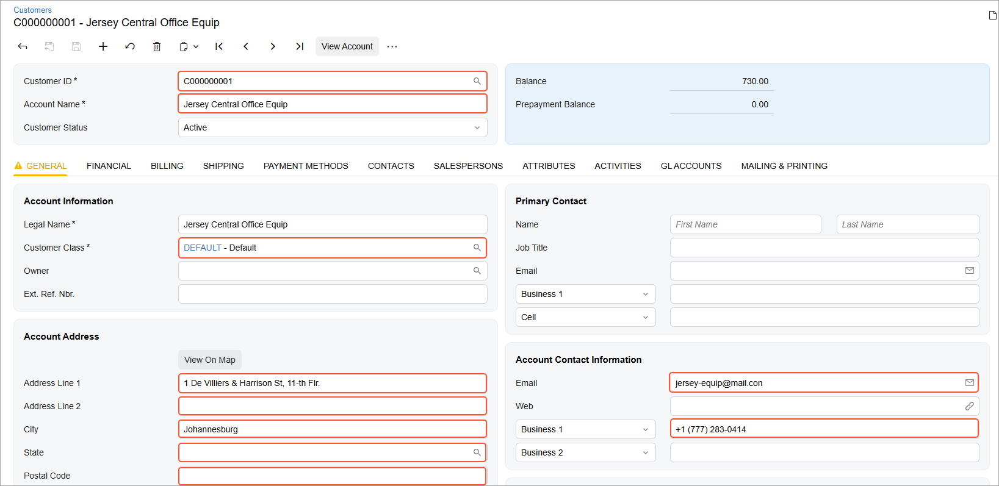

# Generic Inquiry Access Through OData: To Retrieve Data by Using a Custom Generic Inquiry {#_e81f0b95-932d-4d3a-aa74-0cdbff403d85 .task}

This activity will walk you through the process of retrieving a list of records by using a custom generic inquiry through the OData interface.

## Story { .section}

In the business intelligence \(BI\) application of the MyStore company, a marketing manager should be able to view analytics for the distribution of existing customers by geographical state. To display to the marketing manager the information about the customers, you need to retrieve from Acumatica ERP the information about the customers, their contacts, and their addresses. The data of these customers has been entered on the [Customers](AR_30_30_00.md) \(AR303000\) form in Acumatica ERP. You want to use the generic inquiry–based OData interface to obtain this data.

Through the generic inquiry–based OData interface, you cannot export records directly from a data entry form, such as [Customers](AR_30_30_00.md). Thus, before the export, you have to configure a generic inquiry that retrieves the needed data from Acumatica ERP. In this activity, you will use the Customer Contacts \(ARGI0015\) custom generic inquiry, which has been preconfigured for this activity.

## Process Overview { .section}

You will verify that the Customer Contacts \(ARGI0015\) generic inquiry is exposed through OData, review the results of the generic inquiry in Acumatica ERP, and obtain the results of the generic inquiry through the OData interface.

## System Preparation { .section}

Before you begin performing the steps of this activity, do the following:

1.  Deploy an instance of Acumatica ERP with the name *MyStoreInstance* and a tenant that has the *MyStore* name and contains the *T100* data.
2.  Make sure the Postman application is installed on your computer. To download and install Postman, follow the instructions on [https://www.postman.com/downloads/](https://www.postman.com/downloads/).
3.  Complete the following prerequisite activity: [Generic Inquiry Access Through OData: To Sign In to Acumatica ERP and Retrieve the Metadata](../Shared/../UserGuide/GI_Access_to_Exposed_Inquiry_Through_OData_SignIn_Activity.md).
4.  If you have created a Postman collection with the basic authentication configured, add a new request to the collection and configure the request to inherit the authorization type from the parent collection.

## Step 1: Viewing the Generic Inquiry in Acumatica ERP { .section}

To provide the list of customers to the BI application, you need to retrieve the following values from Acumatica ERP:

-   Customer ID
-   Account name
-   Customer class
-   Details of the main contact of the customer:
    -   Email address
    -   Primary phone number
-   Customer address:
    -   City
    -   State
    -   Postal code
    -   Address lines

The corresponding elements on the [Customers](../Shared/../UserGuide/AR_30_30_00.md) \(AR303000\) form are shown in the following screenshot.



The Customer Contacts \(ARGI0015\) custom generic inquiry, which you will use for this activity, retrieves the values of these elements. The generic inquiry has no parameters and is based on the PX.Objects.AR.Customer, PX.Objects.CR.Address, and PX.Objects.CR.Contact data access classes. To review this generic inquiry and make sure it includes the needed elements, do the following:

1.  In the Summary area of the [Generic Inquiry](SM_20_80_00.md) \(SM208000\) form, select the inquiry with the *Customer Contacts* title.
2.  Make sure the **Expose via OData** check box is selected for this generic inquiry on the **Interface Options** tab. This means that the generic inquiry results are available through OData.
3.  On the form toolbar, click **View Inquiry** to review the resulting generic inquiry form.

## Step 2: Retrieving the List of Customers Through OData { .section}

To retrieve the list of customers with contacts through the generic inquiry–based OData interface, do the following:

1.  In the Postman collection, add a request with the following settings:
    -   HTTP method: `GET`
    -   URL: *http://localhost/MyStoreInstance/t/MyStore/api/odata/gi/Customer Contacts*

        In this URL, you’ve appended generic inquiry name, which is *Customer Contacts*, to the base URL of the generic inquiry–based OData interface of the *MyStore* tenant in the *MyStoreInstance* instance.

2.  Send the request. If the request is successful, its response contains the `200 OK` status code. The following code example shows a fragment of the response body.

    ```
    {
      {
      "@odata.context": 
        "http://localhost/MyStoreInstance/t/MyStore/api/odata/gi/$metadata#Customer%20Contacts",
      "value": [
        {
          "CustomerID": "C000000001",
          "CustomerName": "Jersey Central Office Equip",
          "CustomerClass": "DEFAULT",
          "Email": "jersey-equip@mail.con",
          "Phone1": "+1 (777) 283-0414",
          "City": "Johannesburg",
          "State": null,
          "PostalCode": null,
          "AddressLine1": "1 De Villiers & Harrison St, 11-th Flr.",
          "AddressLine2": null,
          "ContactID": 5764,
          "AddressID": 5759
        },
        ...
      ]
    }
    ```

3.  Save the request.

**Parent topic:**[Accessing the Exposed Inquiry Results Through OData](../UserGuide/GI_Access_to_Exposed_Inquiry_Through_OData_Mapref.md)

