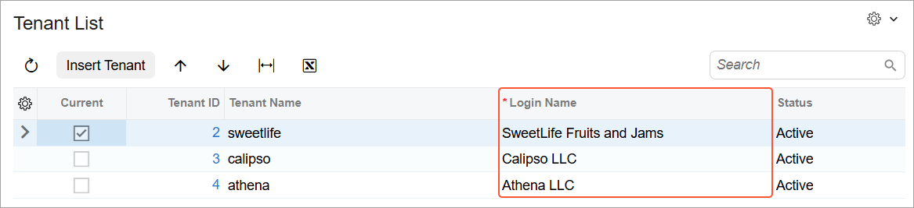
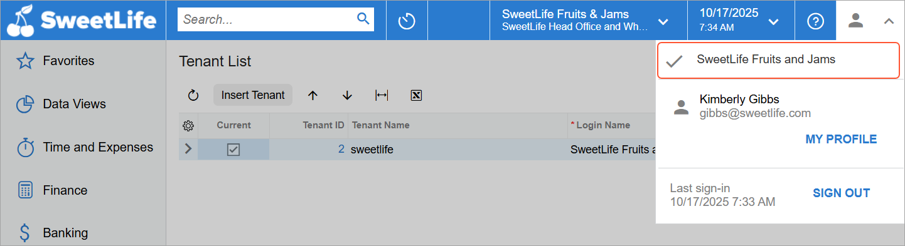

# Generic Inquiry Access Through OData: General Information {#_5d97a93d-45e0-466e-ba5e-77e1ccf96643 .concept}

You can view the results of the generic inquiries exposed through the generic inquiry–based OData interface in your browser or in another application that works with OData.

**Attention:** We strongly recommend that you deploy each Acumatica ERP instance by using HTTPS so that you can pass the user credentials safely.

## Learning Objectives { .section}

In this chapter, you will learn how to do the following:

-   Access data that is exposed through the generic inquiry–based OData interface
-   Configure Cross-Origin Resource Sharing \(CORS\) to access a generic inquiry through client-side web applications

## Applicable Scenarios { .section}

You may find the information in this chapter useful when you are a technical specialist whose responsibilities include the management of different reports and inquiries. An accountant or other employee may have requested access to an Acumatica ERP generic inquiry through a third-party OData client, such as Microsoft Excel, Microsoft Power BI, or a Java-based application.

You may also find this information useful if you are a developer who is creating an integration application that needs to retrieve data from Acumatica ERP.

## Access to an Exposed Generic Inquiry Through an OData Client { .section}

You use the OData interface to expose data from Acumatica ERP—in this case, data from a generic inquiry created on the [Generic Inquiry](SM_20_80_00.md) \(SM208000\) form. By doing this, you can give users the ability to view your company’s data and perform detailed financial analysis by using third-party OData clients, such as Microsoft Excel and Microsoft Power BI.

The generic inquiry–based OData interface in Acumatica ERP uses basic authentication. To access data, sign in to Acumatica ERP, provide the interface URL to your OData client, and enter your credentials. The OData client will then connect to your Acumatica ERP instance and retrieve the requested data.

To view data in a browser, enter the URL of the generic inquiry–based OData interface for your Acumatica ERP instance in the address bar. When prompted, provide your Acumatica ERP username and password. Once authenticated, the system displays the requested data.

**Tip:** When the system calculates the number of signed-in users, it treats the basic authentication used for OData as a sign-in of a conventional user \(not an API user\). The license restriction for conventional users is shown in the **Concurrent Users** box on the **License** tab of the [License Monitoring Console](../Shared/../UserGuide/SM_60_40_00.md) \(SM604000\) form.

In an OData client, you can use the OAuth 2.0 authorization mechanism instead of direct authentication with a username and password. For details about OAuth 2.0 authorization, see [Authorizing Client Applications to Work with Acumatica ERP](../IntegrationDevelopmentGuide/IS__mng_Authorizing_with_OAuth2.md).

## The URL of the Inquiry-Based OData Interface {#_93d81216-ee72-44e8-88bc-559a29e06c94 .section}

The URL for the generic inquiry–based OData interface is *&lt;Acumatica ERP instance URL&gt;/t/&lt;TenantName&gt;/api/odata/gi*. In this URL, *&lt;TenantName&gt;* is the login name of the tenant in the Acumatica ERP instance. \(For more information on single-tenant and multitenant configuration, see [Tenants: General Information](SA_Managing_Tenants_Using_Web_GeneralInfo.md).\) A request to this URL returns the list of all generic inquiries whose data is exposed.

**Attention:** Even though you can view the list of all generic inquiries whose data is exposed, you can obtain only the data to which your user account has sufficient access rights.

For example, you would specify the *https://sweetlife.com/erp/t/Calipso LLC/api/odata/gi* URL if the following are true:

-   The URL of the Acumatica ERP instance is *https://sweetlife.com/erp*.
-   The instance contains the *Calipso LLC* tenant.
-   You want to obtain the list of generic inquiries whose results are exposed through OData.

If you type this sample URL into a browser, you will notice that the browser automatically replaces the space with *%20*.

**Tip:** You can find the login names of tenants in the **Login Name** column on the [Tenant List](../Shared/../UserGuide/SM_20_35_30.md) \(SM203530\) form, as shown in the following screenshot.



Also, you can view the login name of the tenant to which you are currently signed in by viewing the User menu \(as shown in the following screenshot\), which you access by clicking the User menu button on the top pane of the Acumatica ERP screen.



The following code fragment shows a list of the exposed inquiries; the list has been retrieved through the OData interface.

```language-json
{
  "@odata.context": 
    "<Acumatica ERP instance URL>/t/<TenantName>/api/odata/gi/$metadata",
  "value": [
    {
      "name": "BI-LeadConversion",
      "kind": "EntitySet",
      "url": "BI-LeadConversion"
    },
    {
      "name": "BI-Cases",
      "kind": "EntitySet",
      "url": "BI-Cases"
    },
    {
      "name": "DB-StorageDetails",
      "kind": "EntitySet",
      "url": "DB-StorageDetails"
    },
    ...
  ]
}
```

## Use of OData to View a Generic Inquiry’s Fields and Parameters {#_58c5cefb-9ce4-4945-83cb-ab4cee21a9dd .section}

To view the list of fields and parameters in exposed generic inquiries, you append */$metadata* to the URL of the generic inquiry–based OData interface.

The returned data contains the EntityContainer XML tag, which provides the list of all exposed generic inquiries. In this list, you can find the following tags:

-   EntitySet, which specifies the name of an exposed generic inquiry that you use in an OData request and the EntityType element that corresponds to this generic inquiry.
-   FunctionImport, which specifies the name of an exposed generic inquiry that is used in an OData request that specifies parameters of the inquiry. The name of the generic inquiry with parameters has the \_WithParameters postfix. The FunctionImport element also specifies the EntityType and Function elements that correspond to this generic inquiry.

For each exposed generic inquiry, the returned data contains an EntityType element, which includes the following:

-   The list of fields of the generic inquiry in the Property elements.
-   The list of the key fields of the tables used in the generic inquiry in the PropertyRef elements, even if these key fields have not been added to the **Results Grid** tab of the [Generic Inquiry](SM_20_80_00.md) \(SM208000\) form for the generic inquiry.

For each exposed generic inquiry with parameters, the response includes a Function element, which specifies the list of parameters of the generic inquiry.

The system changes the field names and parameter names in the lists to conform to the OData specifications; for more information, see [Generic Inquiries and OData: Preparation of an Inquiry for Exposure](GI_Exposing_Inquiry_by_Using_OData_Preparation_of_Inquiry_for_Exposure.md).

You use the fields and parameters of exposed generic inquiries to retrieve the results of the generic inquiries, as described in [Generic Inquiry Access Through OData: Data Retrieval](GI_Access_to_Exposed_Inquiry_Through_OData_Data_Retrieval.md).

## Configuration of CORS { .section}

Acumatica ERP supports Cross-Origin Resource Sharing \(CORS\), meaning that requests for resources can come from a different domain than that of the resource making the request. With CORS enabled, you can allow access to the OData endpoints of your Acumatica ERP instance for client-side web applications, including Java-based applications. For more information about CORS, see [Cross-Origin Resource Sharing](http://www.w3.org/TR/cors/) on the World Wide Web Consortium portal.

The CORS settings of the web server of your instance are defined by the `cors` section of the `Web.config` file; see the following example of the default configuration for this section.

```language-xml
<cors enabled="true" origins="*" methods="*" headers="*" 
exposedHeaders="DataServiceVersion,MaxDataServiceVersion,OData-Version,
OData-MaxVersion" />
```

By default, CORS is enabled, all origins are allowed access to the server, and all supported headers are exposed and available for use. The web server of the application supports simple headers as well as the following headers: `DataServiceVersion`, `MaxDataServiceVersion`, `OData-Version`, and `OData-MaxVersion`. You need to use these four headers to access OData endpoints.

You can enforce limitations on cross-origin requests by changing the settings in the `Web.config` file. You can add your own headers as well. For details, see [Generic Inquiry Access Through OData: To Configure CORS](../Shared/../UserGuide/CU__how_Odata_CORS.md).

**Parent topic:**[Accessing the Exposed Inquiry Results Through OData](../UserGuide/GI_Access_to_Exposed_Inquiry_Through_OData_Mapref.md)

