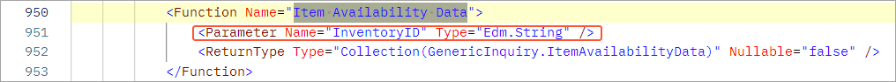
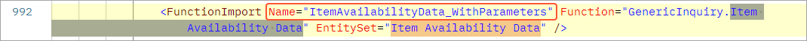

# Generic Inquiry Access Through OData: To Retrieve Data by Using a Generic Inquiry with Parameters {#_fbc48ffc-0c45-472b-aab8-853184d6336d .task}

This activity will walk you through the process of retrieving data by using a generic inquiry with parameters.

## Story { .section}

In the business intelligence \(BI\) application of the MyStore company, a warehouse manager should be able to view the statistics of the items available in the warehouse. To make it possible for the BI application to display these statistics, you need to retrieve from Acumatica ERP information about the quantities of stock items that are available in each warehouse. You also need to retrieve these statistics for a particular stock item. You want to use the generic inquiry–based OData interface to obtain this data.

In Acumatica ERP, you can view the item availability data on the [Inventory Summary](IN_40_10_00.md) \(IN401000\) form. To view the on-hand and available quantities of any stock item on this form, you select the item in the Selection area of the form.

To export the on-hand and available quantities of stock items by using the generic inquiry-based OData interface, you will use the Item Availability Data \(INGI0002\) generic inquiry, which has been preconfigured for this activity.

## Process Overview { .section}

You will verify that the Item Availability Data \(INGI0002\) generic inquiry is exposed through OData, review the results of the generic inquiry in Acumatica ERP with the parameter specified, and obtain the results of the generic inquiry with the parameter specified through OData.

## System Preparation { .section}

Before you begin performing the steps of this activity, do the following:

1.  Deploy an instance of Acumatica ERP with the name *MyStoreInstance* and a tenant that has the *MyStore* name and contains the *T100* data.
2.  Make sure the Postman application is installed on your computer. To download and install Postman, follow the instructions on [https://www.postman.com/downloads/](https://www.postman.com/downloads/).
3.  Complete the following prerequisite activity: [Generic Inquiry Access Through OData: To Sign In to Acumatica ERP and Retrieve the Metadata](../Shared/../UserGuide/GI_Access_to_Exposed_Inquiry_Through_OData_SignIn_Activity.md).
4.  If you have created a Postman collection with the basic authentication configured, add a new request to the collection and configure the request to inherit the authorization type from the parent collection.

## Step 1: Viewing the Generic Inquiry in Acumatica ERP { .section}

The Item Availability Data \(INGI0002\) generic inquiry is based on the [PX.Objects.IN.INSiteStatus](https://help.acumatica.com/dacBrowser/PX.Objects.IN/INSiteStatus) data access class and has one parameter, which you can use to filter the list of stock items by inventory ID. To review this generic inquiry and make sure it includes the needed elements, do the following:

1.  On the [Generic Inquiry](SM_20_80_00.md) \(SM208000\) form, select the inquiry with the *Item Availability Data* title in the Summary area.
2.  Make sure that the **Expose via OData** check box is selected for this generic inquiry on the **Interface Options** tab. This means that the generic inquiry results are available through OData.
3.  Click **View Inquiry** on the form toolbar to review the resulting generic inquiry form.
4.  Select *AACOMPUT01* in the **Inventory ID** box of the generic inquiry form. Make sure that only one record is returned.

## Step 2: Finding the List of Parameters and the Name of the Generic Inquiry { .section}

In [Generic Inquiry Access Through OData: To Sign In to Acumatica ERP and Retrieve the Metadata](GI_Access_to_Exposed_Inquiry_Through_OData_SignIn_Activity.md), you have received the list of fields and parameters in exposed generic inquiries. Now you need to search this list to find the name of the generic inquiry with parameters and the list of parameters. Do the following:

1.  In the list of fields and parameters in exposed generic inquiries, search for *Item Availability Data*.
2.  In the Function element with the *Item Availability Data* name, notice the *InventoryID* parameter.

    

3.  In the FunctionImport element, notice the name of the generic inquiry that is used in an OData request with specified parameters.

    


## Step 2: Retrieving the Quantities of Items { .section}

To retrieve the quantities of items, do the following:

1.  In the Postman collection, add a request with the following settings:
    -   HTTP method: `GET`
    -   URL: *http://localhost/MyStoreInstance/t/MyStore/api/odata/gi/ItemAvailabilityData\_WithParameters\(InventoryID='AALEGO500'\)*

        In this URL:

        -   You’ve appended generic inquiry name, which is *ItemAvailabilityData\_WithParameters*, to the base URL of the generic inquiry–based OData interface of the *MyStore* tenant in the *MyStoreInstance* instance.
        -   You’ve also specified the value of the *InventoryID* parameter of the generic inquiry.
2.  Send the request. If the request is successful, the response contains the `200 OK` status code. The result is shown in the following code.

    ```
    {
      "odata.metadata": 
        "http://localhost/MyStoreInstance/t/MyStore/api/odata/gi/$metadata#Item%20Availability%20Data",
      "value": [
        {
          "InventoryID": "AALEGO500 ",
          "Warehouse": "MAIN      ",
          "Description": "Lego 500 piece set",
          "QtyOnHand": "1999.000000",
          "QtyAvailable": "1977.000000",
          "Subitem": "0"
        }
      ]
    }
    ```

3.  Save the request.

**Parent topic:**[Accessing the Exposed Inquiry Results Through OData](../UserGuide/GI_Access_to_Exposed_Inquiry_Through_OData_Mapref.md)

