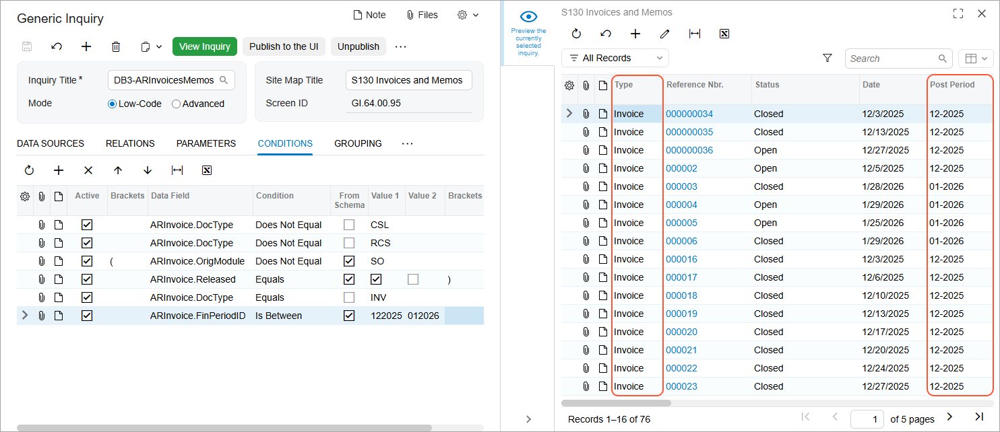

# Conditions and Parameters: To Add a Date Condition {#_bd8cec7b-c14f-41eb-aff2-8c7811e7e9b4 .task}

In this activity, you will learn how to modify an existing generic inquiry to limit the data displayed to a specific range of financial periods—that is, to include a date condition.

**Attention:** This activity is based on the *U100* dataset. If you are using another dataset or if any system settings have been changed in *U100*, these changes can affect the workflow of the activity and the results of the processing. To avoid issues, restore the *U100* dataset to its initial state.

## Story { .section}

Suppose that you are a technical specialist in your company who is working on simple customizations, including those involving the creation, modification, and use of generic inquiries. An accountant of your company has requested an inquiry form that displays data about invoices. You have offered the predefined Invoices and Memos \(AR3010PL\) generic inquiry form, but the accountant wants the inquiry form to show results limited to a range of financial periods that the accountant wants to analyze. Specifically, the inquiry form should display only invoices \(that is, no other document types\) posted from the *12-2025* financial period through the *01-2026* financial period \(including the starting and ending periods\).

## Configuration Overview {#section_ayf_13q_3rb .section}

You will work with a copy of the predefined Invoices and Memos \(AR3010PL\) inquiry form, which has the *AR-Invoices and Memos* inquiry title and the *Invoices and Memos* site map title specified on the [Generic Inquiry](SM_20_80_00.md) \(SM208000\) form.

**Tip:** The Invoices and Memos \(AR3010PL\) generic inquiry form, which is the list of the invoices and memos that have been created on the [Invoices and Memos](AR_30_10_00.md) \(AR301000\) form, is the substitute form that is opened when you click the *Invoices and Memos* link in a workspace or a list of search results.

The copy you will work with has the *DB3-ARInvoicesMemos* inquiry title and the *S130 Invoices and Memos* site map title specified on the [Generic Inquiry](SM_20_80_00.md) form.

## Process Overview { .section}

You will inspect the relevant user interface elements of the [Invoices and Memos](AR_30_10_00.md) \(AR301000\) form whose data will be used in the copied inquiry. On the **Results Grid** tab of the [Generic Inquiry](SM_20_80_00.md) \(SM208000\) form for this generic inquiry, you will then look for the row that corresponds to the **Post Period** column of the inquiry and note the value in the **Data Field** column. Finally, you will add the condition for the inquiry on the **Conditions** tab of the [Generic Inquiry](SM_20_80_00.md) form. With this condition, the results grid will display only documents that fall within the specified range of financial periods.

## System Preparation {#section_aww_z4r_jrb .section}

Launch the Acumatica ERP website, and sign in to a tenant with the *U100* dataset preloaded as system administrator Kimberly Gibbs. You should sign in by using the *gibbs* username and the *123* password.

**Tip:** The *gibbs* user is assigned the *Administrator* role, which has sufficient access rights to manage the system configuration and to modify generic inquiries, advanced filters, pivot tables, and dashboards.

## Step 1: Inspecting the UI Elements { .section}

To inspect the UI elements, do the following:

1.  Open the [Invoices and Memos](AR_30_10_00.md) \(AR301000\) form, which displays a single invoice.
2.  Point to the **Type** box, press Ctrl+Alt, and then click. The **Element Properties** dialog box opens.

    Make a note of the value in the **Data Field** box \(*DocType*\).

3.  Close the dialog box.
4.  Point to the **Post Period** box, press Ctrl+Alt, and then click. The **Element Properties** dialog box again opens.

    Make a note of the value in the **Data Field** box \(*FinPeriodID*\).

5.  Close the dialog box.

## Step 2: Adding a Condition for a Document Type { .section}

To modify the generic inquiry by adding a condition for a document type, do the following:

1.  Open the [Generic Inquiry](SM_20_80_00.md) \(SM208000\) form.
2.  In the **Inquiry Title** box of the Summary area, select *DB3-ARInvoicesMemos*.
3.  On the **Conditions** tab, click **Add Row** on the table toolbar, and specify the following settings in the added row:
    -   **Data Field**: *ARInvoice.DocType*
    -   **Condition**: *Equals*
    -   **From Schema**: Cleared
    -   **Value 1**: `INV`
4.  On the form toolbar, click **Save**.

## Step 3: Adding a Date Condition { .section}

To modify the generic inquiry by adding a date condition, do the following:

1.  While you are still viewing the *DB3-ARInvoicesMemos* inquiry on the [Generic Inquiry](SM_20_80_00.md) \(SM208000\) form, on the **Conditions** tab, click **Add Row** on the table toolbar, and specify the following settings in the added row:
    -   **Data Field**: *ARInvoice.FinPeriodID*
    -   **Condition**: *Is Between*
    -   **From Schema**: Selected
    -   **Value 1**: *12-2025*
    -   **Value 2**: *01-2026*
2.  On the form toolbar, click **Save**.
3.  Click the eye icon on the side panel to preview how your changes have affected the inquiry. The system has applied the conditions you have added, so that the resulting generic inquiry \(see the following screenshot\) displays only the invoices within the range of financial periods that you specified for the condition in the **Value 1** and **Value 2** boxes \(*12-2025* through *01-2026*\).

    

**Parent topic:**[Using Conditions and Parameters](../UserGuide/GI_Conditions_and_Parameters_Mapref.md)

