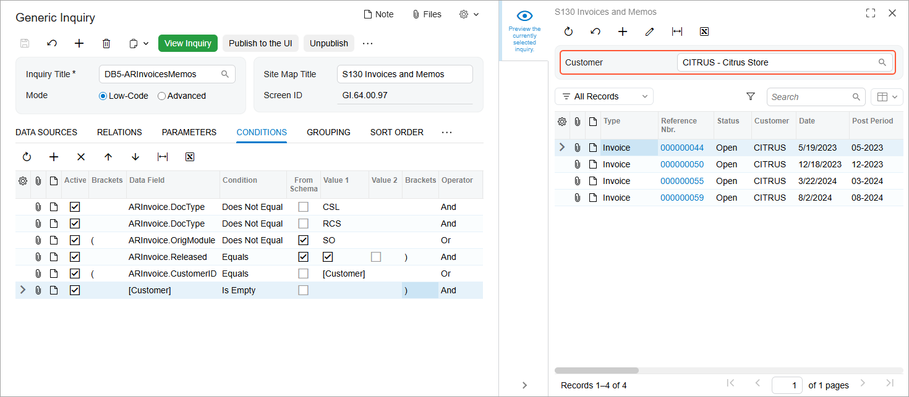

# Conditions and Parameters: To Add a Field Parameter to the Selection Area {#_15a8dc6b-4410-4eca-8e52-48dec6d41d66 .task}

In this activity, you will learn how to modify an existing generic inquiry to give users the ability to limit the data displayed by a value of some data field. To give users the ability to select that value, you will include a parameter for this data field in the Selection area of the inquiry form.

**Attention:** This activity is based on the *U100* dataset. If you are using another dataset or if any system settings have been changed in *U100*, these changes can affect the workflow of the activity and the results of the processing. To avoid issues, restore the *U100* dataset to its initial state.

## Story { .section}

Suppose that you are a technical specialist in your company who is working on simple customizations, including those involving the creation, modification, and use of generic inquiries. An accountant of your company has requested an inquiry that displays data about invoices and memos. You have offered the predefined Invoices and Memos \(AR3010PL\) generic inquiry form, but the accountant wants to give users the ability to filter the inquiry results by a particular customer—that is, users should be able to select a particular customer in the Selection area of the resulting generic inquiry form and review only that customer’s invoices and memos.

## Configuration Overview {#section_ayf_13q_3rb .section}

You will work with a copy of the predefined Invoices and Memos \(AR3010PL\) inquiry form, which has the *AR-Invoices and Memos* inquiry title and the *Invoices and Memos* site map title specified on the [Generic Inquiry](SM_20_80_00.md) \(SM208000\) form.

**Tip:** The Invoices and Memos \(AR3010PL\) generic inquiry form, which is the list of the invoices and memos that have been created on the [Invoices and Memos](AR_30_10_00.md) \(AR301000\) form, is the substitute form that is opened when you click the *Invoices and Memos* link in a workspace or a list of search results.

The copy you will work with has the *DB5-ARInvoicesMemos* inquiry title and the *S130 Invoices and Memos* site map title specified on the [Generic Inquiry](SM_20_80_00.md) form.

## Process Overview { .section}

On the **Results Grid** tab of the [Generic Inquiry](SM_20_80_00.md) \(SM208000\) form for the copied inquiry, you will look for the row that corresponds to the **Customer** column of the inquiry and note the value in the **Data Field** column. You will add the *Customer* parameter on the **Parameters** tab. Then you will specify how the system should apply the value of the parameter to the inquiry output by adding a condition on the **Conditions** tab.

## System Preparation {#section_rr4_1pr_jrb .section}

Launch the Acumatica ERP website, and sign in to a tenant with the *U100* dataset preloaded as system administrator Kimberly Gibbs. You should sign in by using the *gibbs* username and the *123* password.

**Tip:** The *gibbs* user is assigned the *Administrator* role, which has sufficient access rights to manage the system configuration and to modify generic inquiries, advanced filters, pivot tables, and dashboards.

## Step 1: Adding a Parameter { .section}

To modify the generic inquiry to add a parameter, do the following:

1.  Open the [Generic Inquiry](SM_20_80_00.md) \(SM208000\) form.
2.  In the **Inquiry Title** box of the Summary area, select *DB5-ARInvoicesMemos*.
3.  On the **Results Grid** tab, look for the row that corresponds to the **Customer** column, and note the value in the **Data Field** column \(*ARInvoice.CustomerID*\).
4.  On the **Parameters** tab, click **Add Row** on the table toolbar, and specify the following settings in the added row:
    -   **Name**: `Customer`
    -   **Schema Field**: *ARInvoice.CustomerID*
    -   **Display Name**: `Customer`
    -   **From Schema**: Selected
5.  On the form toolbar, click **Save**.

## Step 2: Adding a Condition for the Parameter { .section}

To modify the generic inquiry by adding a condition, do the following:

1.  While you are still viewing the *DB5-ARInvoicesMemos* inquiry, on the **Conditions** tab of the [Generic Inquiry](SM_20_80_00.md) \(SM208000\) form, click **Add Row** on the table toolbar, and specify the following settings in the added row:
    -   **Brackets**: *\(*
    -   **Data Field**: *ARInvoice.CustomerID*
    -   **Condition**: *Equals*
    -   **From Schema**: Cleared
    -   **Value 1**: *\[Customer\]*
    -   **Operator**: *Or*
2.  Again click **Add Row** on the table toolbar, and specify the following settings in the added row:
    -   **Data Field**: *\[Customer\]*
    -   **Condition**: *Is Empty*
    -   **From Schema**: Cleared
    -   **Brackets**: *\)*
3.  On the form toolbar, click **Save**.
4.  Click the eye icon on the side panel to preview how your changes have affected the inquiry form. The system adds the box corresponding to the parameter to the Selection area \(see the following screenshot\). You can select a particular customer account and view only invoices and memos for the customer, or you can leave the box empty.

    

**Parent topic:**[Using Conditions and Parameters](../UserGuide/GI_Conditions_and_Parameters_Mapref.md)

