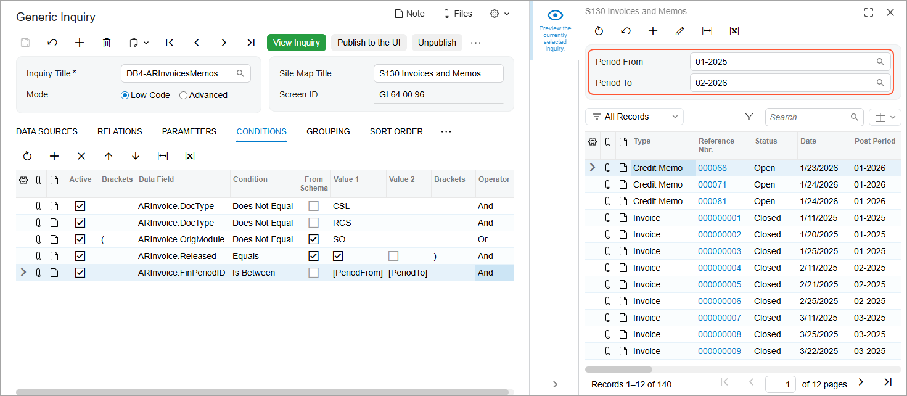

# Conditions and Parameters: To Add Period-Range Parameters to the Selection Area {#_b1ed5c97-7ab9-401f-9798-e499054a8cdc .task}

In this activity, you will learn how to modify an existing generic inquiry to give users the ability to limit the data displayed to a specific range of financial periods—that is, to add boxes corresponding to parameters to define the range.

**Attention:** This activity is based on the *U100* dataset. If you are using another dataset or if any system settings have been changed in *U100*, these changes can affect the workflow of the activity and the results of the processing. To avoid issues, restore the *U100* dataset to its initial state.

## Story { .section}

Suppose that you are a technical specialist in your company who is working on simple customizations, including those involving the creation, modification, and use of generic inquiries. An accountant of your company has requested an inquiry form that displays data about invoices and memos. You have offered the predefined Invoices and Memos \(AR3010PL\) inquiry form, but the accountant has asked you to design the inquiry form to give users the ability to limit the results to a user-defined range of financial periods—that is, a user should be able to specify the needed range of periods.

## Configuration Overview {#section_ayf_13q_3rb .section}

You will work with a copy of the predefined Invoices and Memos \(AR3010PL\) inquiry form, which has the *AR-Invoices and Memos* inquiry title and the *Invoices and Memos* site map title specified on the [Generic Inquiry](SM_20_80_00.md) \(SM208000\) form.

**Tip:** The Invoices and Memos \(AR3010PL\) generic inquiry form, which is the list of the invoices and memos that have been created on the [Invoices and Memos](AR_30_10_00.md) \(AR301000\) form, is the substitute form that is opened when you click the *Invoices and Memos* link in a workspace or a list of search results.

The copy you will work with has the *DB4-ARInvoicesMemos* inquiry title and the *S130 Invoices and Memos* site map title specified on the [Generic Inquiry](SM_20_80_00.md) form.

## Process Overview { .section}

On the **Results Grid** tab of the [Generic Inquiry](SM_20_80_00.md) \(SM208000\) form for the copied inquiry, you will look for the row that corresponds to the **Post Period** column of the inquiry and note the value in the **Data Field** column. You will add two parameters \(*Period From* and *Period To*\) on the **Parameters** tab. Then you will specify how the system should apply the values of these parameters to the inquiry results by adding a condition on the **Conditions** tab.

## System Preparation {#section_oj2_bpr_jrb .section}

Launch the Acumatica ERP website, and sign in to a tenant with the *U100* dataset preloaded as system administrator Kimberly Gibbs. You should sign in by using the *gibbs* username and the *123* password.

**Tip:** The *gibbs* user is assigned the *Administrator* role, which has sufficient access rights to manage the system configuration and to modify generic inquiries, advanced filters, pivot tables, and dashboards.

## Step 1: Inspecting the UI Elements { .section}

To inspect the UI element, do the following:

1.  Open the [Invoices and Memos](AR_30_10_00.md) \(AR301000\) form, which displays a single invoice.
2.  Point to the **Post Period** box, press Ctrl+Alt, and then click. The **Element Properties** dialog box opens.

    Make a note of the value in the **Data Field** box \(*FinPeriodID*\).

3.  Close the dialog box.

## Step 2: Adding Parameters { .section}

To modify the generic inquiry to add parameters, do the following:

1.  Open the [Generic Inquiry](SM_20_80_00.md) \(SM208000\) form.
2.  In the **Inquiry Title** box of the Summary area, select *DB4-ARInvoicesMemos*.
3.  On the **Results Grid** tab, look for the row that corresponds to the **Post Period** column, and make note of the value in the **Data Field** column \(*FinPeriodID*\).
4.  On the **Parameters** tab, set the **Arrange Parameters in X Columns** to `1`.
5.  Click **Add Row** on the table toolbar, and specify the following settings in the added row:
    -   **Name**: `PeriodFrom`
    -   **Schema Field**: *ARInvoice.FinPeriodID*
    -   **Display Name**: `Period From`
    -   **From Schema**: Selected
    -   **Default Value**: *01-2025*
6.  Again click **Add Row** on the table toolbar, and specify the following settings in the added row:
    -   **Name**: `PeriodTo`
    -   **Schema Field**: *ARInvoice.FinPeriodID*
    -   **Display Name**: `Period To`
    -   **From Schema**: Selected
    -   **Default Value**: *02-2026*
7.  On the form toolbar, click **Save**.

## Step 3: Adding a Condition for the Parameters { .section}

To modify the generic inquiry by adding a condition, do the following:

1.  While you are still viewing the *DB4-ARInvoicesMemos* inquiry, on the **Conditions** tab of the [Generic Inquiry](SM_20_80_00.md) \(SM208000\) form, click **Add Row** on the table toolbar, and specify the following settings in the added row:
    -   **Data Field**: *ARInvoice.FinPeriodID*
    -   **Condition**: *Is Between*
    -   **From Schema**: Cleared
    -   **Value 1**: *\[PeriodFrom\]*
    -   **Value 2**: *\[PeriodTo\]*
2.  On the form toolbar, click **Save**.
3.  Click the eye icon on the side panel to preview how your changes have affected the inquiry. The system has added the boxes corresponding to the parameters to the Selection area \(see the following screenshot\). You can specify a range of financial periods and view only the invoices and memos within the range of specified financial periods.

    

## Self-Test Exercise { .section}

Now that you have learned about conditions and parameters, you should change the condition for the inquiry you have developed in this activity, so that the inquiry will return records if a user has cleared either box or both boxes in the Selection area.

**Tip:** On the **Conditions** tab of the [Generic Inquiry](SM_20_80_00.md) \(SM208000\) form, you need to split the added condition into two complex conditions, one for each parameter. In the complex condition, you should use the *OR* operator and the *Is Empty* condition.

**Parent topic:**[Using Conditions and Parameters](../UserGuide/GI_Conditions_and_Parameters_Mapref.md)

