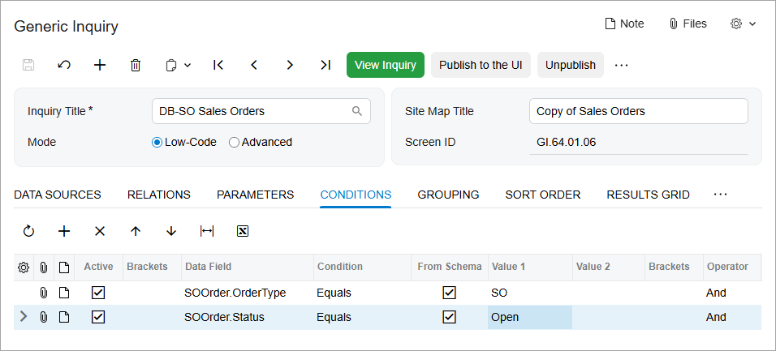
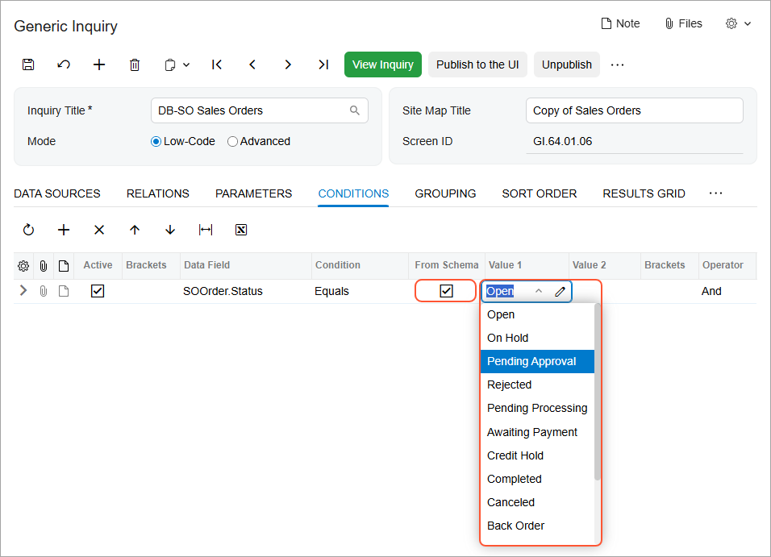
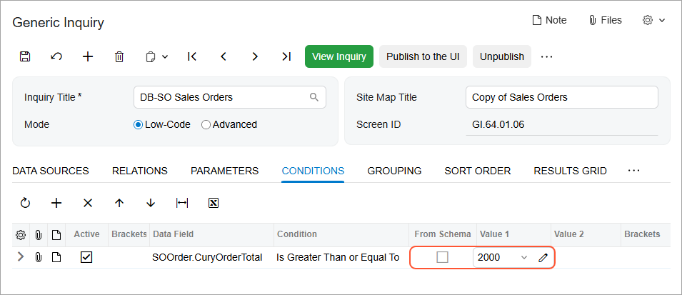
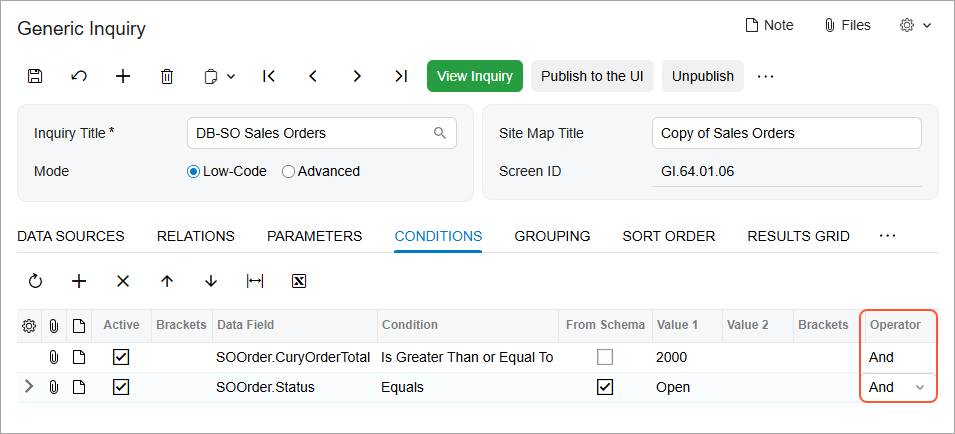

# Conditions and Parameters: Condition Configuration {#_2903105e-9c74-4833-8649-271473c4f6b1 .concept}

For generic inquiries that you develop or modify, you can construct simple or complex conditions to be applied to the data to be displayed.

## Construction of Conditions { .section}

You can limit the data to be displayed in the results of a generic inquiry by adding conditions to the inquiry on the **Conditions** tab of the [Generic Inquiry](SM_20_80_00.md) \(SM208000\) form. For example, suppose that you are designing or modifying an inquiry that lists open sales orders that have been created on the [Sales Orders](SO_30_10_00.md) \(SO301000\) form. To do this, you will define the following conditions that must be met for inquiry results to be listed: The order type equals *SO*, and the order status equals *Open*.

You construct conditions by adding rows to the table on the **Conditions** tab and by specifying the applicable data fields \(from the data access classes specified for the inquiry\), logical conditions, and values. For this example, you add two conditions, as shown in the following screenshot, to limit the data to only orders with the *SO* order type and the *Open* status.

## Specification of Values in Conditions { .section}

While constructing conditions in a generic inquiry, you can use the predefined values of data fields in the database, such as document statuses, and the predefined names of options stored in the database, such as document types. \(A document status value is generally inserted by the system, based on the defined workflow. A document type value is entered by a user, who selects the needed option from the drop-down list.\)

To use the predefined values of data fields, on the **Conditions** tab of the [Generic Inquiry](SM_20_80_00.md) \(SM208000\) form, you select the **From Schema** check box for the data field; as a result, the system displays the possible values in the drop-down list in the **Value 1** column and, for some conditions \(for example, *Is Between*\), the **Value 2** column. In the following screenshot, which shows the condition used to display sales orders with the *Open* status that have been created on the [Sales Orders](SO_30_10_00.md) \(SO301000\) form, you can see that the **From Schema** check box is selected and the predefined document status values are shown in the **Value 1** column.

To use the predefined names of options, you perform actions that are similar to those described above. For example, the [Cash Sales](AR_30_40_00.md) \(AR304000\) form has the **Type** drop-down list with the *Cash Sale* and *Cash Return* options. On the *AR-Cash Sales* inquiry \(with the *Cash Sales* site map title\), which lists documents created on the [Cash Sales](AR_30_40_00.md) form, the **Type** column \(which corresponds to the drop-down list on the entry form\) lists the values in the `ARCashSale.DocType` data field.

Further suppose that you would like to copy the inquiry and modify the copy to return only cash sales with the *Cash Sale* type, which requires you to define a condition. As the value in the condition, you should use the option name stored in the database, which you can find by inspecting the element, as described in [Discovering DACs](GI_Discovering_DACs_Mapref.md). On the [Cash Sales](AR_30_40_00.md) form, you inspect the **Type** element, and note that the option name for *Cash Sale* is *CSL*.

Also, you can define a value to be a formula that uses the values of particular data fields. To specify a formula as a value, on the **Conditions** tab of the [Generic Inquiry](SM_20_80_00.md) form, you click the edit button in the **Value 1** or **Value 2** column to open the Formula Editor dialog box. For details, see [Formulas in Inquiry Results: General Information](GI_Using_Formulas_General_Info.md). In a formula, if you use a value of a data field with a drop-down control, then you should use the value that is stored in the database, rather than the one that is displayed on the user interface. For details, see [DAC Discovery: General Information](GI_Discovering_DACs_General_Info.md).

If you are designing a condition that is not based on predefined values—as you would for data fields that store amounts or dates, which vary widely and are not predefined in the system—you clear the **From Schema** check box in the row with the data field. For example, suppose that you are designing an inquiry that returns only sales orders that have been created on the [Sales Orders](SO_30_10_00.md) form with a total amount that is greater than or equal to $2000. You would add the condition shown in the following screenshot.

## Use of Brackets and Operators { .section}

To limit the results of a generic inquiry, you might need to compose complex conditions: logical expressions that consist of multiple conditions. To do this, on the **Conditions** tab of the [Generic Inquiry](SM_20_80_00.md) \(SM208000\) form, you use opening and closing parentheses to indicate to the system the order of conditions, as well as the *And* or *Or* operator to join these conditions. By default, when you add a new row, the *And* operator is inserted for the row added to this tab.

The following screenshot displays two active conditions joined with the *And* operator. The resulting complex condition is applied to sales orders that have been created on the [Sales Orders](SO_30_10_00.md) \(SO301000\) form. With this complex condition specified, the resulting generic inquiry returns only open sales orders with a total amount greater than or equal to $2000.

**Parent topic:**[Using Conditions and Parameters](../UserGuide/GI_Conditions_and_Parameters_Mapref.md)

