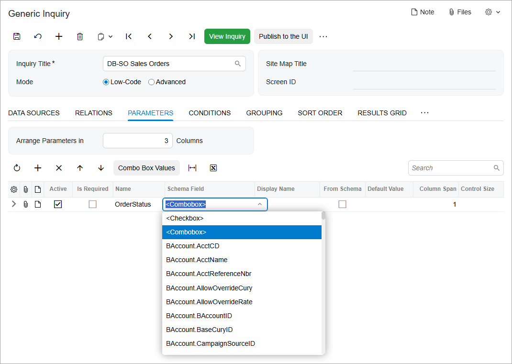
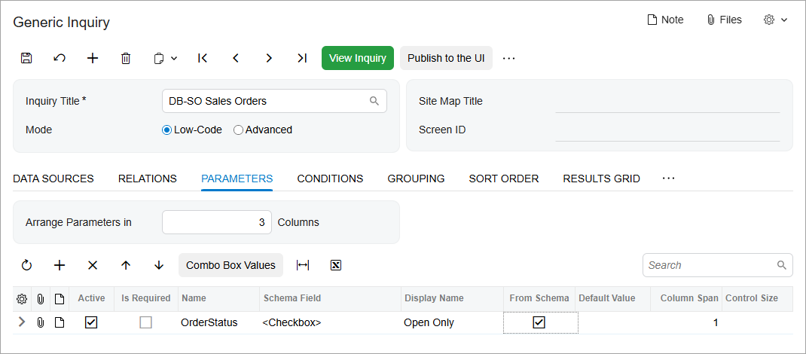
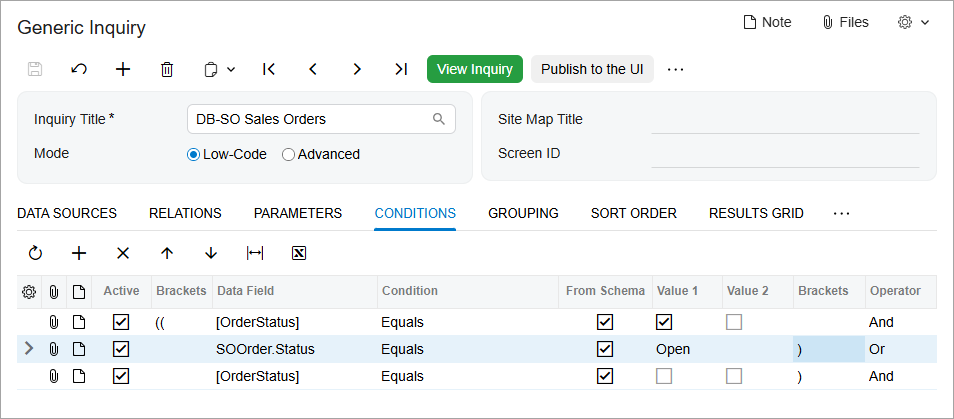
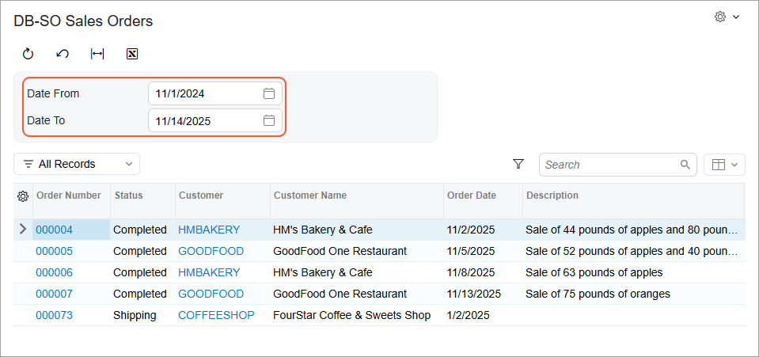
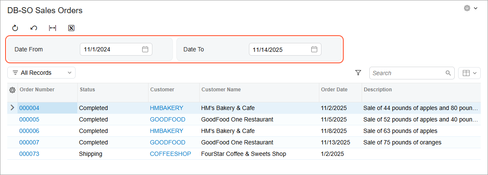

# Conditions and Parameters: Parameter Configuration {#_36b43638-f562-4c8c-9fbd-ce96d6146c94 .concept}

You can configure parameters that correspond to UI elements on the generic inquiry form. By using these UI elements, users can narrow the inquiry results to meet their current needs for information.

## Use of Parameters {#section_sck_5dx_3rb .section}

Although some generic inquiry forms consist of only the table with the results, on others, users have the ability to make selections to view specific data displayed in the table of the inquiry form, such as that for a particular date range or warehouse \(or both\). On the **Parameters** tab of the [Generic Inquiry](SM_20_80_00.md) \(SM208000\) form, you configure parameters for which optional or required boxes and other controls will be placed in the Selection area of the generic inquiry form \(above the table with the results\) in the order and layout you specify.

On the **Parameters** tab, you add a row for each element to be added to the Selection area, with the appropriate settings so that the inquiry will retrieve the relevant data from the DACs. In the **Name** column, you specify the identifier of the parameter without spaces. You use this identifier to create conditions \(on the **Conditions** tab\) for the parameter. In the **Display Name** column, you specify the caption to be used for the element.

You define the type of control to be used for the parameter, which can be any of the following, by the value you specify in the **Schema Field** column:

-   A selection box \(that is, a lookup box that has a corresponding lookup table or a date box that has a calendar\): In the column, you select the data field whose value you want to use for filtering.
-   A check box: In the column, you select the *&lt;Checkbox&gt;* option.
-   A drop-down list: In the column, you select *&lt;Combobox&gt;*, as shown in the following screenshot for a parameter being defined for an inquiry for sales orders that have been defined on the [Sales Orders](SO_30_10_00.md) \(SO301000\) form. Because the parameter corresponds to the **Status** drop-down list on the form, you need to select &lt;*Combobox*&gt;. In this case, you also need to define the list of options in the **Combo Box Values** dialog box, which you invoke by clicking **Combo Box Values** on the table toolbar.

Optionally, you can specify a default value for the parameter in the **Default Value** column. To make it possible to select a default value from a drop-down list or a lookup box, you can select the **From Schema** check box. If a field name is selected in the **Schema Field** column and you select the **From Schema** check box, then in the **Default Value** column, a lookup box, drop-down list, or check box \(depending on the selected field\) is displayed, and you can select a default value from the list of values.

## Creation of Conditions for Parameters {#section_tck_5dx_3rb .section}

You must create a corresponding condition for every parameter that you define on the **Parameters** tab of the [Generic Inquiry](SM_20_80_00.md) \(SM208000\) form. If a parameter does not have a corresponding condition specified on the **Conditions** tab, user selections for the element corresponding to the parameter will not affect the records that are returned; however, the element will still be displayed in the Selection area of the resulting inquiry form. For details on condition configuration, see [Conditions and Parameters: Condition Configuration](GI_Conditions_and_Parameters_Condition_ConfigurationConcept.md).

On the **Conditions** tab, the inquiry parameters used in conditions appear in square brackets to distinguish them from data fields. You can specify inquiry parameters in any of the following columns: **Data Field**, **Value 1**, and **Value 2**. For example, suppose that you are modifying an inquiry that lists sales orders that have been created on the [Sales Orders](SO_30_10_00.md) \(SO301000\) form. Further suppose that for the inquiry, you have added a parameter with the *OrderStatus* name on the **Parameters** tab of this form. On the **Conditions** tab, you can select the *\[OrderStatus\]* parameter as a data field or a value.

As another example, suppose that for an inquiry form that lists sales orders, you were asked to add the **Open Only** check box to the Selection area of the inquiry form instead of limiting the output to list only open sales orders by default. If a user selects the check box, the inquiry should display only open sales orders; if the check box is cleared, it should list all available orders. You first add the *OrderStatus* parameter on the **Parameters** tab of the [Generic Inquiry](SM_20_80_00.md) form and define it as a check box that is cleared by default, as shown in the following screenshot.

Then on the **Conditions** tab of the form, you add a complex condition for the parameter you added, as shown in the following screenshot. The condition has the following meaning: If the **Order Status** check box is selected, display only orders with the *Open* status; otherwise, display the records regardless of the status.

If you need the system to display the output results if a user of the generic inquiry form selects no values for a particular element in the Selection area that corresponds to a parameter, you should add a complex condition in which you indicate to the system that the parameter value can be empty. To create the complex condition, you add a row following the existing condition with the *OR* logical operator. In this new row, you specify the *IsEmpty* condition for the element mentioned in the **Value 1** column of the existing condition. Thus, you indicate that the complex condition is met if the element is left empty.

For example, suppose that for the inquiry you are modifying \(which lists sales orders that have been created on the [Sales Orders](SO_30_10_00.md) form\), you have been asked to add the **Date From** and **Date To** boxes to the Selection area of the inquiry form to give users the ability to specify a date range for the sales orders to be listed; you also need to add the parameters on the **Parameters** tab of the [Generic Inquiry](SM_20_80_00.md) form. If you do not indicate to the system that the values of these parameters can be empty, the system will not display any results if a user leaves the **Date From** and **Date To** boxes cleared.

Thus, for each of these date range parameters, you need to add a complex condition on the **Conditions** tab, as shown in the screenshot below, that specifies that the **Date From** and **Date To** boxes can be empty. If you add such a condition and a user leaves the **Date From** box empty and specifies a date in the **Date To** box, for example, the inquiry results display sales orders that have been created before the date specified in the **Date To** box. If the user leaves both boxes empty, the system displays all applicable sales orders regardless of the date.

**Tip:** If you did not include a condition on the **Conditions** tab to indicate that the parameter can be left empty by specifying the *IsEmpty* value in the **Condition** column, and if a user left the **Date From** box empty on the generic inquiry form, the inquiry would compare the empty value with the dates of order creation. Because in the database there are no records with empty order creation dates, the inquiry results would be empty.

")

## Arrangement of Elements on the Generic Inquiry Form {#section_vck_5dx_3rb .section}

You can change the arrangement of the elements that are displayed in the Selection area of the generic inquiry form you are designing by using the **Arrange Parameters in X Columns** box on the Parameters tab of the [Generic Inquiry](SM_20_80_00.md) \(SM208000\) form. In this box, you specify the number of columns in which the elements corresponding to parameters will be placed on the resulting inquiry form.

For example, if an inquiry has two parameters and **Arrange Parameters in X Columns** is set to *1* on the [Generic Inquiry](SM_20_80_00.md) form, then the system arranges the elements corresponding to the parameters in a single column, as shown in the following screenshot, which shows a generic inquiry listing sales orders that have been created on the [Sales Orders](SO_30_10_00.md) \(SO301000\) form.

If **Arrange Parameters in X Columns** is set to *2* on the [Generic Inquiry](SM_20_80_00.md) form, then the system arranges the elements corresponding to the parameters in two columns, as the following screenshot demonstrates.

**Parent topic:**[Using Conditions and Parameters](../UserGuide/GI_Conditions_and_Parameters_Mapref.md)

