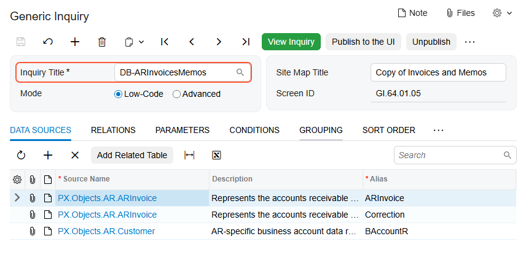
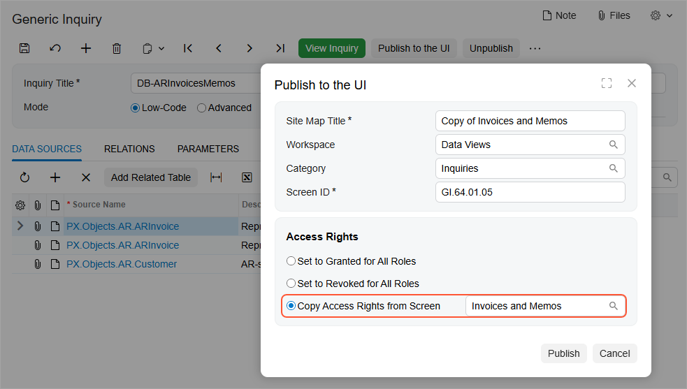

# Modification of a Predefined Inquiry: To Copy an Existing Generic Inquiry {#_aad752bb-38f7-4df2-bf88-ab74b280eb0d .task}

In this activity, you will learn how to make a copy of a predefined generic inquiry and create a new inquiry based on the copied generic inquiry.

**Attention:** This activity is based on the *U100* dataset. If you are using another dataset or if any system settings have been changed in *U100*, these changes can affect the workflow of the activity and the results of the processing. To avoid issues, restore the *U100* dataset to its initial state.

## Story { .section}

Suppose that you are a technical specialist in your company who is working on simple customizations. An accountant of your company has requested an inquiry that collects data about invoices and memos. You have offered the predefined Invoices and Memos \(AR3010PL\) generic inquiry form, but the accountant has requested some additions to the inquiry.

In this activity, acting as the technical specialist, you will copy the predefined generic inquiry to leave it intact, and you will later modify its copy as requested.

## Configuration Overview {#section_ayf_13q_3rb .section}

You will work with the predefined Invoices and Memos \(AR3010PL\) inquiry form, which has the *AR-Invoices and Memos* inquiry title and the *Invoices and Memos* site map title specified on the [Generic Inquiry](SM_20_80_00.md) \(SM208000\) form.

**Tip:** The Invoices and Memos \(AR3010PL\) generic inquiry form, which is the list of the invoices and memos that have been created on the [Invoices and Memos](AR_30_10_00.md) \(AR301000\) form, is the substitute form that is opened when you click the *Invoices and Memos* link in a workspace or a list of search results.

## Process Overview { .section}

To make a copy of the generic inquiry for modification while leaving the existing generic inquiry intact, you will use the [Generic Inquiry](SM_20_80_00.md) \(SM208000\) form. On this form, you will copy the original inquiry, paste the copy, and save it with its new name. You will then publish the copied inquiry. In this activity, you will only make a copy of an existing inquiry; you will not modify it.

**Tip:** We recommend that you use naming conventions for the generic inquiries that you create or copy from predefined inquiries to easily identify them. For example, in this activity, the copied inquiry title will start with *DB* to indicate that the inquiry is being added to the database manually, rather than automatically during product installation.

## System Preparation { .section}

Launch the Acumatica ERP website, and sign in to a tenant with the *U100* dataset preloaded as system administrator Kimberly Gibbs. You should sign in by using the *gibbs* username and the *123* password.

**Tip:** The *gibbs* user is assigned the *Administrator* role, which has sufficient access rights to manage the system configuration and to modify generic inquiries, advanced filters, pivot tables, and dashboards.

## Step 1: Making a Copy of the Generic Inquiry { .section}

To make a copy of the generic inquiry with the inquiry title *AR-Invoices and Memos* and assign a different name to the copy, do the following:

1.  Open the Invoices and Memos \(AR3010PL\) form.
2.  On the form title bar, click **Settings** &gt; **Edit Generic Inquiry**. The system opens the [Generic Inquiry](SM_20_80_00.md) \(SM208000\) form with the settings of this generic inquiry. The inquiry title is *AR-Invoices and Memos*.
3.  On the form toolbar, click **Clipboard** &gt; **Copy**.
4.  Click **Add New Record**.
5.  In the **Inquiry Title** box of the Summary area, type `DB-ARInvoicesMemos`.
6.  Press Tab on the keyboard, or move the focus to any other box on the form.
7.  On the form toolbar, click **Clipboard** &gt; **Paste**.
8.  In the **Site Map Title** box, type `Copy of Invoices and Memos`.

    To avoid the identical titles causing confusion in the workspace, you have changed the site map title.

9.  Click **Save**.

    Now you are working with *DB-ARInvoicesMemos* \(as shown in the following screenshot\), a copy of the *AR-Invoices and Memos* generic inquiry that has a different name and can be modified as needed without the *AR-Invoices and Memos* inquiry being affected.

    

Notice that the system has assigned an ID to the copied inquiry. By default, the newly created inquiry form cannot be accessed from the UI. In the next step, you will publish the generic inquiry to make the inquiry form visible for users.

## Step 2: Publishing the Generic Inquiry { .section}

To make the copied inquiry visible for users, do the following on the [Generic Inquiry](SM_20_80_00.md) \(SM208000\) form:

1.  On the form toolbar, click **Publish to the UI**.
2.  In the **Publish to the UI** dialog box, which opens, specify the following settings:
    -   **Site Map Title**: *Copy of Invoices and Memos* \(inserted automatically\)
    -   **Workspace**: *Data Views*
    -   **Category**: *Inquiries*
3.  In the **Access Rights** section, select **Copy Access Rights from Screen**, and then select *Invoices and Memos* with the *AR.30.10.PL* screen ID in the box next to the option button \(as shown in the following screenshot\). \(To do this, you search for the screen ID in the lookup table.\)

    With these settings, users that have access to the Invoices and Memos \(AR3010PL\) list of records will also have access to the Copy of Invoices and Memos form.

    

4.  Click **Publish**.

    The system publishes the generic inquiry and adds it to the **Data Views** workspace. Now you can open it by searching for its identifier.

**Parent topic:**[Copying a Predefined Inquiry](../UserGuide/GI_Copying_Predefined_Inquiry_Mapref.md)

