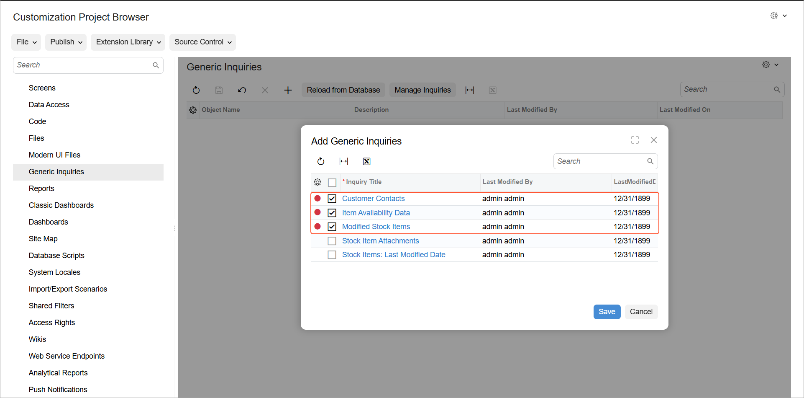

# Generic Inquiries in a Customization Project: To Include Generic Inquiries in a Customization Project {#_62682ad6-47d3-4305-b648-cd53086f34bb .task}

This activity will walk you through the process of including generic inquiries in a customization project.

## Story { .section}

Suppose that you need to distribute the generic inquiries that you have created in Acumatica ERP to the Acumatica ERP instances of the company. You need to create a customization project that includes these generic inquiries. You can then export this customization project to a ZIP file, import the file to the target instance, and publish this customization project.

## Process Overview { .section}

You will create a customization project and include in it the needed generic inquiries and the access rights to these inquiries.

## System Preparation { .section}

Before you begin performing this activity, deploy an instance of Acumatica ERP with the name *MyStoreInstance* and a tenant that has the *MyStore* name and contains the *T100* data.

## Step 1: Creating a Customization Project { .section}

To create a customization project, do the following on the [Customization Projects](SM_20_45_05.md) \(SM204505\) form:

1.  On the form toolbar, click **Add Row**.
2.  In the **Project Name** column of the added row, type the name of the project: `MyBIIntegration`.
3.  On the form toolbar, click **Save**
4.  In the **Project Name** column, click the *MyBIIntegration* link, which opens the Customization Project Editor for the *MyBIIntegration* customization project.

## Step 2: Including Generic Inquiries in the Customization Project { .section}

You will include in the customization project the following generic inquiries:

-   Customer Contacts \(ARGI0015\)
-   Item Availability Data \(INGI0002\)
-   Modified Stock Items \(INGI0016\)

To include these generic inquiries in the customization project, do the following:

1.  In the navigation pane of the Customization Project Editor, click **Generic Inquiries** to open the [Generic Inquiries](AU_20_60_00.md) page.
2.  On the page toolbar, click **Add New Record**.
3.  In the **Add Generic Inquiries** dialog box, which opens, select the check boxes in the rows with the following inquiry titles \(as shown in the following screenshot\):

    -   *Customer Contacts*
    -   *Item Availability Data*
    -   *Modified Stock Items*
    

4.  Click **Save**.

    Three inquiries have been added to the [Generic Inquiries](AU_20_60_00.md) page.

## Step 3: Including Access Rights in the Customization Project { .section}

You include access rights for the generic inquiries in the customization project as follows:

1.  In the navigation pane of the Customization Project Editor, click **Access Rights** to open the [Access Rights](AU_20_52_00.md) page.
2.  On the page toolbar, click **Add New Record**.
3.  In the **Add Access Rights for Screen** dialog box, select the Customer Contacts \(ARGI0015\) generic inquiry in the **Screen Name** box and click **Add**.
4.  Repeat the previous two instructions for the Item Availability Data \(INGI0002\) and Modified Stock Items \(INGI0016\) generic inquiries.

**Parent topic:**[Including Generic Inquiries in a Customization Project](../UserGuide/GI_CustomizationProject_Mapref.md)

