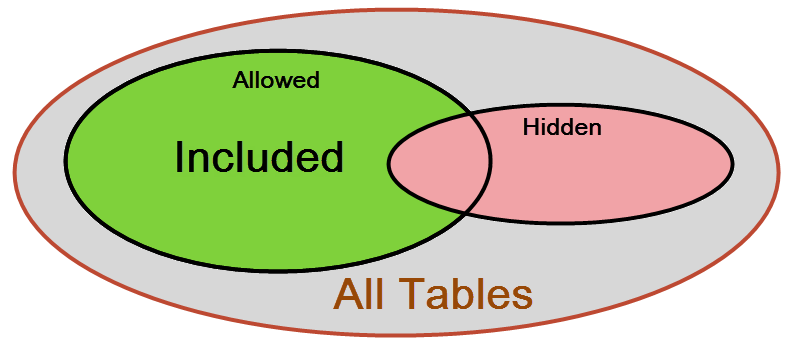

# Generic Inquiries in a Customization Project: Limiting the DACs Available for Generic Inquiries {#_10a2e1e8-345e-460e-8cb1-914e3c7fca84 .concept}

You can limit the list of data access classes \(DACs\) available for creating generic inquiries on the [Generic Inquiry](SM_20_80_00.md) \(SM208000\) form in the production environment. You will do this by making changes, adding them to a customization project in a development environment, and then publishing that customization project in the production environment. In the development environment, you should perform the following general steps:

1.  You create the `GITables.xml` configuration file to specify the Allowed and Hidden collections of masks for the full names of the DACs, as described in [The Contents of the GITables.xml File](#_f18917b0-5294-41e6-813c-5cfeb92d0a2c).
2.  You save the configuration file to the `App_Data` folder of the website.
3.  You add the file to a customization project as a *File* item. \(See [To Add a Custom File to a Project](../CustomizationPlatform/CG_GL_Items_Files_Adding.md) for details.\)

The platform automatically checks whether this file exists in the `App_Data` folder. If the customization project is published in the production environment, the platform applies the file content when a user selects a DAC for a generic inquiry on the [Generic Inquiry](SM_20_80_00.md) form.

## The Contents of the GITables.xml File {#_f18917b0-5294-41e6-813c-5cfeb92d0a2c .section}

The `GITables.xml` configuration file is in XML format and includes the GITables element only. This element must include the Allowed section and can also contain the Hidden section. Each section is a collection of Table elements.

The Allowed collection specifies the list of DACs that are available for use in generic inquiries that are constructed on the [Generic Inquiry](SM_20_80_00.md) \(SM208000\) form. If a DAC is not included in the Allowed collection, it does not appear in the list for selection on the **Table** tab of the form. You can also add the Hidden section to the configuration file. This section specifies the DACs you want to exclude from the list.

If a DAC is allowed and not hidden \(as illustrated by the green area in the following diagram\), it is included in the list of the DACs available for constructing generic inquiries on the [Generic Inquiry](SM_20_80_00.md) form. Otherwise, the DAC is not displayed in this list of DACs.



Each Table element of the Allowed and Hidden sections contains the FullName attribute, which specifies the DAC name or the mask for a set of DACs.

The attribute value is a string that can contain the following wildcard characters:

-   An asterisk \(*\**\), which matches any number of characters \(or no characters\)
-   A question mark \(*?*\), which matches exactly one character

The example below shows how to exclude the DACs by using the `PX.Objects.CR.BAccount` and `PX.*Contact*` masks.

```
<?xml version="1.0" encoding="utf-8"?>
<GITables>
	<Hidden>
		<Table FullName="PX.Objects.CR.BAccount" />
		<Table FullName="PX.*Contact*" />
	</Hidden>
	<Allowed>
		<Table FullName="*" />
	</Allowed>
</GITables>
```

Based on the mask with `Contact`, users will not be able to use any DACs that contain the word *Contact* in the DAC name, such as the PX.Objects.CR.Contact DAC, in their generic inquiries.

To limit the list of DACs by using only the Allowed collection, you can empty or remove the Hidden section. The following example shows how to include only the DACs that match the `PX.Objects.IN.*` mask.

```
<?xml version="1.0" encoding="utf-8"?>
<GITables>
	<Allowed>
		<Table FullName="PX.Objects.IN.*" />
	</Allowed>
</GITables>
```

**Parent topic:**[Including Generic Inquiries in a Customization Project](../UserGuide/GI_CustomizationProject_Mapref.md)

