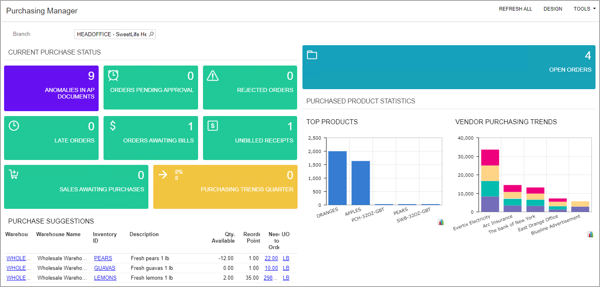
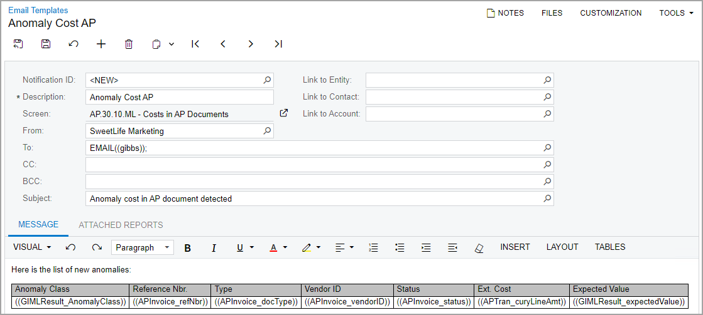
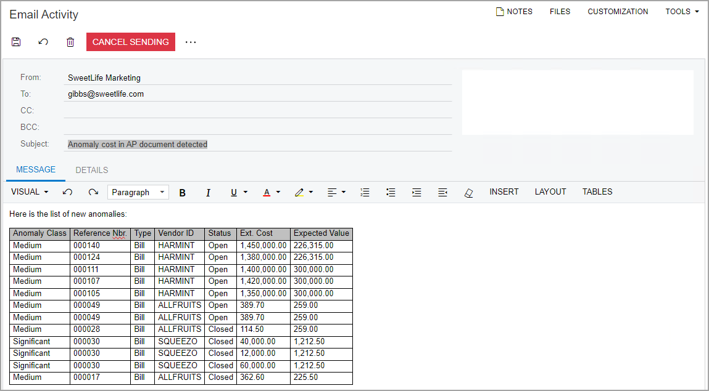

# Anomaly Detection: Process Activity {#_0e7394a3-41c4-4e99-9752-ce98e20fa1bc .task}

The following activity will walk you through the process of configuring the process that detects anomalies in generic inquiries.

**Attention:** This activity is based on the *U100* dataset. If you are using another dataset or if any system settings have been changed in *U100*, these changes can affect the workflow of the activity and the results of the processing. To avoid issues, restore the *U100* dataset to its initial state.

## Story { .section}

Suppose that you are a technical specialist who is working on configuring generic inquiries. Further suppose that a purchase manager in your company monitors the cost information of inventory items included in accounts payable documents. This purchase manager has requested the sending of notifications when the cost of an item in a particular AP document is too high or too low for a particular vendor, depending on the average value of the item for this vendor. Acting as a system administrator, you need to do the following:

1.  Configure the anomaly detection process for the generic inquiry that lists the cost information of inventory items
2.  Configure a business event that the system will trigger when any anomalies are detected
3.  Create a widget that displays the number of new anomalies and add this widget to a dashboard

## Configuration Overview {#section_tz4_djx_cnb .section}

In the *U100* dataset, the Costs in AP Documents \(AP3010ML\) generic inquiry form has been added for the purposes of this activity. The table on this form displays AP document lines that have been entered on the [Bills and Adjustments](AP_30_10_00.md) \(AP301000\) form. The Selection area contains elements that give the user the ability to select the start and end dates of the documents, the vendor, and the inventory item. The form does not yet display any information related to anomaly detection.

## Process Overview { .section}

On the [Generic Inquiry](SM_20_80_00.md) \(SM208000\) form for the *Costs in AP Documents \(AP3010ML\)* generic inquiry, you will specify the settings for anomaly detection. On the resulting Costs in AP Documents \(AP3010ML\) generic inquiry form, you will manually start the anomaly detection process. You will then set up a schedule for anomaly detection on the [Generic Inquiry](SM_20_80_00.md) form. Finally, you will add a widget to the predefined *Purchasing Manager \(PO3015DB\)* dashboard and configure a business event on the [Business Events](SM_30_20_50.md) \(SM302050\) form.

## System Preparation { .section}

Before you begin performing the steps of this activity, do the following:

1.  Launch the Acumatica ERP website with the *U100* dataset preloaded, and sign in as a system administrator by using the *gibbs* username and the *123* password.
2.  On the [Enable/Disable Features](CS_10_00_00.md) \(CS100000\) form, enable the *Detection of Numeric Anomalies in Generic Inquiries* feature.

    **Attention:** The *Detection of Numeric Anomalies in Generic Inquiries* feature requires a separate license.


## Step 1: Configuring Anomaly Detection { .section}

To configure anomaly detection for the Costs in AP Documents \(AP3010ML\) generic inquiry, do the following on the [Generic Inquiry](SM_20_80_00.md) \(SM208000\) form:

1.  In the **Inquiry Title** box of the Summary area, select *AP-ML-Costs in AP Documents*.
2.  Select the **Detect Anomalies** check box.

    The **Anomaly Detection** tab appears on the form.

3.  On this tab, specify the following settings:
    -   **Field for Analysis**: *Ext. Cost*
    -   **Date Field for Timeline**: *Date*
4.  In the **Grouping** section, do the following:
    -   On the table toolbar, click **Add Row**. In the **Data Field** column of the row, select *Vendor ID*.
    -   Select the **Skip Empty Groups** check box.
5.  In the **Update Frequency** box, select *On Demand*.
6.  On the form toolbar, click **Save**.

## Step 2: Starting the Anomaly Detection Process { .section}

While your are still working on the [Generic Inquiry](SM_20_80_00.md) \(SM208000\) form with the Costs in AP Documents \(AP3010ML\) generic inquiry selected, do the following:

1.  On the form toolbar, click **Detect Anomalies**.

    The [Detect Anomalies in Generic Inquiries](ML_50_20_00.md) \(ML502000\) form opens.

2.  In the table with generic inquiries \(the top table\), select the unlabeled check box in the only row, which contains the *AP-ML-Costs in AP Documents* generic inquiry.
3.  On the form toolbar, click **Process**.

    The **Processing** dialog box opens, and the system uploads data to the cloud service.

4.  When the uploading completes, close the dialog box.

    Notice that in the only row in the table with results \(the bottom table\), the status of anomaly detection is *Data Uploaded*. \(This is the same status that is shown for the generic inquiry in the top table.\)

5.  In the table with generic inquiries, again select the unlabeled check box in the row with the generic inquiry, and click **Process** on the form toolbar.

    The system starts the calculation for the selected row and changes the status to *Calculation in Progress*.

    **Tip:** Depending on the size of the data, the calculation could take a considerable amount of time. You can check the status by selecting the unlabeled check box for the needed row in the top table and then clicking **Process** on the form toolbar. Alternatively, you can click the row in the top table and then click **Execute Next Step** on the table toolbar of the bottom table.

6.  After the status becomes to *Ready to Download*, click **Process** on the form toolbar again to download the calculation results into the system.

    The final status of anomaly calculation is *Completed*.


**Tip:** Instead of clicking **Process** on the form toolbar, you can click **Execute Next Step** on the table toolbar of the table with results.

## Step 3: Reviewing the Results of Anomaly Calculation { .section}

To review the results of anomaly calculation and create a tab that lists records with the *Significant* and *Medium* anomaly severities, do the following on the Costs in AP Documents \(AP3010ML\) generic inquiry form:

1.  Notice that the following columns are shown:
    -   **Anomaly Severity**
    -   **Expected Value \(Ext. Cost\)**
    -   **Comment**
    -   **Reviewed**
2.  On the table toolbar, click **Filter Settings**.
3.  In the **Filter Settings** dialog box, which opens, add four rows with the following settings.

    |Brackets|Property|Condition|Value|Brackets|Operator|
    |--------|--------|---------|-----|--------|--------|
    |*\(*|*Anomaly Severity*|*Equals*|*Significant*| |*Or*|
    | |*Anomaly Severity*|*Equals*|*Medium*|*\)*|*And*|
    |*\(*|*Reviewed*|*Equals*|Cleared| |*Or*|
    | |*Reviewed*|*IsEmpty*|Cleared|*\)*| |

4.  In the **Filter Settings** dialog box, click **Save**.
5.  In the dialog box that opens, enter `Significant and Medium Anomalies` as the filter name and click **OK**.
6.  In the **Filter Settings** dialog box, to which you return, select the **Shared** check box and click **Apply**.

    The **Significant and Medium Anomalies** tab appears on the generic inquiry form. This tab lists the records with only *Medium* or *Significant* in the **Anomaly Severity** column. Notice that the system highlights these records in red.

7.  In the row with the *00028* bill, enter `Reviewed` in the **Comment** column and select the check box in the **Reviewed** column.
8.  Refresh the form in the browser.

    Notice that the row with the *00028* bill is not highlighted anymore. Based on the filter settings, the system does not display the records for which the **Reviewed** check box has been selected.


## Step 4: Setting Up a Schedule { .section}

Now that you have run the initial anomaly calculation, you can set it up to run on a schedule. To cause the system to run the anomaly calculation once a week, do the following:

1.  On the [Generic Inquiry](SM_20_80_00.md) \(SM208000\), select *AP-ML-Costs in AP Documents* in the **Inquiry Title** box.
2.  In the **Update Frequency** box on the **Anomaly Detection** tab, select *Weekly*.
3.  On the form toolbar, click **Save**.
4.  Open the [Detect Anomalies in Generic Inquiries](ML_50_20_00.md) \(ML502000\) form. If you have this form open, refresh it in the browser.

    Notice that the value in the **Next Run** column has changed from *On Demand* to the date that is a week from today.

5.  Select the unlabeled check box in the only row with the generic inquiry, and click **Process** on the form toolbar.

    The system displays a warning that the calculation will run according to the schedule and does not process the generic inquiry.


**Tip:** You can view the *Generic Inquiry Anomalies Calculation* schedule that the system has created on the [Automation Schedules](SM_20_50_20.md) \(SM205020\) form.

## Step 5: Adding a Widget { .section}

To add a dashboard widget that displays the number of new anomalies, do the following:

1.  On the dashboard title bar of the *Purchasing Manager \(PO3015DB\)* dashboard, click **Design**.
2.  In the widget placeholder, click **Add a New Widget**.
3.  In the **Add Widget** dialog box, click **Key Performance Indicator \(KPI\)**, and click **Next**.
4.  In the **Widget Properties** dialog box, which opens, specify the following settings:
    -   **Inquiry Screen**: *Costs in AP Documents*
    -   **Shared Filter to Apply**: *Significant and Medium Anomalies*
    -   **Field to Aggregate**: *Reference Nbr.*
    -   **Alarm Color**: *Purple*
    -   **Caption**: `Anomalies in AP Documents`
5.  Click **Finish**, which saves your changes, closes the dialog box, and adds the widget.

    The following screenshot shows the *Purchasing Manager \(PO3015DB\)* dashboard with the added widget.

    


## Step 6: Configuring the Business Event { .section}

To configure a business event to send notifications when the system detects anomalies with certain severities, do the following:

1.  On the [Business Events](SM_30_20_50.md) \(SM302050\) form, add a new record, and specify the following settings in the Summary area:
    -   **Event ID**: `Anomaly Event`
    -   **Type**: *Trigger by Schedule*
    -   **Screen Name**: *Costs in AP Documents*
    -   **Raise Event**: *Once for All Records*
    -   **Description**: `Anomaly is detected`
2.  On the **Trigger Conditions** tab, add rows with the settings listed in the following table.

    |Brackets|Table Name|Field Name|Condition|From Schema|Value 1|Brackets|Operator|
    |--------|----------|----------|---------|-----------|-------|--------|--------|
    |*\(*|*GIMLResult*|*Anomaly Severity \(anomalyClass\)*|*Equals*|Selected|*Significant*| |*Or*|
    | |*GIMLResult*|*Anomaly Severity \(anomalyClass\)*|*Equals*|Selected|*Medium*|*\)*|*And*|
    |*\(*|*GIMLReview*|*Reviewed \(reviewed\)*|*Equals*|Selected| | |*Or*|
    | |*GIMLReview*|*Reviewed \(reviewed\)*|*Is Empty*|Selected| |*\)*| |

3.  On the **Subscribers** tab, click **Create Subscriber** &gt; **Email Notification**.
4.  On the [Email Templates](SM_20_40_03.md) \(SM204003\) form, which opens, specify the following settings:

    -   **Description**: `Anomaly Cost AP`
    -   **From**: *SweetLife Marketing*
    -   **To**: *Kimberly Gibbs*
    -   **Subject**: `Anomaly cost in AP document detected`
    **Attention:** The email accounts that you use in the email template should have the appropriate settings. For details, see [Configuring Email Accounts](EM__con_Configuring_Email_Accounts.md).

5.  On the **Message** tab, select *HTML* on the formatting toolbar, and add the following text:

    ```
    <p class="richp">Here is the list of new anomalies:</p>
    <p class="richp"><br></p>
    <p class="richp">
    <table class="rtetable">
        <tbody>
            <tr>
                <td>Anomaly Class</td>
                <td>Reference Nbr.</td>
                <td>Type</td>
                <td>Vendor ID</td>
                <td>Status</td>
                <td>Ext. Cost</td>
                <td>Expected Value</td>
            </tr>
            <tr data-foreach-view="">
                <td>((GIMLResult_AnomalyClass))</td>
                <td>((APInvoice_refNbr))</td>
                <td>((APInvoice_docType))</td>
                <td>((APInvoice_vendorID))</td>
                <td>((APInvoice_status))</td>
                <td>((APTran_curyLineAmt))</td>
                <td>((GIMLResult_expectedValue))</td>
            </tr>
        </tbody>
    </table></p>
    ```

    The following screenshot shows the resulting subscriber of the business event.

    

6.  On the form toolbar, click **Save and Close** to save your changes, close the [Email Templates](SM_20_40_03.md) form, and return to the [Business Events](SM_30_20_50.md) form.
7.  On the table toolbar of the **Schedules** tab, click **Create Schedule**.

    The [Automation Schedules](SM_20_50_20.md) \(SM205020\) form opens.

8.  In the Summary area, type `Anomaly Cost AP Schedule` as the **Description**.
9.  On the **Schedule** tab, select *Weekly* as the **Frequency**.

    **Important:** You must specify the same frequency in the schedule as specified on the **Anomaly Detection** tab of the [Generic Inquiry](SM_20_80_00.md) \(SM208000\) form.

10. On the form toolbar, click **Save and Close** to save your changes, close the [Automation Schedules](SM_20_50_20.md) form, and return to the [Business Events](SM_30_20_50.md) form.
11. On the form toolbar, click **Save**.

    The following screenshot shows an example of an email that the purchase manager will receive when the business event is triggered.

    


**Parent topic:**[Detecting Anomalies in Generic Inquiries](../UserGuide/GI_DetectAnomalies_Mapref.md)

