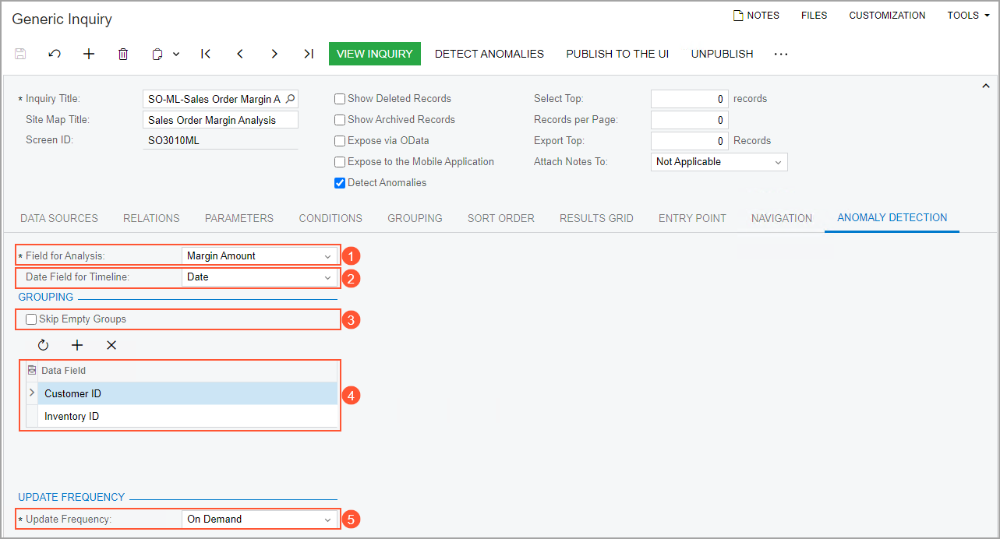
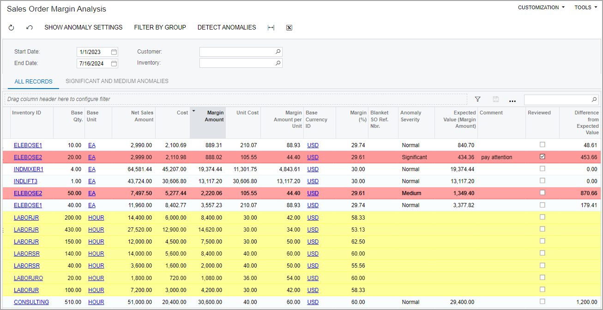
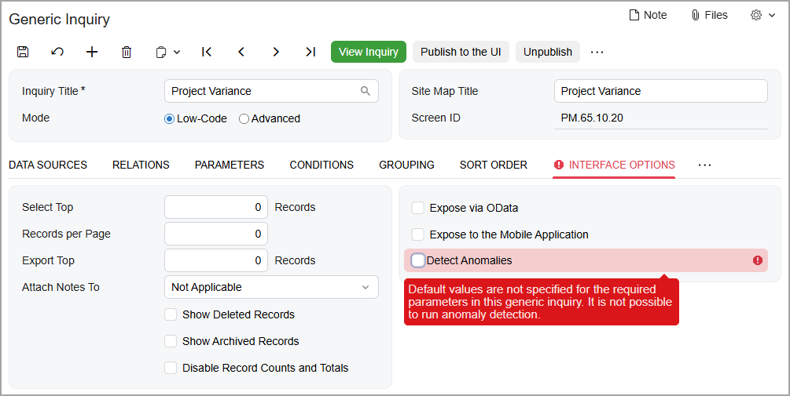
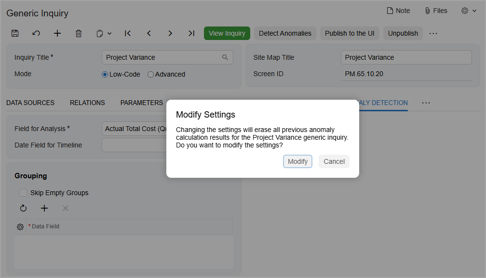

# Anomaly Detection: General Information {#_670d7f7c-7dee-46fa-a068-15995a22ad81 .concept}

By using the anomaly detection functionality in Acumatica ERP, supply chain managers can detect anomalies in a particular numeric column of a generic inquiry form. For example, they can quickly find records whose total amounts are too large or too small compared to these amounts in other listed records. The functionality can help supply chain managers to monitor key data values and correct any data entry errors, thus preventing ineffective business decisions based on incorrect data. In addition, sales managers and purchase managers can use anomaly detection to recognize deviations in data based on the system's analysis of abnormal figures in amounts, totals, costs, and other values.

Anomaly detection is usually configured by a technical specialist who performs basic customization tasks. In this topic, you will learn more about the configuration and use of anomaly detection.

**Attention:** The *Detection of Numeric Anomalies in Generic Inquiries* feature requires a separate license.

## Applicable Scenarios { .section}

You may find the information in this chapter useful if you are a sales manager, a purchase manager, or an accountant who is responsible for tracking deviations in particular amounts in entered records. You may also find this information useful if you are a technical specialist tasked with configuring the detection of anomalies in Acumatica ERP.

## Detection of Anomalies { .section}

Anomaly detection uses an unsupervised machine learning algorithm to classify numeric values as anomalies. The algorithm uses a machine learning model that has been developed to recognize certain patterns and is operated by a cloud service. The model classifies the analyzed values as one of the following:

-   *Significant*: These values should be treated as anomalies.
-   *Medium*: These values may be anomalies, but they may be falsely indicating possible anomalies.
-   *Normal*: These values are within a normal range.

The functionality can detect anomalies in all records on the generic inquiry form or in groups of records, which can be defined by the technical specialist who sets up the functionality. The anomaly detection process can be run on demand or by schedule on a daily, weekly, or monthly basis. The anomalies that the system finds can then be used in business events and shown on dashboards.

## Predefined Generic Inquiries for Anomaly Detection { .section}

You can set up anomaly detection for any generic inquiry. Acumatica ERP contains the following generic inquiries, which have been specifically designed to use anomaly detection:

-   Sales Order Margin Analysis \(SO3010ML\): This generic inquiry form shows the actual margin amount and percentage for sold items \(that is, items for which invoices have already been released\) for each sales order.

    By using anomaly detection, sales managers and supply chain managers can identify anomalies in sales margins, analyze profitability, and make informed pricing decisions in the future.

-   Costs in Purchase Orders \(PO3010ML\): On this generic inquiry form, purchasing managers and supply chain managers can view the cost information of items included in purchase orders.

    By running anomaly detection, these managers can detect unexpected purchase variations early. They can also analyze the costs of abnormal purchases, identify cost inefficiencies, prevent excessive spending, and negotiate better terms with suppliers.

-   Costs in AP Documents \(AP3010ML\): This generic inquiry form shows the cost information of inventory items included in accounts payable documents.

    Accountants, purchasing managers, and supply chain managers can use this form to detect anomalies in these documents. They can also analyze the abnormal costs, identify inconsistencies in billing, detect and correct billing errors, and monitor spending.

-   Production Total Variance \(AM0018ML\): This generic inquiry provides a complete picture of cost variances per production order, so you can review exceptions before period-end and correct discrepancies quickly.
-   Production Labor Variance \(AM0024ML\): This generic inquiry lets you identify discrepancies in labor time and cost to catch inaccurate reporting or outdated BOM estimates.
-   Production Material Variance \(AM0025ML\): This generic inquiry helps you analyze material cost deviations between planned and actual values for WIP and completed production orders—broken down by operation.
-   Production Employee Efficiency \(AM0030ML\): This generic inquiry gives you the ability to compare actual performance across employees doing the same operations, enabling fair evaluation and targeted coaching without over-adjusting BOM labor times.

## Setup of Anomaly Detection {#section_vv2_1y4_y4b .section}

You configure the anomaly detection for each generic inquiry separately. The typical process involves the following general steps:

1.  The configuration of anomaly settings on the [Generic Inquiry](SM_20_80_00.md) \(SM208000\).
2.  The initial running of the detection process on the [Detect Anomalies in Generic Inquiries](ML_50_20_00.md) \(ML502000\) form.
3.  A review of the calculation results on the appropriate generic inquiry form.
4.  Optional: The creation of a shared filter with the records whose anomaly severity is *Significant* or *Medium*.
5.  The setup of a schedule for running the anomaly detection process on the [Generic Inquiry](SM_20_80_00.md) \(SM208000\).
6.  Optional: The addition of a dashboard widget with the number of detected anomalies to a dashboard.
7.  Optional: The configuration of a business event that the system triggers when it detects anomalies.

## Anomaly Detection Settings { .section}

You specify the following anomaly detection settings for a generic inquiry on the **Anomaly Detection** tab of the [Generic Inquiry](SM_20_80_00.md) \(SM208000\) form:

-   The data field whose values will be analyzed.

    In the **Field for Analysis** box \(see Item 1 in the screenshot below\), you can select any data field that is specified on the **Results Grid** tab of the [Generic Inquiry](SM_20_80_00.md) form and has a numeric value.

-   The date field whose values provide the data points on the timeline.

    In the **Date Field for Timeline** box \(Item 2\), you can select only a data field that is specified on the **Results Grid** tab of the [Generic Inquiry](SM_20_80_00.md) form and contains date or date and time values.

-   The **Skip Empty Groups** check box in the **Grouping** section \(Item 3\) indicating whether groups with empty key values should be skipped.

    Suppose that you select the *Inventory ID* and *Order Type* fields—which correspond to the **Inventory ID** and **Order Type** boxes on the [Sales Orders](SO_30_10_00.md) \(SO301000\) form—for grouping in the table. If the **Skip Empty Groups** check box is selected and **Inventory ID** is empty for a certain record, this record will be skipped, or the model will treat all records with the same **Order Type** and empty **Inventory ID** as one group.

-   The groups of records that should be analyzed for anomalies.

    In the table in the **Grouping** section \(Item 4\), you can specify multiple data fields by which the records should be grouped. The system isolates these groups of records when detecting anomalies and searches for anomalies in the analyzed values only inside the specified groups. Anomalies found in one group do not influence the detection of anomalies in another group.

    For example, if a generic inquiry form lists sales orders of different types, you can group them by the order type. The system will then analyze data for sales orders of each of the order types \(such as *SO* and *IN*\).

-   The frequency \(**Update Frequency**\) of running the anomaly detection process \(Item 5\).

    You can select *Daily* \(the process is run each day between 12 AM and 6 AM\), *Weekly* \(it is run on Sundays between 12 AM and 6 AM\), *Monthly* \(it is run on the first day of the month between 12 AM and 6 AM\), or *On Demand* \(you start the process yourself\). The default value is *Weekly*.

    

**Attention:** If you change the values in the **Field for Analysis** box, the **Date Field for Timeline** box, or the **Data Field** table after anomaly detection has run, the system deletes all previous calculation results for the generic inquiry.

## Start of Anomaly Detection { .section}

After you have specified the anomaly detection settings, you start the anomaly detection process on the [Detect Anomalies in Generic Inquiries](ML_50_20_00.md) \(ML502000\) form \(see the following screenshot\). You open this form by clicking **Detect Anomalies** on the form toolbar of the [Generic Inquiry](SM_20_80_00.md) \(SM208000\) form or on the form toolbar of the appropriate generic inquiry form. \(You can also open the form directly from search results or a workspace.\)

 form")

To start the anomaly detection process manually, you perform the following general steps on this form:

1.  You select the needed generic inquiry or inquiries in the top table \(by selecting the Included check box for each inquiry to be processed\) and click **Process** on the form toolbar.

    The system uploads the data to the server.

2.  After the status of anomaly calculation changes to *Data Uploaded* for the processed inquiries, you select the same generic inquiries and click **Process** on the form toolbar again.

    The system starts the calculation, and the status changes to *Calculation in Progress* for each processed inquiry.

3.  After the status becomes *Ready to Download* for each processed inquiry, you select the needed generic inquiries and click **Process** on the form toolbar again to download the calculation results into the system.

    If the process is successful, the final status of anomaly calculation is *Completed* for each processed inquiry.

You can click the **Process** button only if *On Demand* is selected in the **Update Frequency** box on the [Generic Inquiry](SM_20_80_00.md) form for all generic inquiries selected for processing. The system starts the processing immediately in this case. If any other value is selected in this box for any included generic inquiry, the system displays a warning and starts the processing at the scheduled time.

You use the bottom table on the [Detect Anomalies in Generic Inquiries](ML_50_20_00.md) form to view the processing status of the generic inquiry selected in the top table. \(You select the needed generic inquiry by clicking it.\) During manual processing, you can also use the bottom table to initiate the next processing step for this generic inquiry by clicking **Execute Next Step** on the table toolbar. The bottom table displays only one row during manual processing. \(If you have not yet run the process for this generic inquiry, the table is empty.\)

After you perform the steps listed above for the first time, the following columns appear on the processed inquiry form:

-   **Anomaly Severity**: An indicator of the difference between the expected value and the real value: *Normal*, *Medium*, or *Significant*.

    The system highlights the rows with records with the *Medium* and *Significant* anomaly severity, as well as the rows that have not been processed, as shown in the screenshot below.

    **Important:** Results with the *Medium* anomaly severity can falsely indicate possible anomalies. We recommend that you use these results when it is important to detect even small deviations.

-   **Expected Value**: The value in the data field that you have selected as the field for analysis on the [Generic Inquiry](SM_20_80_00.md) form.
-   **Reviewed**: A check box that a supply chain manager selects to indicate to the system that the current row has been reviewed or verified and should be excluded from subsequent analysis.

    You can configure a shared filter to display only records that have not been reviewed \(that is, records with this check box cleared\). If a manager has selected the check box for any row, the system will not display it.

-   **Comment**: A comment about the processing results; the manager can enter this comment.

The following screenshot shows the *Sales Order Margin Analysis \(SO3010ML\)* inquiry form with the results of processing. Notice that the rows with the *Medium* and *Significant* anomaly severities are highlighted in red, and that the records that have not been processed are highlighted in yellow.

## Start of Anomaly Detection on a Schedule { .section}

You can configure anomaly detection to be run on a schedule. You do this by selecting the needed frequency in the **Update Frequency** box of the [Generic Inquiry](SM_20_80_00.md) \(SM208000\) form \(**Anomaly Detection** tab\). We recommend that you select the *Daily*, *Weekly* \(default\), or *Monthly* mode to direct the system to run the processes, and use the *On Demand* mode only during initial configuration.

**Attention:** You should not use the **Schedule** &gt; **Add** button on the form toolbar of the [Detect Anomalies in Generic Inquiries](ML_50_20_00.md) \(ML502000\) form for schedule configuration.

If you have run the process at least once during a certain day, the system will not start the next calculation for at least the next 24 hours \(even if the *Daily* update frequency is specified\). Suppose that you have specified the *Daily* frequency and then changed this setting to *On Demand*. Further suppose that you started the calculation on Wednesday and then changed the update frequency back to *Daily*. The system will run the next daily schedule at 12 AM on Friday.

**Tip:** The schedule runs according to the time zone specified on the [Site Preferences](SM_20_05_05.md) \(SM200505\) form.

You can reset the status of the processed records and remove all temporary data related to the anomaly calculation by clicking **Reset Data** on the form toolbar of the [Detect Anomalies in Generic Inquiries](ML_50_20_00.md) \(ML502000\) form.

## Use of Anomaly Detection in Dashboards { .section}

You can use a generic inquiry with anomaly detection configured in a dashboard. By using a widget on a dashboard, a supply chain manager can see the number of anomalies, follow the link, and review the detected records. Before adding a widget, you must do the following:

1.  Specify the anomaly detection settings for this generic inquiry
2.  Run the anomaly detection process at least once
3.  Create a shared filter for the generic inquiry form

You then add a widget by using the standard process \(for details, see [Specific Widgets: To Add KPI Widgets](RPT_Configuring_Widgets_To_Add_KPI_Widgets_Activity.md)\).

We recommend that you add to the filter a condition that excludes records that have been marked as *Reviewed*. In this case, the system will display only the newly found anomalies.

## Use of Anomaly Detection to Trigger Business Events { .section}

You can configure business events to send notifications when the system detects anomalies with certain severities.

You create a business event of the *Triggered by Schedule* type that uses an email notification as a subscriber and that the system will trigger once for all records in the inquiry form. When the business event is triggered, the sales manager, purchasing manager, or supply chain manager will receive an email with the new anomalies.

**Important:** You should specify the same frequency in the schedule as is specified on the **Anomaly Detection** tab of the [Generic Inquiry](SM_20_80_00.md) \(SM208000\) form.

For details on creating business events, see [Using Business Events](SA_Using_Business_Events_Mapref.md).

## Current Limitations {#section_bk3_yfp_g3c .section}

When you add the required parameters to your generic inquiries, you must specify their default values before using anomaly detection. If default values aren’t specified and you try to select the **Detect Anomalies** check box on the [Generic Inquiry](SM_20_80_00.md) \(SM208000\) form, the system displays an error, as shown below.

If you’ve already run anomaly calculation for a generic inquiry and you modify its settings on the **Anomaly Detection** tab, the existing calculation becomes outdated. In this case, you must start a new calculation. If a schedule is already running, the system stops it and then reruns the calculation with the updated values. The system displays a warning, as shown below.

## Anomaly Detection for Complex Generic Inquiries {#section_as5_hfp_g3c .section}

You can also set up anomaly detection for a complex generic inquiry—one that uses another generic inquiry as a data source. You use the same process as described above. For details on complex inquiries, see [Data from Multiple Data Sources: Use of Generic Inquiry as Data Source](GI_Use_of_Generic_Inquiry_as_Data_Source_Concept.md).

We recommend not modifying a generic inquiry that’s used as a data source. These changes would affect the dataset and invalidate existing calculations. If you need to modify a source inquiry, stop the current calculation, make the needed changes, and then run the process again. To stop the current calculation, select the needed inquiry on the [Detect Anomalies in Generic Inquiries](ML_50_20_00.md) \(ML502000\) form and click **Reset Data** on the form toolbar.

**Tip:** You can run anomaly calculation for both the source generic inquiry and the inquiry that uses it.

**Parent topic:**[Detecting Anomalies in Generic Inquiries](../UserGuide/GI_DetectAnomalies_Mapref.md)

