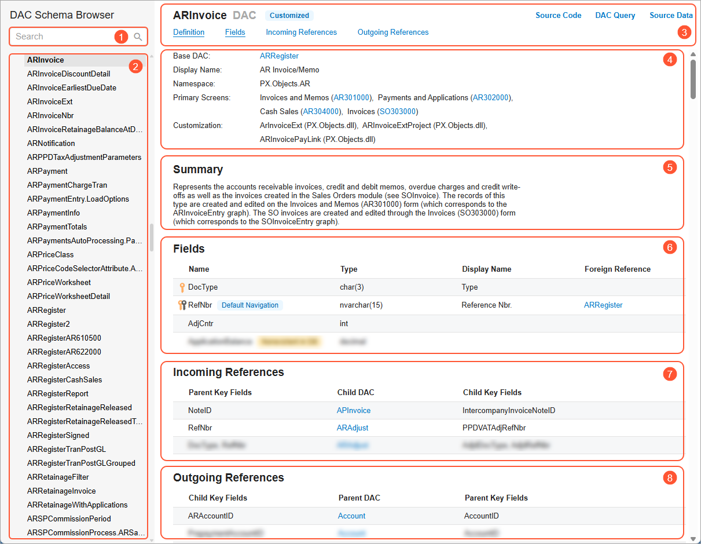

# Data from Multiple Data Sources: DAC Schema Browser {#_b6c3f441-a543-4345-a354-a27167f99d27 .concept}

During manual configuration of relations between tables when you are designing a generic inquiry or report, you can use the Acumatica ERP DAC Schema Browser to find information about any data access class \(DAC\). You can use this information to understand which DACs should be used in generic inquiries and reports, and how to join these DACs.

## Ways to Access the Information {#section_z2t_bqk_xrb .section}

You can open DAC Schema Browser by clicking one of the following:

-   A link with a table name in the **Source Name** column on the **Data Sources** tab of the [Generic Inquiry](SM_20_80_00.md) \(SM208000\) form
-   A link with a data access class in the **Element Properties** dialog box, which opens when you inspect UI elements on a data entry form
-   **Settings** &gt; **DAC Schema Browser** on the right side of the form title bar of any form

The system opens the DAC Schema Browser in a separate browser tab.

## Parts of the DAC Schema Browser { .section}

The following screenshot demonstrates the DAC Schema Browser and its parts.

1.  Search box \(see Item 1 in the screenshot\): By using this box, you can search for a DAC by its name or display name. When you search for a DAC by its name, you may notice that the search results contain more than one DAC. These DACs have the same names but different namespaces.

    **Tip:** To be sure that you are viewing the needed DAC, we recommend that you open the DAC Schema Browser in the **Element Properties** dialog box, which you invoke on a data entry form. In this case, the DAC Schema Browser opens with the information about the selected data access class.

2.  DAC navigation menu \(Item 2\): This menu has a tree structure in which DACs are listed below their namespaces. In this menu, you can select a DAC to view its information.
3.  Page title bar \(Item 3\): In this part, you can obtain information about the DAC name and the type of the DAC—for example, *Obsolete*, *Hidden*, *Nonexistent in DB*, and *Projection*. Also, using the links on the title bar, you can go to the needed sections of the current page. On the far right of the title bar, there are the following links:
    -   *Source Code*: Opens the source code for the selected DAC.
    -   *DAC Query*: Opens an SQL query that the selected DAC executes.
    -   *Source Data*: Opens the source data of the selected DAC.
4.  Main information area \(Item 4\): In this part, you can obtain additional information about the selected DAC, such as the following:
    -   a link to the base DAC \(that is, the DAC through which the system receives data\);
    -   a link to a DAC that is used in a projection query or in a nested DAC;
    -   the list of forms whose primary view is based on the selected DAC \(applicable only for primary DACs\);
    -   a link to the parent DAC \(if applicable\) of the selected DAC.
5.  Summary and Remarks area \(Item 5\): This area contains a general description of the selected DAC, which can be useful when you are selecting DACs for your generic inquiry or report.
6.  List of DAC fields \(Item 6\): In this part, you can get information not only about the names of the selected DACs but also about key fields and references to other DACs. Key fields are marked with icons to indicate that the field is a primary key \(yellow key\), a foreign key \(black key\), or both types of keys. If a particular field is a foreign key, the link to the foreign DAC is displayed in the **Foreign Reference** column.

    **Tip:** A foreign key is a set of attributes in a table that refer to the primary key of another table. The foreign key links these two tables. A primary key is a specific choice of a minimal set of attributes \(columns\) that uniquely specify a row in a table.

7.  Incoming references \(Item 7\): Incoming references are the DACs that reference the selected DAC. These DACs are listed in the **Child DAC** column. In the **Parent Key Fields** column, the system lists the key fields of the selected DAC and in the **Child Key Fields** column, the system shows the corresponding key fields that you should use to join the DACs.
8.  Outgoing references \(Item 8\): Outgoing references are the DACs that the selected DAC references. These DACs are listed in the **Parent DAC** column. In the **Child Key Fields** column, the system lists the key fields of the selected DAC and in the **Parent Key Fields** column, the system shows the corresponding key fields that you should use to join the DACs.

For detailed information about the DAC Schema Browser, see [DAC Schema Browser](DAC_Schema_Browser_Reference.md).

**Parent topic:**[Getting Data from Multiple Data Sources](../UserGuide/GI_Getting_Data_from_Multiple_Tables_Mapref.md)

