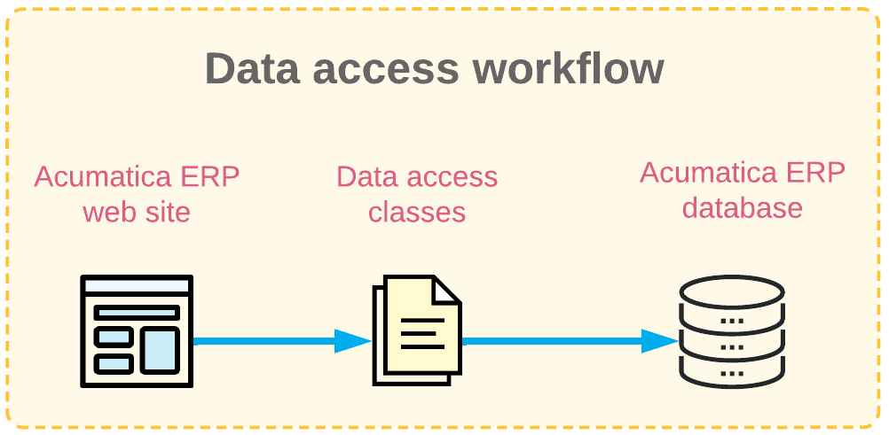
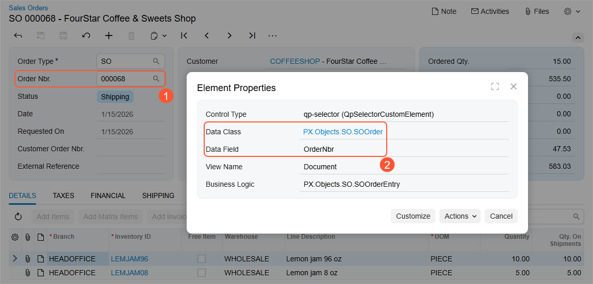
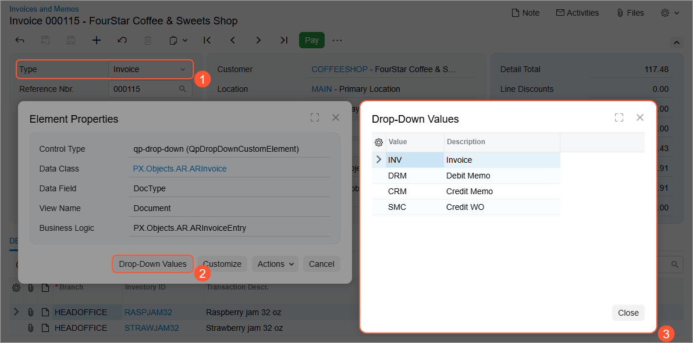
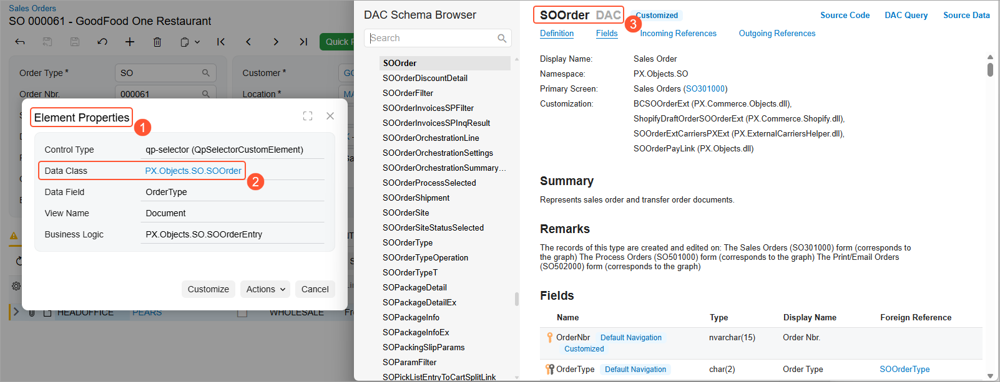
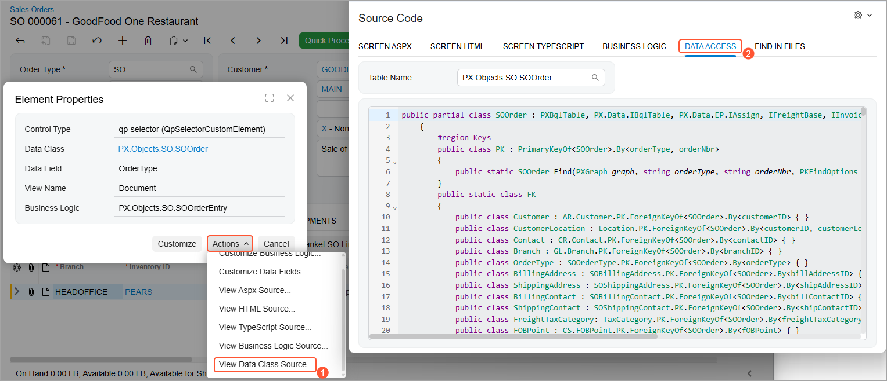
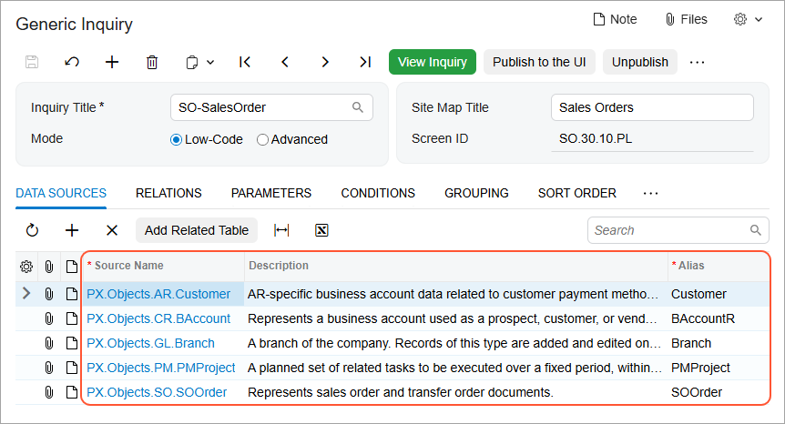
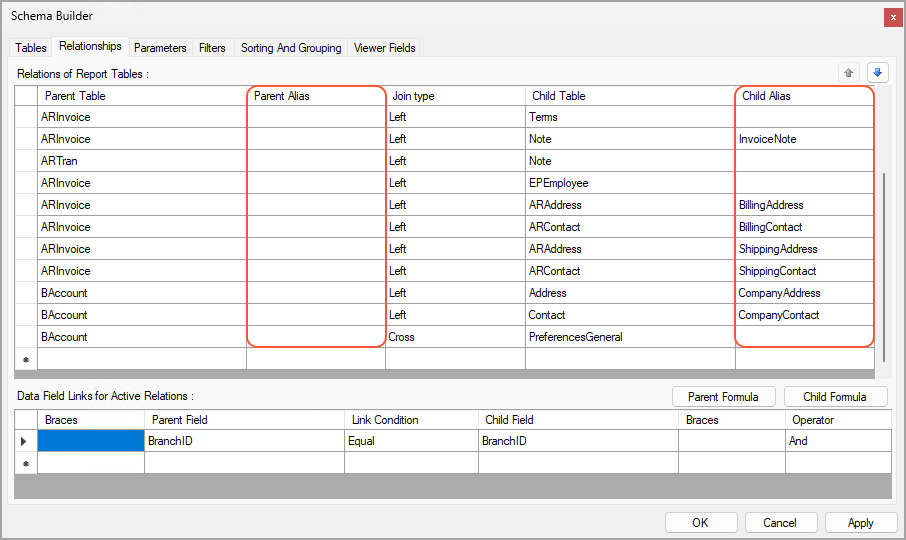

# DAC Discovery: General Information {#_51ede759-d530-4101-bb3a-274e8a922faa .concept}

In Acumatica ERP, the data is stored in a database. However, users of Acumatica ERP do not access the database directly. Instead, they access the data access classes \(DACs\), as shown in the illustration below. A data access class is a programming object used to represent and provide access to a database table in the code of Acumatica ERP.

Data access classes contain data fields that hold different data that has been entered in Acumatica ERP. The data fields that you select to retrieve data from will be the columns of the resulting generic inquiry form or will be linked to elements of the resulting report.

To work with a generic inquiry or report, you need to find the data access classes and data fields that underlie the key elements on the relevant data entry form or forms. To do this, you inspect these user interface elements.

For detailed descriptions of data access classes used by Acumatica ERP, look for the needed DAC in the [DAC Schema Browser](https://help.acumatica.com/dacBrowser). \(For details about the DAC Schema Browser, see [Data from Multiple Data Sources: DAC Schema Browser](GI_Discovering_DACs_DAC_Schema_Browser_Concept.md).\)

## Learning Objectives { .section}

In this chapter, you will learn how to inspect UI elements to find the underlying data fields.

## Applicable Scenarios { .section}

You may need to discover DACs when you are responsible for the customization of Acumatica ERP in your company, and you need to modify an existing generic inquiry or report to better meet the needs of a particular group of users or all users. Before you start to modify the inquiry or report, you need to find out what DACs store the data that you want to modify. For this purpose, you need to inspect the needed UI elements.

## Inspection of UI Elements {#section_tpq_yrk_jrb .section}

You usually create or modify a generic inquiry or report to retrieve data related to some business purpose, so you know which data you need to retrieve. Thus, you have to explore which data access classes and data fields you can use to access this data.

To find the underlying data access classes and fields, you explore the forms related to the needed data. For example, suppose that you want to find the data field that holds the reference number of a sales order. When you save a sales order on the [Sales Orders](SO_30_10_00.md) \(SO301000\) form, the system assigns a reference number to it. To find out which data class and data field correspond to the sales order reference number, you open this form, press Ctrl+Alt and click the **Order Nbr.** element on the form \(see Item 1 below\).

**Tip:** As an alternative, you can click **Settings** &gt; **Inspect Element** on the form title bar and then click the needed UI element.

The **Element Properties** dialog box opens. You are interested in the values in the **Data Class** and **Data Field** boxes \(Item 2\), which correspond to the data access class and data field you need to specify when you modify the generic inquiry or report.

You use the **Data Class** values you discover when you add data access classes on the **Data Sources** tab of the [Generic Inquiry](SM_20_80_00.md) \(SM208000\) form for a generic inquiry or on the **Tables** tab of the Schema Builder in the Report Designer for a report. The generic inquiry or report can access various data fields of the data access classes that are listed on this tab. You will use the **Data Field** value to customize various generic inquiry parameters, conditions, and listed items in the results grid \(that is, the table of the generic inquiry form that shows its results\). In the Report Designer, you will use the **Data Field** value to customize report parameters and filters, to specify data sorting and grouping, and to link the elements with the data to be displayed in the report.

## Inspection of an Element with a Drop-Down Control {#section_vpq_yrk_jrb .section}

If you are inspecting an element with a drop-down control \(see Item 1 below\), you can also view the list of values for the element. To do this, in the **Element Properties** dialog box, you click the **Drop-Down Values** button \(Item 2\) and the system displays the **Drop-Down Values** dialog box \(Item 3\). In the dialog box, you can review the list of options available for the drop-down control. The **Value** column lists the values stored in the database, and the **Description** column lists the corresponding captions that are displayed on the user interface. You use the values from the **Value** column in complex conditions and in formulas in generic inquiries and reports.

## Detailed Information About DACs {#section_mb2_lsk_jrb .section}

You can get more information about the data access class structure and its data fields by using the functionality of the **Element Properties** dialog box \(see Item 1 below\).

In the dialog box, you can click the link with the data access class name \(Item 2\). The system opens the DAC Schema Browser in a new browser tab with information about the selected data access class \(Item 3\). For more information about the DAC Schema Browser, see [Data from Multiple Data Sources: DAC Schema Browser](GI_Discovering_DACs_DAC_Schema_Browser_Concept.md).

Also, you can click **Actions** &gt; **View Data Class Source...** in the dialog box \(see Item 1 in the following screenshot\). The system opens the [Source Code](SM_20_45_70.md) \(SM204570\) form in a pop-up window with the details of the data access class shown on the **Data Access** tab \(Item 2\).

## DAC Names and Aliases { .section}

The full name of any data access class consists of the namespace and the class name. For example, *PX.Objects.AR.ARPayment* is the full name of the data access class that holds information about accounts receivable payments, where `PX.Objects.AR` is the namespace and `ARPayment` is the class name.

For each data access class, you can specify a shortened version of the name used to designate the table. For example, *ARPayment* can be used as the alias for the *PX.Objects.AR.ARPayment* data access class.

You use aliases to specify \(on other tabs of the form\) which data access class the system will use to access a data field for a generic inquiry.

The following screenshot shows the list of data access classes and their aliases for the *SO-SalesOrder* generic inquiry \(with the *Sales Orders* site map title\).

In the Acumatica Report Designer, you can specify aliases on the **Relationships** tab of the Schema Builder. The following screenshot shows the aliases specified for some tables on the **Relationships** tab of the Schema Builder.

**Parent topic:**[Discovering DACs](../UserGuide/GI_Discovering_DACs_Mapref.md)

