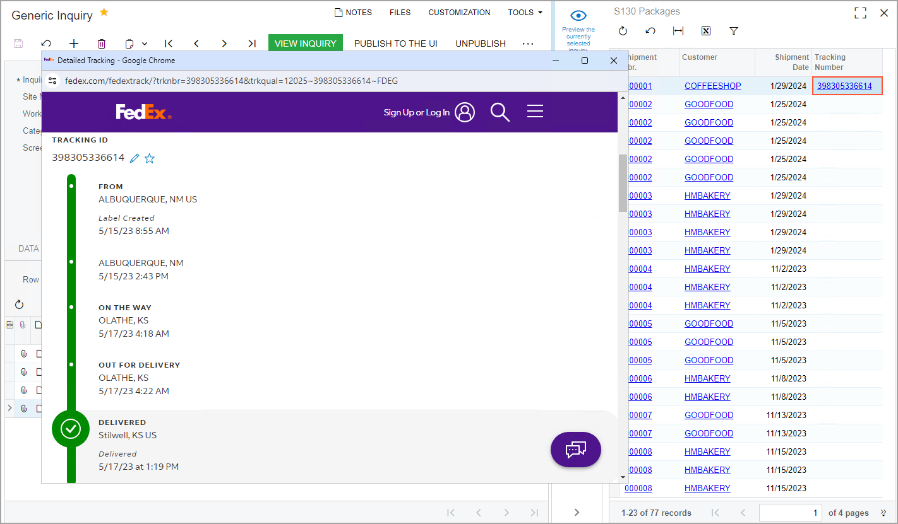

# Navigation Configuration: To Configure Navigation to an External URI {#_e22dbc3e-57e6-4405-8e17-a87b114165bd .task}

In this activity, you will learn how to configure navigation from a generic inquiry form to an external URI.

**Attention:** This activity is based on the *U100* dataset. If you are using another dataset or if any system settings have been changed in *U100*, these changes can affect the workflow of the activity and the results of the processing. To avoid issues, restore the *U100* dataset to its initial state.

## Story { .section}

Suppose that you are a technical specialist in your company who works on simple customizations, including those involving the creation, modification, and use of generic inquiries. A sales manager of your company has requested an inquiry form that displays a list of shipped packages. This generic inquiry should give the manager the ability to monitor the delivery of the packages by the FedEx delivery services company. The sales manager has asked you to make it possible to click a link in a column for any row \(that is, any package\) and open a page on the FedEx site with the details of the package, based on the tracking number.

## Configuration Overview {#section_dzm_1dz_jrb .section}

In this activity, you will use and modify the generic inquiry that has the *DB1-SOPackages* inquiry title and the *S130 Packages* site map title specified on the [Generic Inquiry](SM_20_80_00.md) \(SM208000\) form.

## Process Overview { .section}

For the generic inquiry, on the **Navigation** tab of the [Generic Inquiry](SM_20_80_00.md) \(SM208000\) form, you will specify the link to the needed page on the FedEx site; this link will contain the tracking number parameter. You will also specify the navigation settings the system should use to display the webpage with the package whose tracking number the user clicks in the inquiry results.

## System Preparation {#section_gqt_bpr_jrb .section}

Launch the Acumatica ERP website, and sign in to a tenant with the *U100* dataset preloaded as system administrator Kimberly Gibbs. You should sign in by using the *gibbs* username and the *123* password.

**Tip:** The *gibbs* user is assigned the *Administrator* role, which has sufficient access rights to manage the system configuration and to modify generic inquiries, advanced filters, pivot tables, and dashboards.

## Step: Configuring Navigation to an External URI { .section}

To configure navigation to an external URI, do the following:

1.  Open the [Generic Inquiry](SM_20_80_00.md) \(SM208000\) form.
2.  In the **Inquiry Title** box of the Summary area, select *DB1-SOPackages*.
3.  In the **Navigation Targets** pane of the **Navigation** tab, add a row with the following settings:
    -   **Link**: *https://www.fedex.com/apps/fedextrack/?action=track&amp;trackingnumber=\(\(TrackingNumber\)\)*
    -   **Window Mode**: *Pop-Up Window*
4.  On the form toolbar, click **Save**.
5.  On the **Navigation Parameters** tab of the right pane, add a row, and specify the following settings in the added row:
    -   **Field**: *\(\(TrackingNumber\)\)*
    -   **Parameter**: *SOPackageDetail.TrackNumber*
6.  On the form toolbar, click **Save**.
7.  On the **Results Grid** tab, in the row with *TrackNumber* in the **Data Field** column, clear the **Default Navigation** check box.

    **Tip:** If the column is not available in the table, make it visible by using the **Column Configuration** dialog box of the table.

8.  In the same row, in the **Navigate To** column, select the URI that you have entered in the **Navigation Targets** pane of the **Navigation** tab—that is, *https://www.fedex.com/apps/fedextrack/?action=track&amp;trackingnumber=\(\(TrackingNumber\)\)*.

    In the resulting generic inquiry form, the system will display tracking numbers that are links in the **Tracking Number** column. When a user clicks a link in this column, the system will open the window with the FedEx tracking information of the package, based on the tracking number.

9.  On the form toolbar, click **Save**.
10. Click the eye icon on the side panel of the [Generic Inquiry](SM_20_80_00.md) form to preview how your changes have affected the resulting generic inquiry form. In the **Tracking Number** column, click *398305336614*. Notice that the system opens a pop-up window and navigates to the *https://www.fedex.com/apps/fedextrack/?action=track&amp;trackingnumber=398305336614* URI \(see the following screenshot\).

    **Tip:** The data on third-party webpages is subject to change. Therefore, the resulting generic inquiry form may differ from the data shown in the screenshot.

    

**Parent topic:**[Enabling Navigation](../UserGuide/GI_Enabling_Navigation_Mapref.md)

