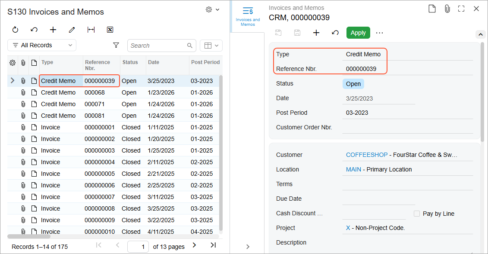

# Navigation Configuration: To Configure the Side Panel {#_f873d0cb-ffde-4793-8927-0d28a3e918c0 .task}

In this activity, you will learn how to modify an existing generic inquiry to add the ability to view the details of a record selected in the inquiry results in a side panel. You will configure a side panel with a single tab.

**Attention:** This activity is based on the *U100* dataset. If you are using another dataset or if any system settings have been changed in *U100*, these changes can affect the workflow of the activity and the results of the processing. To avoid issues, restore the *U100* dataset to its initial state.

## Story { .section}

Suppose that you are a technical specialist in your company who works on simple customizations, including those involving the creation, modification, and use of generic inquiries. An accountant of your company has requested an inquiry form that displays data about AR invoices and memos. You have offered the predefined Invoices and Memos \(AR3010PL\) generic inquiry form, but the accountant has asked you to give users the ability to view the details of any listed invoice or memo in a side panel.

## Configuration Overview {#section_dzm_1dz_jrb .section}

You will work with a copy of the predefined Invoices and Memos \(AR3010PL\) generic inquiry form, which has the *AR-Invoices and Memos* inquiry title and the *Invoices and Memos* site map title specified on the [Generic Inquiry](SM_20_80_00.md) \(SM208000\) form.

**Tip:** The Invoices and Memos \(AR3010PL\) generic inquiry form, which is the list of the invoices and memos that have been created on the [Invoices and Memos](AR_30_10_00.md) \(AR301000\) form, is the substitute form that is opened when you click the *Invoices and Memos* link in a workspace or a list of search results.

The copy that you will modify has the *DB7-ARInvoicesMemos* inquiry title and the *S130 Invoices and Memos* site map title specified on the [Generic Inquiry](SM_20_80_00.md) form.

## Process Overview { .section}

On the **Navigation** tab of the [Generic Inquiry](SM_20_80_00.md) \(SM208000\) form, you will specify the [Invoices and Memos](AR_30_10_00.md) \(AR301000\) form to be displayed in the side panel of the resulting inquiry form. You will also provide the navigation settings the system should use to display the details of the invoice or memo whose identifier the user clicks in the inquiry results.

## System Preparation {#section_uhj_cpr_jrb .section}

Launch the Acumatica ERP website, and sign in to a tenant with the *U100* dataset preloaded as system administrator Kimberly Gibbs. You should sign in by using the *gibbs* username and the *123* password.

**Tip:** The *gibbs* user is assigned the *Administrator* role, which has sufficient access rights to manage the system configuration and to modify generic inquiries, advanced filters, pivot tables, and dashboards.

## Step: Specifying Navigation Settings for the Side Panel { .section}

To modify the copied generic inquiry to specify the needed navigation settings for the side panel, do the following:

1.  Open the [Generic Inquiry](SM_20_80_00.md) \(SM208000\) form.
2.  In the **Inquiry Title** box of the Summary area, select *DB7-ARInvoicesMemos*.
3.  On the **Navigation** tab, in the **Navigation Targets** pane, add a row with the following settings:
    -   **Link**: *AR301000 - Invoices and Memos*

        To select this value, click the selector icon; in the lookup table, type `AR301000` in the Search box, and double-click the row with the form.

    -   **Window Mode**: *Side Panel*
4.  On the form toolbar, click **Save**.
5.  On the **Navigation** tab, while the row you added is still selected in the **Navigation Targets** pane, in the **Icon** box of the right pane, select *account details*.

    **Tip:** This box appears for any navigation target row with *Side Panel* selected in the **Window Mode** column.

6.  On the **Navigation Parameters** tab \(also in the right pane of the **Navigation** tab\), add a row, and specify the following settings in the added row:
    -   **Field**: *DocType*
    -   **Parameter**: *ARInvoice.DocType*
7.  Add another row, and specify the following settings:
    -   **Field**: *RefNbr*
    -   **Parameter**: *ARInvoice.RefNbr*
8.  On the form toolbar, click **Save**.
9.  On the form toolbar, click **View Inquiry** to preview how your changes have affected the inquiry form.
10. Click a row with an invoice or memo, and notice that the system displays its details in the side panel \(see the following screenshot\).

    

## Self-Test Exercise { .section}

Now that you learned how to configure the side panel and specify navigation parameters, try to apply the knowledge and add the [Customers](AR_30_30_00.md) \(AR303000\) form to the side panel for another copy of the *AR-Invoices and Memos* generic inquiry. On the resulting inquiry form, by clicking a row, a user should be able to view the details of the customer account associated with the invoice or memo listed in the row the user clicked.

**Tip:** On the **Navigation** tab of the [Generic Inquiry](SM_20_80_00.md) \(SM208000\) form, in the **Navigation Targets** pane, you add a row with the *AR303000 - Customers* link and select the *Side Panel* window mode. Then in the right pane, you select an icon and specify the navigation parameter offered by the system for selection.

**Parent topic:**[Enabling Navigation](../UserGuide/GI_Enabling_Navigation_Mapref.md)

