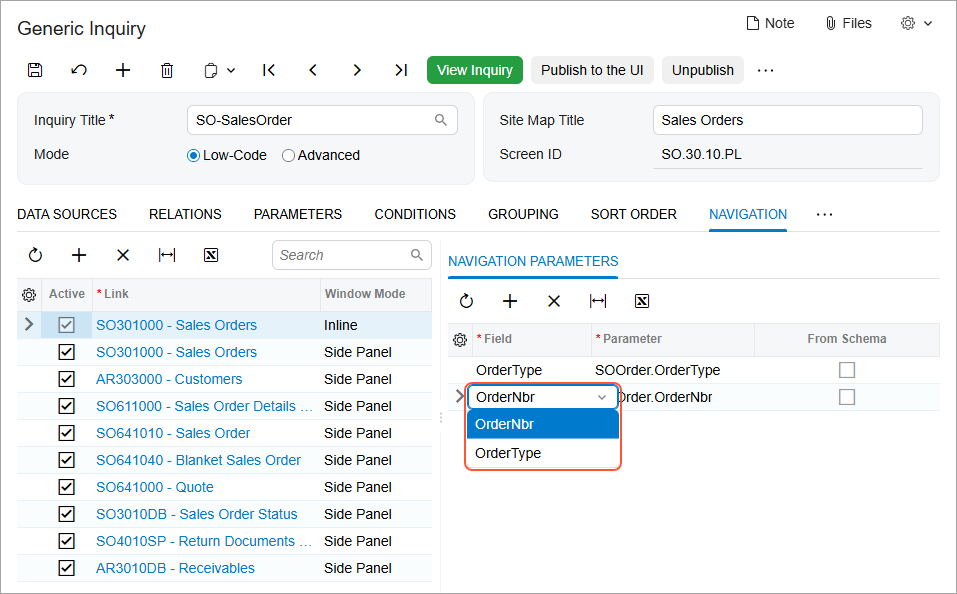

# Navigation Configuration: General Information {#_30994ae2-7c9b-4814-b4e7-86e1ab49c51a .concept}

When you design a generic inquiry by using the [Generic Inquiry](SM_20_80_00.md) \(SM208000\) form, you can define navigation options that give users of the inquiry form the ability to quickly access related information and work more effectively. You can add a side panel with tabs that can display Acumatica ERP forms and external webpages related to a selected record on the inquiry form. You can also define any column of the results grid of the inquiry form to contain links to an Acumatica ERP form or to an external webpage; on the inquiry form, a user can click the link in the column to view the listed record on the form where it was created or the external webpage.

This topic presents information about the configuration of all types of navigation, as well as the specifics of navigation through the links in columns of the inquiry form, and the [Navigation Configuration: Side Panel](GI_Enabling_Navigation_Side_Panel_Configuration_Concept.md) topic provides additional details about configuring a side panel.

## Learning Objectives { .section}

In this chapter, you will learn how to specify different navigation options from generic inquiries by doing the following:

-   Configuring navigation to a particular form
-   Configuring the display of related forms and webpages on the side panel of an inquiry form
-   Configuring navigation to external webpages from an inquiry form
-   Managing the ways the system should open the target forms or webpages
-   Managing the visibility of tabs defined on the side panel

## Applicable Scenarios { .section}

You may find the information in this chapter useful when you work on the customization of Acumatica ERP in your company, including developing and modifying generic inquiries to give users information they need to do their jobs. You may want to give users flexible ways to navigate from generic inquiry forms to other Acumatica ERP forms and to webpages, according to your business requirements.

For example, as you are creating a generic inquiry form that lists purchase orders, you could turn on and configure built-in navigation for the **Vendor ID** column, which contains links to the [Vendors](AP_30_30_00.md) \(AP303000\) form. With this configuration, on the generic inquiry form, in the row of any purchase order, a user will be able to click the link in this column to view the details of the vendor from which the items were purchased.

The ability to navigate to external webpages can be very useful, for example, in ecommerce solutions to monitor entities whose state can change. For example, suppose that your company uses the FedEx delivery services company to deliver packages. You can design a generic inquiry that lists the packages in shipments and the packages' FedEx tracking numbers. In this generic inquiry, you can configure navigation to a tracking page on the FedEx website. In the results grid of the inquiry form, in the column with tracking numbers, a user can click the link in a row of any package and open the page on the FedEx website that corresponds to the tracking number.

## Default Navigation {#section_otk_mbc_qrb .section}

For any column of the results grid of the generic inquiry form, you can turn on or turn off the default navigation—that is, the user's ability to click a link to navigate to the field’s default form. You do this by using the **Default Navigation** check box on the **Results Grid** tab of the [Generic Inquiry](../Shared/../UserGuide/SM_20_80_00.md) \(SM208000\) form.

**Attention:** Default navigation is available only for fields that have a default form specified in the source code. For example, for a row with a field that holds the reference number of an AR invoice, the default form is [Invoices and Memos](../Shared/../UserGuide/AR_30_10_00.md) \(AR301000\).

With the **Default Navigation** check box selected, values of these fields are shown as links in the inquiry results. When a user clicks such a link, the default form is opened in a pop-up window.

When you add a new row to the table on the **Results Grid** tab, the check box is selected by default.

## Specification of Navigation Settings {#section_jqf_dcd_qrb .section}

Whether users will access the navigation target through a side panel of the generic inquiry or a link in the inquiry results, the specification of navigation settings for a target involves three general steps: You specify the target to which you want to provide navigation, you select the navigation mode, and you specify the data field the system should pass to the target.

**Tip:** You do not need to specify any navigation settings for the default navigation.

On the **Navigation** tab of the [Generic Inquiry](SM_20_80_00.md) \(SM208000\) form, in the **Navigation Targets** pane, you specify the list of navigation targets \(with one row for each target\) to which users can navigate from the resulting generic inquiry form. A navigation target can be either an Acumatica ERP form or an external webpage.

You can configure navigation to an Acumatica ERP form of any of the following types:

-   Data entry and maintenance
-   Mass processing
-   Dashboard
-   Inquiry
-   Report

For each target, in the **Link** column, you specify the screen ID of the form or the uniform resource locator \(URL\) of the external website. In the **Window Mode** column, you select one of the following options, which determine the mode in which the system opens the form or page:

-   *Same Tab* \(default\): In the same browser tab, replacing the generic inquiry form
-   *New Tab*: In a new tab of the same browser
-   *Pop-Up Window*: In a pop-up window
-   *Side Panel*: In the side panel

Then with the row of the navigation target selected, on the **Navigation Parameters** tab on the right pane \(of the **Navigation** tab\), you specify the data field or fields the system should pass to the target or the name of the parameter from the URI in the **Field** column. For each data field you pass to the target, you specify the corresponding parameter in the **Parameter** column by selecting it from the fields of the generic inquiry that you are configuring.

In most cases, you need to pass the key fields, which are displayed on the UI and used to identify the record to be displayed on the target form. There are some forms with hidden key fields \(that is, fields not displayed on the UI\); an example of a form with hidden key fields is the [Email Activity](CR_30_60_15.md) \(CR306015\) form. Regardless of the visibility of the key fields, in the **Field** column of the **Navigation Parameters** tab, the system offers for selection the key field or fields that correspond to the requirements of the navigation target.

For example, if the [Sales Orders](SO_30_10_00.md) \(SO301000\) form is the selected navigation target, you need to pass the order type and the order number, which are the key fields. In the **Field** column, the system provides the key fields of the [Sales Orders](SO_30_10_00.md) form for selection, as shown in the following screenshot.

If you specify an inquiry, a report form, or a dashboard as a navigation target and parameters have been defined for the target, the system instead provides the list of these parameters for selection in the **Field** column of the **Navigation Parameters** tab.

In the **Link** column of the table in the **Navigation Targets** pane, you can specify the same Acumatica ERP inquiry, dashboard, or report form more than once. For each row in which you list the same inquiry, dashboard, or report, you can specify different parameters in the table on the **Navigation Parameters** tab.

## Navigation to a Particular Form or Webpage { .section}

You use the **Navigation** tab of the [Generic Inquiry](SM_20_80_00.md) \(SM208000\) form to specify the list of navigation targets: Acumatica ERP forms and webpages to which users can navigate from the generic inquiry form. For each navigation target you list, you specify navigation settings—in particular, the mode in which the system opens the form or page. For the navigation targets with a mode other than *Side Panel*, you need to associate a data field that should be displayed in the generic inquiry results as a link.

After you have finished specifying the navigation settings for the target, you switch to the **Results Grid** tab of the [Generic Inquiry](SM_20_80_00.md) form. In the row of the data field that should be displayed in the inquiry results as a link, you cancel the default navigation by clearing the **Default Navigation** check box, and you select the configured navigation target in the **Navigate To** column.

**Attention:** If you were to leave the **Default Navigation** check box selected, the target selected in the **Navigate To** column would be ignored—that is, if a user clicked a link in the column of the inquiry results, the system would open the default form \(if any was defined for the data field\). If you were to clear the **Default Navigation** check box and not specify a form in the **Navigate To** column for the data field, the data field would not be displayed as a link.

## Specification of Navigation Settings for a Webpage {#section_ts4_zts_jrb .section}

The process of configuring an external webpage as a navigation target is the same as that for a form, as detailed in the previous section. This section describes and illustrates the specifics of this process for a webpage.

On the **Navigation** tab of the [Generic Inquiry](SM_20_80_00.md) \(SM208000\) form, in the **Navigation Targets** pane, you specify the URI and the window mode of the navigation target in the **Link** column. Within the URI, you also specify the parameters you would like to pass. Note that in the original URI of the target resource \(the page to which you are configuring navigation\), you must surround each parameter value with double or triple parentheses. The system recognizes these values as key fields it should pass to the URI and makes them available for selection in the **Field** column of the **Navigation Parameters** tab for the target. \(You need to add a row on this tab for each parameter in the URI.\) For each URI parameter selected in the **Field** column, you specify the corresponding data field of the generic inquiry or a formula in the **Parameters** column.

**Tip:** You surround each parameter value with double parentheses if you need the system to apply URL encoding for the values. Otherwise, you surround each parameter value with triple parentheses.

For example, suppose that the URI of the page to which you are configuring navigation is the following: `https://www.google.com/search?q=((query))&lang=((language))`. Then in the **Field** column, the drop-down list contains the following options: *\(\(query\)\)* and *\(\(language\)\)*. So you need to map each of these options to an inquiry field that returns a corresponding value—the query and the language of the query.

Alternatively, you can specify just a parameter value as a target in the **Link** column and on the **Navigation Parameters** tab you specify for this parameter the corresponding data field of the generic inquiry or a formula. The system will validate the resulted external URL before the navigation.

For example, you store the URL parts to be used before and after a tracking number as a carrier contact. You created a generic inquiry where you list these parts for each carrier. In the **Link** column, you specify just `(((url)))`. On the **Navigation Parameters** tab, you specify a formula for this parameter using needed data fields from the generic inquiry.

For the navigation target, if you selected a window mode other than *Side Panel*, you should associate the target with a data field that should be displayed in the inquiry results as a link. On the **Results Grid** tab of the form, for a data field of your choice, you select the URI in the **Navigate To** column and clear the check box in the **Default Navigation** column.

**Parent topic:**[Enabling Navigation](../UserGuide/GI_Enabling_Navigation_Mapref.md)

