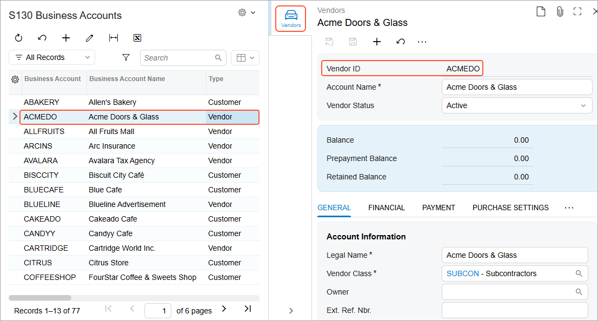

# Navigation Configuration: To Specify Visibility Conditions for a Side Panel {#_51e13abe-497e-40e6-8dbf-192247ef5a99 .task}

In this activity, you will learn how to specify the visibility conditions for tabs on a side panel.

**Attention:** This activity is based on the *U100* dataset. If you are using another dataset or if any system settings have been changed in *U100*, these changes can affect the workflow of the activity and the results of the processing. To avoid issues, restore the *U100* dataset to its initial state.

## Story { .section}

Suppose that you are a technical specialist in your company who works on simple customizations, including those involving the creation, modification, and use of generic inquiries. A sales representative of your company has requested an inquiry form that displays data about business accounts.

You have offered the predefined Business Accounts \(CR3030PL\) generic inquiry form, but the sales representative has asked you to give users the capability to view the following detailed information on a single tab of the side panel, depending on the type of the selected record:

-   For a business account of the vendor type: Vendor details on the [Vendors](AP_30_30_00.md) \(AP303000\) form
-   For a business account of the customer type: Customer details on the [Customers](AR_30_30_00.md) \(AR303000\) form
-   For a business account of the business account type: Business account details on the [Business Accounts](CR_30_30_00.md) \(CR303000\) form

## Configuration Overview {#section_dzm_1dz_jrb .section}

You will work with a copy of the predefined Business Accounts \(CR3030PL\) generic inquiry form, which has the *CR-BusinessAccounts2018R1* inquiry title and the *Business Accounts* site map title specified on the [Generic Inquiry](SM_20_80_00.md) \(SM208000\) form. The original inquiry form has a side panel with eight tabs. For the purposes of this activity, the copy has been modified to have no navigation settings specified.

**Tip:** The Business Accounts \(CR3030PL\) generic inquiry form, which is the list of the business accounts that have been created on the [Business Accounts](CR_30_30_00.md) \(CR303000\) form, is the substitute form that is opened when you click the *Business Accounts* link in a workspace or a list of search results.

The copy that you will modify has the *DB1-CRBAccounts* inquiry title and the *S130 Business Accounts* site map title specified on the [Generic Inquiry](SM_20_80_00.md) form.

## Process Overview { .section}

On the **Navigation** tab of the [Generic Inquiry](SM_20_80_00.md) \(SM208000\) form, you will configure navigation to the [Vendors](AP_30_30_00.md) \(AP303000\) form, the [Customers](AR_30_30_00.md) \(AR303000\) form, and the [Business Accounts](CR_30_30_00.md) \(CR303000\) form with the *Side Panel* option selected as the navigation mode. You will provide the navigation settings that the system should use to display the details of the business account whose identifier the user clicks in the inquiry results. You will also specify the visibility conditions for each navigation target, which depend on the type of business account that the user clicks in the inquiry results.

## System Preparation {#section_ywx_cpr_jrb .section}

Launch the Acumatica ERP website, and sign in to a tenant with the *U100* dataset preloaded as system administrator Kimberly Gibbs. You should sign in by using the *gibbs* username and the *123* password.

**Tip:** The *gibbs* user is assigned the *Administrator* role, which has sufficient access rights to manage the system configuration and to modify generic inquiries, advanced filters, pivot tables, and dashboards.

## Step 1: Specifying the Navigation Settings for the Side Panel { .section}

To specify the needed navigation settings for the side panel of the generic inquiry, do the following:

1.  Open the [Generic Inquiry](SM_20_80_00.md) \(SM208000\) form.
2.  In the **Inquiry Title** box of the Summary area, select *DB1-CRBAccounts*.
3.  On the **Navigation** tab, in the **Navigation Targets** pane, add a row with the following settings:
    -   **Link**: *AP303000 - Vendors*
    -   **Window Mode**: *Side Panel*
4.  On the form toolbar, click **Save**.
5.  While the row you just added is still selected in the **Navigation Targets** pane, in the **Icon** box of the right pane of the **Navigation** tab, select *directions car*.
6.  On the **Navigation Parameters** table \(in the right pane within the **Navigation** tab\), add a row with the following settings:
    -   **Field**: *AcctCD*
    -   **Parameter**: *BAccount.AcctCD*
7.  On the form toolbar, click **Save**.
8.  On the **Visibility Conditions** tab \(in the right pane within the **Navigation** tab\), add a row, and specify the following settings:

    -   **Data Field**: *BAccount.Type*
    -   **Condition**: *Equals*
    -   **From Schema**: Selected
    -   **Value**: *Vendor*
    **Tip:** If the *Side Panel* option is selected in the **Window Mode** column, the **Visibility Conditions** tab is displayed in the right pane.

9.  On the form toolbar, click **Save**.
10. On the **Navigation** tab, in the **Navigation Targets** pane, add one more row with the following settings:
    -   **Link**: *AR303000 - Customers*
    -   **Window Mode**: *Side Panel*
11. On the form toolbar, click **Save**.
12. While the row you just added is still selected in the **Navigation Targets** pane, in the **Icon** box of the right pane of the **Navigation** tab, select *shopping cart*.
13. On the **Navigation Parameters** tab \(in the right pane\), add a row with the following settings:
    -   **Field**: *AcctCD*
    -   **Parameter**: *BAccount.AcctCD*
14. On the form toolbar, click **Save**.
15. On the **Visibility Conditions** tab of the **Navigation** tab, add a row, and specify the following settings:
    -   **Data Field**: *BAccount.Type*
    -   **Condition**: *Equals*
    -   **From Schema**: Selected
    -   **Value**: *Customer*
16. On the form toolbar, click **Save**.
17. On the **Navigation** tab, in the **Navigation Targets** pane, add one more row with the following settings:
    -   **Link**: *CR303000 - Business Accounts*
    -   **Window Mode**: *Side Panel*
18. On the form toolbar, click **Save**.
19. While the row you just added is still selected in the **Navigation Targets** pane, in the **Icon** box of the right pane, select *badge*.
20. On the **Navigation Parameters** tab \(in the right pane\), add a row with the following settings:
    -   **Field**: *AcctCD*
    -   **Parameter**: *BAccount.AcctCD*
21. On the form toolbar, click **Save**.
22. On the **Visibility Conditions** tab of the **Navigation** tab, add a row, and specify the following settings:
    -   **Data Field**: *BAccount.Type*
    -   **Condition**: *Equals*
    -   **From Schema**: Selected
    -   **Value**: *Business Account*
23. On the form toolbar, click **Save**.

## Step 2: Verifying the Configuration of Visibility Conditions for the Side Panel { .section}

To verify the configuration of visibility conditions for the side panel, while you are still working on the [Generic Inquiry](SM_20_80_00.md) \(SM208000\) form with the *DB1-CRBAccounts* inquiry selected, do the following:

1.  On the form toolbar, click **View Inquiry** to preview how your changes have affected the resulting generic inquiry form.
2.  In the inquiry results, click a row with a business account of the *Vendor* type, and notice that on the side panel, the system displays only one tab \(with the directions car icon\).
3.  Click this icon, and notice that in the side panel, the system displays detailed information about the selected vendor on the [Vendors](AP_30_30_00.md) \(AP303000\) form \(see the following screenshot\).

    

4.  In the inquiry results, click a row with a business account of the *Customer* type, and notice that on the side panel, the system has changed the icon to the shopping cart icon. In the side panel, which is already opened, notice that the system displays detailed information about the selected customer on the [Customers](AR_30_30_00.md) \(AR303000\) form.
5.  In the inquiry results, click a row with a business account of the *Business Account* type, and notice that on the side panel, the system has changed the icon to the badge icon. In the side panel, notice that the system displays detailed information about the selected business account on the [Business Accounts](CR_30_30_00.md) \(CR303000\) form.

**Parent topic:**[Enabling Navigation](../UserGuide/GI_Enabling_Navigation_Mapref.md)

