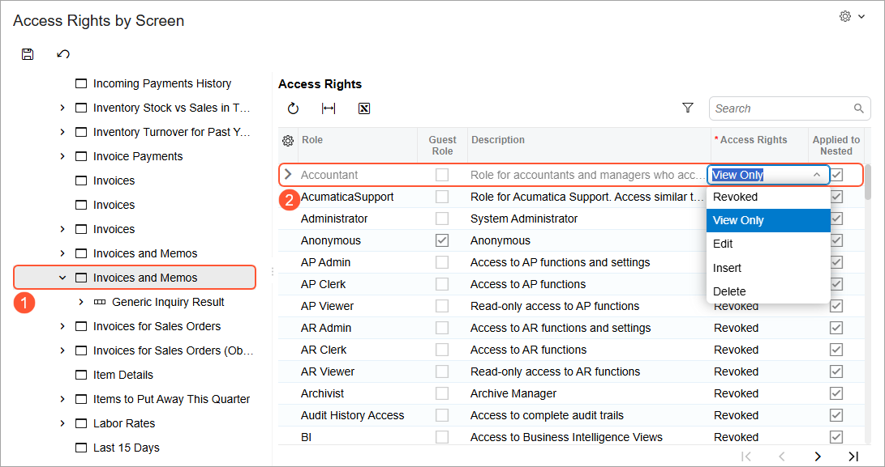

# Generic Inquiries and OData: To Expose Inquiry Results Through OData {#_265a8850-3071-47c4-a4fe-a589d5895ce9 .task}

In this activity, you will learn how to modify an existing generic inquiry to expose its results through OData.

**Attention:** This activity is based on the *U100* dataset. If you are using another dataset or if any system settings have been changed in *U100*, these changes can affect the workflow of the activity and the results of the processing. To avoid issues, restore the *U100* dataset to its initial state.

## Story { .section}

Suppose that you are a technical specialist in your company who is working on simple customizations, including the creation and modification of generic inquiry forms. An accountant of your company has asked you to provide access to the predefined Invoices and Memos \(AR3010PL\) inquiry form through Microsoft Excel. The accountant uses Excel for building reports based on the data of this inquiry and would like the data to always be up to date. Further suppose that the access role of the accountant is *Accountant*.

**Tip:** The Invoices and Memos inquiry form, which is a list of records, has the *AR-Invoices and Memos* inquiry title and the *Invoices and Memos* site map title specified on the [Generic Inquiry](SM_20_80_00.md) \(SM208000\) form.

## Process Overview { .section}

On the [Generic Inquiry](SM_20_80_00.md) \(SM208000\) form, you will verify that the *AR-Invoices and Memos* generic inquiry complies with the requirements for a generic inquiry to be exposed through OData—that is, it has been published. You will select the **Expose via OData** check box for the generic inquiry and save your changes.

After the results of the generic inquiry are exposed, you will make sure that the accountant \(whose user account is assigned the *Accountant* role\) has sufficient access rights for the inquiry form by using the [Access Rights by Screen](SM_20_10_20.md) \(SM201020\) form.

## System Preparation { .section}

Launch the Acumatica ERP website, and sign in to a tenant with the *U100* dataset preloaded as system administrator Kimberly Gibbs. You should sign in by using the *gibbs* username and the *123* password.

**Tip:** The *gibbs* user is assigned the *Administrator* role, which has sufficient access rights to manage the system configuration and to modify generic inquiries, advanced filters, pivot tables, and dashboards.

## Step 1: Exposing the Inquiry { .section}

To expose the needed generic inquiry results by using OData, do the following:

1.  Open the [Generic Inquiry](SM_20_80_00.md) \(SM208000\) form.
2.  In the **Inquiry Title** box of the Summary area, select *AR-Invoices and Memos*.
3.  Verify that a screen identifier has been assigned in the **Screen ID** box.

    **Tip:** An inquiry form is considered published as long as the **Screen ID** box is filled in on the [Generic Inquiry](SM_20_80_00.md) form.

4.  On the **Interface Options** tab, select the **Expose via OData** check box.
5.  On the form toolbar, click **Save**.

## Step 2: Specifying the Access Rights to the Exposed Inquiry { .section}

To specify the access rights of the *Accountant* role to the exposed inquiry, do the following:

1.  Open the [Access Rights by Screen](SM_20_10_20.md) \(SM201020\) form. Because no workspace is specified for the *AR-Invoices and Memos* generic inquiry on the [Generic Inquiry](SM_20_80_00.md) \(SM208000\) form, you need to search for this generic inquiry in the **Hidden** node of the left pane.
2.  In the **Hidden** node of the left pane, click **Invoices and Memos** with the *AR3010PL* screen ID \(see Item 1 in the following screenshot\).

    **Tip:** The system displays a tooltip with the screen identifier when you point to a node; this can help you find the needed form when multiple forms have the same name.

3.  In the right pane, in the **Access Rights** column of the row with the *Accountant* role, select the *View Only* level \(Item 2\).

    

4.  On the form toolbar, click **Save**.

**Parent topic:**[Exposing Inquiry Results by Using OData](../UserGuide/GI_Exposing_Inquiry_by_Using_OData_Mapref.md)

