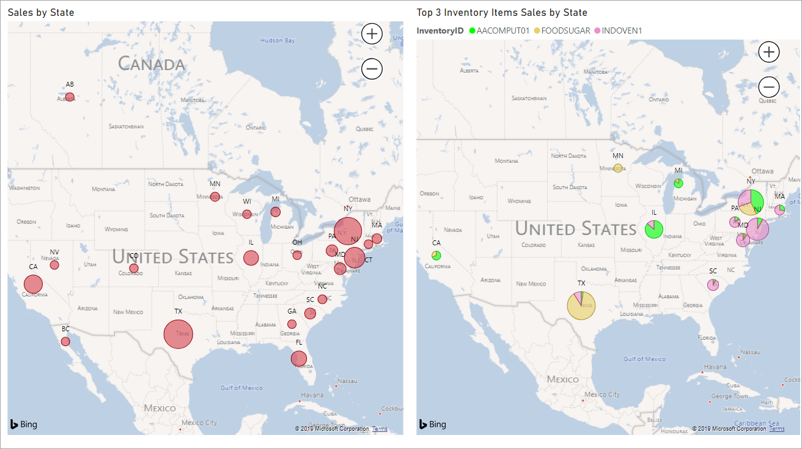

# Generic Inquiries and OData: General Information {#_36beb9aa-f04d-4f63-a93b-a00b1c315be0 .concept}

Acumatica ERP supports the generic inquiry–based OData interface, through which a generic inquiry’s results are used as the data source for third-party applications that track and analyze the data.

Acumatica ERP supports [OData Version 4.0](https://www.odata.org/documentation/) with some exceptions related to query options and query functions. For details about exceptions, see [Generic Inquiries and OData: Preparation of an Inquiry for Exposure](GI_Exposing_Inquiry_by_Using_OData_Preparation_of_Inquiry_for_Exposure.md).

## Learning Objectives { .section}

In this chapter, you will learn how to expose a generic inquiry’s results by using the generic inquiry–based OData interface.

## Applicable Scenarios { .section}

You may find the information in this chapter useful when you are a technical specialist with your company, you manage reports and inquiries, and your company has decided to use a third-party reporting tool that supports the OData protocol \(in addition to using Acumatica ERP reporting\). You need to expose the requested generic inquiries and verify access to the exposed data by using an external application, such as Microsoft Excel.

You may also find this information useful if you are a developer who is creating an integration application that needs to retrieve data from Acumatica ERP.

## Benefits from Exposing Data Through OData { .section}

Multiple applications can use data exposed through the OData protocol, including Microsoft Power BI and Microsoft Excel. Also, some Acumatica ERP technology partners have built reporting solutions by using the ability of Acumatica ERP to expose data through the generic inquiry–based OData interface.

Microsoft Power BI offers advanced capabilities for creating charts. You can expose a generic inquiry’s results through OData and access the data from Power BI. By using Power BI, you can create advanced charts based on data imported from Acumatica ERP. An advanced Power BI chart can then be imported back to Acumatica ERP and added to a dashboard as a widget. For example, you can create a visual display of your sales across the United States \(as shown in the following screenshot\). Due to the exposure of the inquiry results through OData, the Power BI chart displays real-time data when you view it either in Power BI or on your dashboard in Acumatica ERP.

Microsoft Excel offers the following capabilities to process data:

-   To make basic calculations, such as summing, multiplying, and finding the average, as well as advanced calculations, such as regression analysis and conversions
-   To create professional reports and dashboards with charts and visualizations

**Parent topic:**[Exposing Inquiry Results by Using OData](../UserGuide/GI_Exposing_Inquiry_by_Using_OData_Mapref.md)

