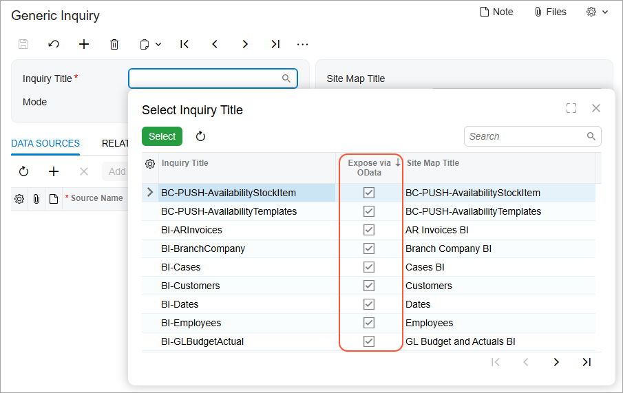

# Generic Inquiries and OData: Preparation of an Inquiry for Exposure {#_b3b6df43-2545-4562-a219-b53325bfd1cd .concept}

To expose the results of a generic inquiry through OData, you should perform the necessary steps to prepare the inquiry and ensure that it complies with the pertinent requirements.

## Preparing a Generic Inquiry for Exposure { .section}

Before exposing a generic inquiry’s results through OData, you need to make sure that the generic inquiry complies with the requirements for this exposure. As a first requirement, you can expose the results of only published inquiries—that is, those that have been assigned a screen ID.

The second requirement is assigning the appropriate access rights to the user accounts that will access the exposed inquiry results through an OData client. These user accounts need to have the *View Only* level of access rights to the inquiry forms. For more information about access rights to generic inquiries, see [Managing Access Rights To Generic Inquiries](GI_Access_Rights_Mapref.md).

## Supporting the OData Specification {#_0cbb4d56-39ec-46fa-90e5-174b1505048d .section}

Acumatica ERP generates the names of the fields for OData entities based on the display names of the Acumatica ERP fields in an English locale. To adhere to the OData specification, Acumatica ERP uses the following rules in generating these names:

-   If the display name contains no invalid symbols, the name is left unchanged.
-   If the display name starts with a digit, an underscore is added before the name. For example, *2Update* is converted to *\_2Update*.
-   If the display name contains invalid symbols, such as spaces, these symbols are removed from the name. For example, *Account Name* is converted to *AccountName*.

The generic inquiry–based OData protocol provided by Acumatica ERP does not support the following items in the OData specification:

-   The *$expand* and *$count* query options
-   The *IsOf\(\)* query function

The system applies the *$filter* query option as a part of the WHERE clause of the SQL request—that is, in the same way as it applies conditions on the **Conditions** tab of the [Generic Inquiry](SM_20_80_00.md) \(SM208000\) form. You cannot sort and filter by the fields that the system calculates by using a formula in the source generic inquiry.

## Exposing Generic Inquiry Results { .section}

You can expose generic inquiry results at any time, whether you are creating a new generic inquiry or modifying an existing one. To do this, you select the **Expose via OData** check box for the generic inquiry in the Summary area of the [Generic Inquiry](SM_20_80_00.md) \(SM208000\) form.

You can view the list of generic inquiries whose results are exposed through OData by opening the lookup table for the **Inquiry Title** box on the [Generic Inquiry](SM_20_80_00.md) form and then filtering the generic inquiries by the selection of the check box in the **Expose via OData** column, as the following screenshot shows.

Acumatica ERP includes multiple predefined generic inquiries whose results can be exposed through OData; the titles of these inquiries start with *BI*. Additionally, the *BI* role is available in Acumatica ERP; a user with the role assigned can access the data of these predefined generic inquiries.

**Tip:** To give users with the *BI* role access to other generic inquiries, you should grant access to these inquiries. For details about granting access rights, see [Managing Access Rights To Generic Inquiries](GI_Access_Rights_Mapref.md).

**Parent topic:**[Exposing Inquiry Results by Using OData](../UserGuide/GI_Exposing_Inquiry_by_Using_OData_Mapref.md)

