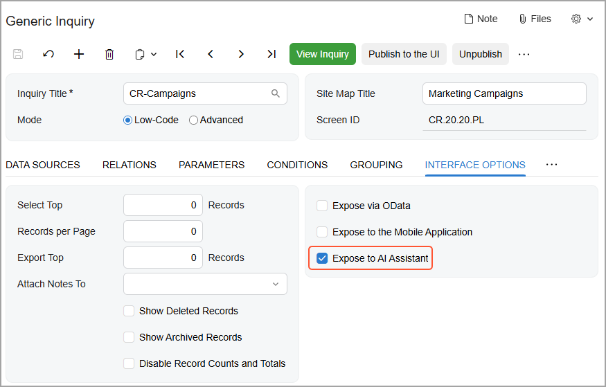
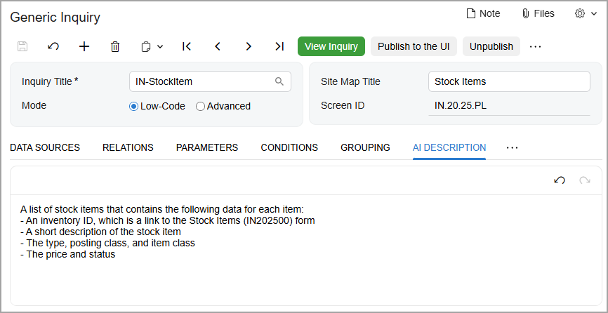
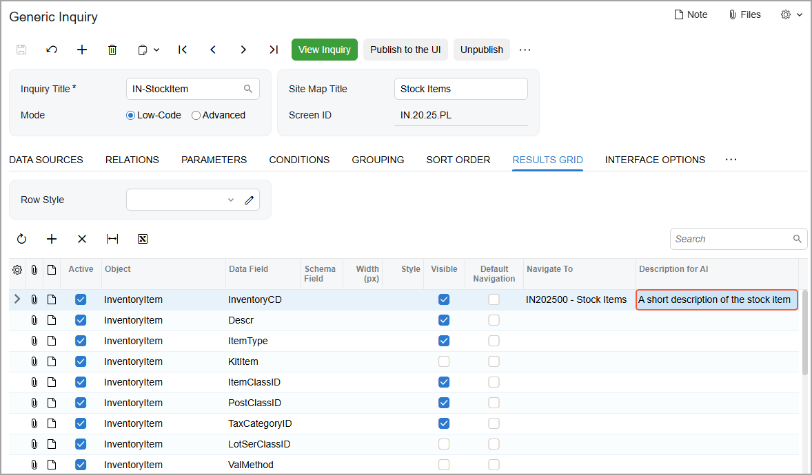
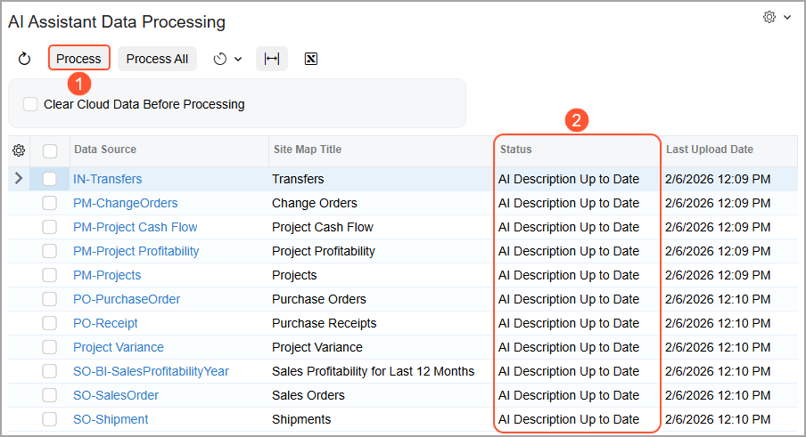
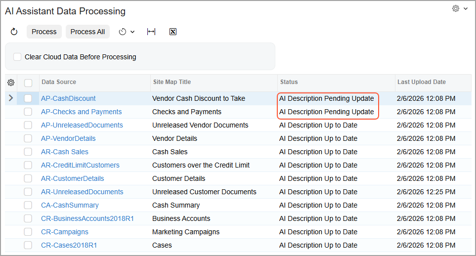

# Exposing Generic Inquiries to AI Assistant: General Information {#_071c93f9-351f-4447-a0cf-395df312a968 .concept}

AI Assistant can return answers as text summaries, tables, lists, charts, and pivot tables. You can jump directly to the relevant forms and records from the response.

To maximize the accuracy and relevance of the answers, you control which generic inquiries AI assistant uses and how those inquiries are described in business language that's familiar in your company.

In this topic, you will learn how to make generic inquiries available to AI Assistant and how to process them.

**Attention:** These capabilities are available only if the *AI Assistant* feature is enabled on the [Enable/Disable Features](CS_10_00_00.md) \(CS100000\) form. Also, you need to have one of the following roles to be able to use AI Assistant:

-   *AI Assistant User*
-   *Administrator*
-   *Acumatica Support*

## Applicable Scenarios { .section}

You modify the AI-related settings of generic inquiries in the following cases:

-   You are rolling out AI Assistant and need to control which data it can use.
-   You need to add generic inquiries to the default set used by AI Assistant or to remove them from this set.
-   You want to refine the inquiry, field, or parameter descriptions so that users get more accurate, business-relevant answers.
-   You've updated a generic inquiry and need to refresh what AI Assistant uses.

## Adding Generic Inquiries { .section}

You can make any generic inquiry available to AI Assistant by selecting the **Expose to AI Assistant** check box on the **Interface Options** tab of the [Generic Inquiry](SM_20_80_00.md) \(SM208000\) form, as shown below.

**Important:** A generic inquiry must be published to the UI before it can be used by AI Assistant.

## Adding Descriptions {#section_vv2_1y4_y4b .section}

To help AI Assistant understand users’ questions and provide better answers, you can add a description for the whole generic inquiry, as well as descriptions for any of its parameters and fields. AI Assistant will then associate those phrases with the generic inquiry, the parameter, or the field. When the phrases appear in users' questions, AI Assistant is more likely to understand what information is being sought.

You can use the rich text editor on the **Description for AI** tab of the [Generic Inquiry](SM_20_80_00.md) \(SM208000\) form to enter a short explanation of what the generic inquiry is for, as shown below.

**Tip:** If your instance has multiple active locales, you can provide localized versions of the descriptions on this tab.

In the **Description for AI** column on the **Results Grid** tab, add a short text string for each data field—that is, column on the resulting inquiry form—where an explanation may be helpful \(shown below\).

Also, on the **Parameters** tab, you can add an instruction for using each parameter. \(For example, for a date, you could enter *Select the date up to which open invoices are included*.\)

The descriptions provide extra context that can improve answer quality, but specifying them is optional.

## Processing the Descriptions {#section_ud4_d5h_g3c .section}

After you expose a generic inquiry to AI Assistant and add descriptions, you need to process this inquiry on the [AI Assistant Data Processing](ML_50_30_10.md) \(ML503010\) form. You either click **Process All** or select the needed records and click **Process** \(Item 1 below\). After the system processes the inquiries \(Item 2\), their data can be used by AI Assistant.

If you modify a generic inquiry, its status on the [AI Assistant Data Processing](ML_50_30_10.md) \(ML503010\) form changes, indicating that this inquiry should be processed again, as shown below.

By default, the system uses the predefined *AI Assistant GI Schema Upload* schedule to process the descriptions. \(This schedule runs once a week.\) You can also run the process manually.

**Parent topic:**[Exposing Generic Inquiries to AI Assistant](../UserGuide/GI_Exposing_Inquiry_to_AI_Assistant_Mapref.md)

