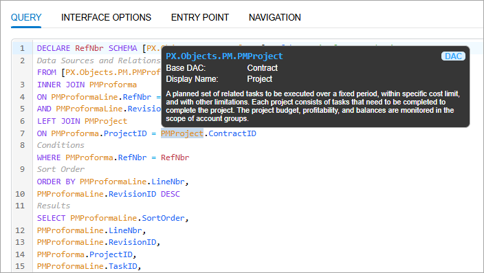
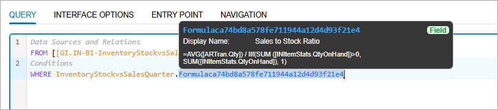
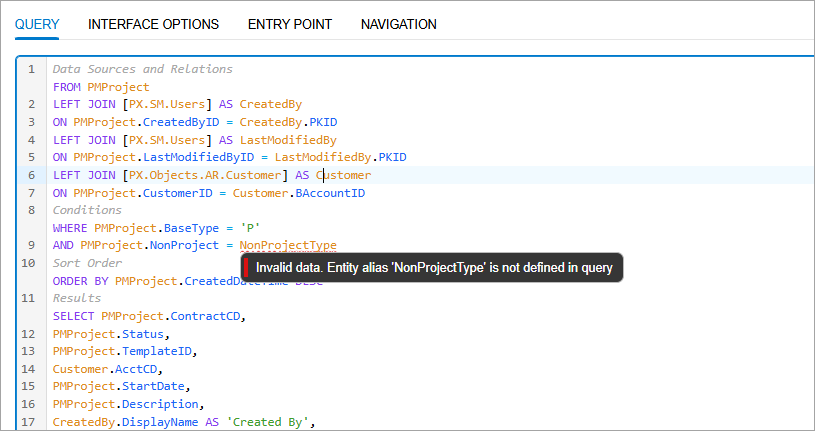
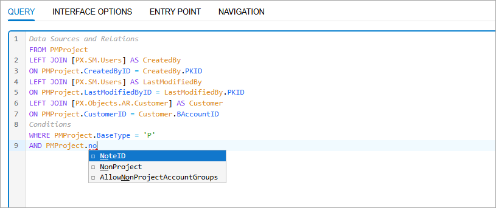
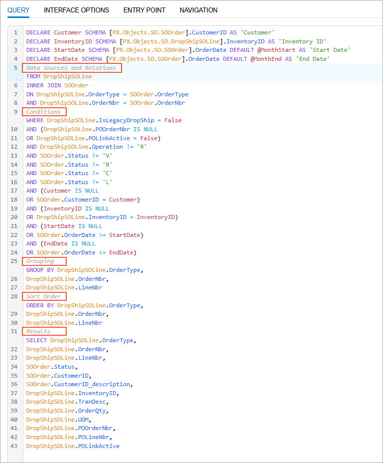
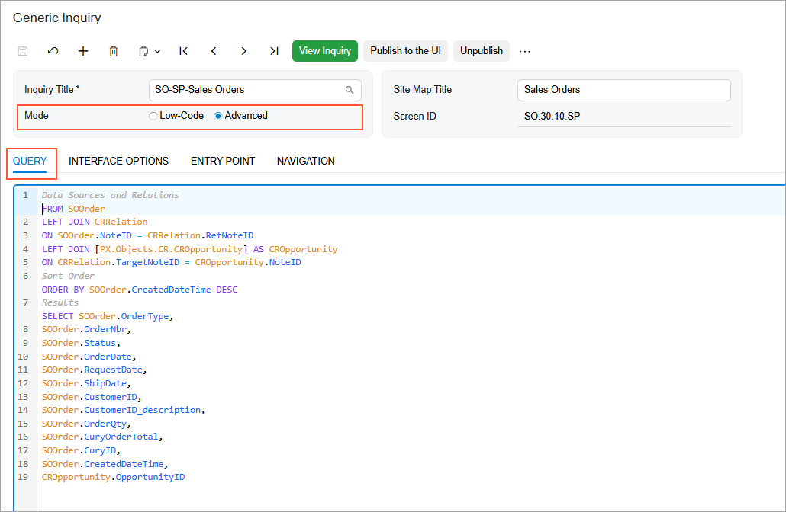

# GIQL: General Information {#_a4052e18-a08b-4a81-8fc5-129798ec9565 .concept}

Generic Inquiry Query Language \(GIQL\) is a powerful SQL-like language that streamlines how you create generic inquiries. This section describes the basic principles of GIQL and how to create generic inquiries by using GIQL.

## Learning Objectives { .section}

In this chapter, you will learn about the following:

-   Basic principles of GIQL and GIQL Editor
-   How to define a generic inquiry with GIQL
-   How to access the GIQL Editor

## Applicable Scenarios { .section}

You create generic inquiries with GIQL when you want to define or modify a generic inquiry in a code-like format.

## Overview of GIQL { .section}

GIQL is an SQL-like language meaning that it uses SQL syntax and keywords with a few important differences:

-   You reference DACs and DAC fields instead of database tables. That means you can use both database-bound and unbound DACs and DAC fields.
-   You can use another generic inquiry as a data source in your query and reference fields of a generic inquiry.
-   GIQL queries start with FROM, not SELECT.

Here’s a sample GIQL query that selects AR transactions for a specific salesperson within a date range.

```
FROM SalesPerson
INNER JOIN ARTran
ON SalesPerson.SalesPersonID = ARTran.SalesPersonID
WHERE (StartDate IS NULL
OR ARTran.TranDate >= StartDate)
AND (EndDate IS NULL
OR ARTran.TranDate <= EndDate)
AND (SalespersonID IS NULL
OR SalesPerson.SalesPersonID = SalespersonID)
ORDER BY SalesPerson.SalesPersonCD
SELECT MAX(SalesPerson.SalesPersonCD),
MAX(SalesPerson.Descr),
MAX(ARTran.TranDate) AS 'Invoice Date',
SUM(ARTran.TranAmt) AS 'Invoiced Sales'
```

By using GIQL, you can define the same components of a generic inquiry that you would configure on the following tabs of the [Generic Inquiry](SM_20_80_00.md) form:

-   **Data Source**
-   **Relations**
-   **Parameters**
-   **Conditions**
-   **Grouping**
-   **Sort Order**
-   **Results Grid**

## GIQL Editor { .section}

To define and modify generic inquiries, Acumatica ERP provides the **GIQL Editor**. The **GIQL Editor** provides a rich text box where you can write your queries directly.

GIQL Editor includes several intelligent assistance features:

-   **Syntax highlighting**: For easy readability, the editor color-codes query components, such as keywords, entities, properties, aggregate functions and parameters.
-   **Interactive infotips**: When you hover over an entity, such as a DAC or a DAC field, the editor shows helpful information about it \(see below\).

    

    If a field comes from a formula in another generic inquiry, the GIQL Editor generates a readable name for this field and shows the full formula in the infotip, as shown below.

    

-   **Real-time validation**: The editor checks your syntax and semantics as you type, validates entities, and makes sure they exist. It also highlights errors, as you can see below.

    

-   **Auto completion**: The editor shows valid entities \(see below\) depending on the current context and cursor position.

    

-   **Automatic organization**: As you type your query, it automatically organizes your code into these generic inquiry components, as shown below:

    -   Data sources and relations
    -   Conditions
    -   Grouping
    -   Sort order
    -   Results
    


## Where You Can Use GIQL { .section}

You can access the GIQL Editor and write GIQL queries on the [Generic Inquiry](SM_20_80_00.md) \(SM208000\) form: In the Summary area, select **Advanced** as the mode. The **Query** tab appears with the GIQL Editor, as shown below.



Everything you write in the GIQL Editor is also available in the **Low Code** mode so that you can switch between the mode while editing the inquiry.

**Parent topic:**[Using Generic Inquiry Query Language \(GIQL\)](../UserGuide/SM_MNG_GIQL_Mapref.md)

