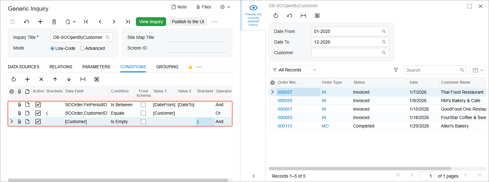

# Data from Multiple Data Sources: To Create an Inquiry with Two Tables {#_78c973d5-8f06-4d46-8b64-10ff1fcae7d5 .task}

In this activity, you will learn how to create a generic inquiry that collects and displays data from two data access classes \(DACs\), which are referred to as *tables* on the user interface of the [Generic Inquiry](SM_20_80_00.md) \(SM208000\) form. The activity walks you through the steps of designing a sample generic inquiry for testing purposes, so that you can develop a better understanding of the process.

**Attention:** This activity is based on the *U100* dataset. If you are using another dataset or if any system settings have been changed in *U100*, these changes can affect the workflow of the activity and the results of the processing. To avoid issues, restore the *U100* dataset to its initial state.

## Story { .section}

Suppose that you are a technical specialist in your company who is working on simple customizations, including the creation and modification of generic inquiry forms. A salesperson of your company has requested an inquiry that collects data about sales orders by customer. The salesperson would like to see the sales orders of those customers whose accounts are still in the system \(that is, they have not been deleted\). Also, the security policy of your company restricts access to the customer accounts and you should make sure that each salesperson will see only the allowed customer accounts.

The inquiry form should have a Selection area with the following elements, which should be empty by default:

-   **Date From**
-   **Date To**
-   **Customer**
-   **Order Status**

The results grid of the inquiry form will consist of columns that display the following information about each sales order: sales order number, type, status, date, and customer name.

## Process Overview { .section}

The generic inquiry that you are going to create in this activity will collect data about sales orders and the corresponding customers. You will inspect the needed elements on the [Sales Orders](SO_30_10_00.md) \(SO301000\) and [Customers](AR_30_30_00.md) \(AR303000\) forms to explore which classes you can use to access the needed data.

With the knowledge you have obtained, you will create a generic inquiry on the [Generic Inquiry](SM_20_80_00.md) \(SM208000\) form and configure the results grid, the requested parameters \(that is, the elements in the Selection area\), and the conditions that correspond to the parameters.

To comply with the security policy and fulfill the salesperson’s requirement, you will use the *Inner* join type while configuring table relations. An *Inner* join creates a result by combining the rows of the parent and child tables when there is at least one match in both tables. That is, if for a sales order, the system finds a customer account that was deleted or the salesperson has no access, the system will not return the sales order.

When an inquiry has been created and all the necessary settings have been specified, you will preview and then publish the inquiry.

## System Preparation { .section}

Launch the Acumatica ERP website, and sign in to a tenant with the *U100* dataset preloaded as system administrator Kimberly Gibbs. You should sign in by using the *gibbs* username and the *123* password.

**Tip:** The *gibbs* user is assigned the *Administrator* role, which has sufficient access rights to manage the system configuration and to modify generic inquiries, advanced filters, pivot tables, and dashboards.

## Step 1: Discovering the DACs and Data Fields { .section}

To inspect the needed user interface elements to find the needed DACs and data fields, do the following:

1.  Open the [Sales Orders](SO_30_10_00.md) \(SO301000\) form.
2.  Point to the **Order Type** box, press Ctrl+Alt, and then click. The **Element Properties** dialog box opens.
3.  Make a note of the values in the **Data Class** and **Data Field** boxes \(*PX.Objects.SO.SOOrder* and *OrderType*, respectively\), which are the data access class and data field you need. Close the dialog box.

    **Tip:** Although in this activity, the tasks of element inspection and generic inquiry development are kept separate for simplicity, in production development, you will generally be inspecting elements on the UI and creating the generic inquiry at the same time. In this case, you may find it convenient to have the form or forms containing the UI elements open in a separate tab, so that you can quickly switch between the [Generic Inquiry](SM_20_80_00.md) \(SM208000\) form and the form you are using to inspect the elements.

4.  Repeat Instructions 2–3 for the following UI elements on the [Sales Orders](SO_30_10_00.md) form:

    -   **Order Nbr.**
    -   **Status**
    -   **Date**
    -   **Customer**
    The **Customer** element on the [Sales Orders](SO_30_10_00.md) form contains an identifier of a customer but not a customer name that should be displayed in the resulting inquiry form. To obtain information about specific customer specified in each sales order, you should use the [Customers](AR_30_30_00.md) \(AR303000\) form.

    In exploring these elements, you have discovered that the data access class you need is *PX.Objects.SO.SOOrder* and the data fields are *OrderType*, *OrderNbr*, *Status*, *OrderDate*, and *CustomerID*.

5.  Open the [Customers](AR_30_30_00.md) form.
6.  Point to the **Customer ID** box, press Ctrl+Alt, and then click. The **Element Properties** dialog box opens.
7.  Make a note of the values of the **Data Class** and **Data Field** elements \(*PX.Objects.AR.Customer* and *AcctCD*, respectively\), which are the data access class and data field you need.

## Step 2: Creating the New Inquiry { .section}

To begin the process of creating the generic inquiry, do the following:

1.  Open the [Generic Inquiry](SM_20_80_00.md) \(SM208000\) form.
2.  In the Summary area, in the **Inquiry Title** box, type the name you will use for the inquiry: `DB-SOOpenByCustomer`.
3.  On the table toolbar of the **Data Sources** tab, click **Add Row**, and in the **Source Name** column, select *PX.Objects.SO.SOOrder*.
4.  On the table toolbar, click **Add Related Table** to add the child table for your generic inquiry.
5.  In the **Related Tables** dialog box, which opens, notice that the system has inserted the name of the selected table \(*PX.Objects.SO.SOOrder*\) in the **Parent Table** box.

    Also notice that in the **Alias** box to the right of the **Parent Table** box, the *SOOrder* value has been inserted.

6.  In the list of tables, click the row with the *PX.Objects.AR.Customer* full name, and on the table toolbar, click **Select Related Table**.

    **Tip:** You can use the search box below the list of tables to find the necessary table by its name.

    The system inserts the name of the selected table in the **Child Table** box. Notice that in the **Alias** box to the right of the **Child Table** box, the *Customer* value is displayed.

    In the **Relation** box, the relation between the pair of tables has been inserted.

7.  In the bottom of the dialog box, click the **Add** button.

    The system closes the **Related Tables** dialog box and adds the tables to the list on the **Data Sources** tab. It also adds the relation between the tables on the **Relations** tab, where you can see that the *Inner* join type is used for the relation.

8.  On the form toolbar, click **Save**.

## Step 3: Configuring the Output Columns { .section}

To configure the columns in the generic inquiry form, on the **Results Grid** tab of the [Generic Inquiry](SM_20_80_00.md) \(SM208000\) form with the *DB-SOOpenByCustomer* inquiry selected, do the following:

1.  Click **Add Row** on the table toolbar, and do the following:

    **Tip:** The lists of values available for selection can be quite long. To speed up the process of selecting the needed values, start typing the needed value in the column; the system will filter the list based on the text you have typed.

    1.  In the **Object** column, select *SOOrder*.
    2.  In the **Data Field** column, select *OrderNbr*.
2.  By using the actions you performed in the previous instruction, add rows with the following settings:

    |**Object**|**Data Field**|
    |----------|--------------|
    |*SOOrder*|*OrderType*|
    |*SOOrder*|*Status*|
    |*SOOrder*|*OrderDate*|
    |*Customer*|*AcctName*|

    Notice that the **Visible** and **Default Navigation** check boxes are selected by default for all rows. With these settings, the system will display the added columns in the inquiry results, and for data fields that have a default data entry form specified in the source code, the system will display the values in the corresponding columns of the generic inquiry form as links. When a user clicks a link in this column on the generic inquiry form, the system opens the specified form in a pop-up window with the record selected.

3.  On the form toolbar, click **Save**.
4.  On the side panel of the [Generic Inquiry](SM_20_80_00.md) form, click the eye icon to preview the generic inquiry form you have created.

## Step 4: Configuring the Selection Area \(Self-Test\) { .section}

You have learned how to add parameters to the Selection area while completing the following activities:

-   [Conditions and Parameters: To Add Period-Range Parameters to the Selection Area](GI_Conditions_and_Parameters_Adding_Range_Parameters_Activity.md)
-   [Conditions and Parameters: To Add a Field Parameter to the Selection Area](GI_Conditions_and_Parameters_Adding_Field_parameters_Activity.md)

A salesperson has requested that you add parameters to the *DB-SOOpenByCustomer* generic inquiry, which you have developed in this activity, so that the results can be narrowed to meet each salesperson’s current needs for information. Use the knowledge and experience you have gained to add the requested parameters to the generic inquiry. After you have added the needed parameters, the Selection area of the inquiry form should have the elements shown in the following screenshot.

For details on parameters and conditions, see [Conditions and Parameters: General Information](GI_Conditions_and_Parameters_General_Info.md).

## Step 5: Publishing the Generic Inquiry Form { .section}

To add the generic inquiry form you have created to the site map, on the [Generic Inquiry](SM_20_80_00.md) \(SM208000\) form, do the following:

1.  Open the *DB-SOOpenByCustomer* generic inquiry.
2.  Click the **Publish to the UI** button on the form toolbar.
3.  In the **Publish to the UI** dialog box, which opens, in the **Site Map Title** box, type `Sales Orders of the Selected Customer`.
4.  In the **Access Rights** section, select **Copy Access Rights from Screen**, and then select *Sales Orders* with the *SO.30.10.00* screen ID in the box next to the option button.

    With these settings, users that have access to the [Sales Orders](SO_30_10_00.md) \(SO301000\) list of records will also have access to the created generic inquiry.

5.  Click **Publish** to complete publication and close the dialog box.
6.  In the main menu, select the **Data Views** workspace, and under the **Inquiries** category, make sure the inquiry you have created is listed.

**Parent topic:**[Getting Data from Multiple Data Sources](../UserGuide/GI_Getting_Data_from_Multiple_Tables_Mapref.md)

